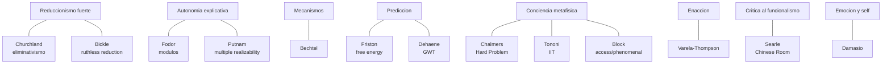

# 03_Autores — Indice de Fichas-Personaje

> 25 fichas de autor. Cada ficha incluye: posicion central, argumentos clave, citas del corpus, objeciones principales, tabla resumen, diagrama de relaciones (mermaid) y vinculos cruzados.

## Mapa rapido de posiciones

---

## Fichas por numero

| N | Archivo | Autor | Programa / posicion central |
|---|---------|-------|-----------------------------|
| 01 | [01_bechtel.md](01_bechtel.md) | William Bechtel | Mecanismos + epistemologia de la evidencia |
| 02 | [02_hinton.md](02_hinton.md) | Geoffrey Hinton | Conexionismo; representaciones distribuidas |
| 03 | [03_mundale.md](03_mundale.md) | Jennifer Mundale | Cartografia cerebral multicriterio |
| 04 | [04_mandik.md](04_mandik.md) | Pete Mandik | Neuropragmatismo; representaciones orientadas a la accion |
| 05 | [05_chalmers.md](05_chalmers.md) | David J. Chalmers | Hard problem; dualismo de propiedades |
| 06 | [06_tononi.md](06_tononi.md) | Giulio Tononi | Integrated Information Theory (IIT); Phi |
| 07 | [07_dehaene.md](07_dehaene.md) | Stanislas Dehaene | Global Neuronal Workspace Theory (GNWT) |
| 08 | [08_searle.md](08_searle.md) | John R. Searle | Naturalismo biologico; Habitacion China |
| 09 | [09_block.md](09_block.md) | Ned Block | Distincion A-conciencia / P-conciencia |
| 10 | [10_friston.md](10_friston.md) | Karl Friston | Free Energy Principle; active inference |
| 11 | [11_damasio.md](11_damasio.md) | Antonio Damasio | Marcador somatico; conciencia anidada |
| 12 | [12_dennett.md](12_dennett.md) | Daniel C. Dennett | Intentional stance; multiple drafts |
| 13 | [13_churchland.md](13_churchland.md) | Patricia y Paul Churchland | Eliminativismo; neurofilosofia |
| 14 | [14_place_smart.md](14_place_smart.md) | U.T. Place y J.J.C. Smart | Teoria de identidad mente-cerebro |
| 15 | [15_putnam.md](15_putnam.md) | Hilary Putnam | Realizabilidad multiple; funcionalismo |
| 16 | [16_varela_thompson.md](16_varela_thompson.md) | Francisco Varela y Evan Thompson | Enactivismo; autopoiesis; neurofenomenologia |
| 17 | [17_baggio.md](17_baggio.md) | Giosue Baggio | Neurolinguistica integrada; red distribuida del lenguaje |
| 18 | [18_ramirez_bermudez.md](18_ramirez_bermudez.md) | Jesus Ramirez-Bermudez (+ Perez-Gay, Aliseda) | Constructos neuropsiquiatricos como puentes |
| 19 | [19_miller_cummings.md](19_miller_cummings.md) | Bruce L. Miller y Jeffrey L. Cummings | Lobulos frontales; triparticion OFC/ACC/DLPFC |
| 20 | [20_zeki.md](20_zeki.md) | Semir Zeki | Especializacion funcional visual; binding problem |
| 21 | [21_raichle.md](21_raichle.md) | Marcus E. Raichle | PET/fMRI; default mode network (DMN) |
| 22 | [22_ledoux.md](22_ledoux.md) | Joseph LeDoux | Circuitos del miedo; amigdala; low/high road |
| 23 | [23_fodor.md](23_fodor.md) | Jerry Fodor | Language of Thought; modularidad; autonomia de la psicologia |
| 24 | [24_hebb.md](24_hebb.md) | Donald O. Hebb | Regla hebbiana; asambleas celulares |
| 25 | [25_koch.md](25_koch.md) | Christof Koch | Neural Correlates of Consciousness (NCC); concept cells; IIT |

---

## Fichas por bloque tematico del curso

### Epistemologia y filosofia de la ciencia
- [01_bechtel.md](01_bechtel.md) — mecanismos, evidencia mediada por instrumentos
- [03_mundale.md](03_mundale.md) — cartografia multicriterio
- [04_mandik.md](04_mandik.md) — neuropragmatismo
- [21_raichle.md](21_raichle.md) — neuroimagen, PET/fMRI, DMN

### Fundamentos historicos del debate mente-cerebro
- [14_place_smart.md](14_place_smart.md) — identidad de tipo (1956-59)
- [15_putnam.md](15_putnam.md) — realizabilidad multiple, funcionalismo
- [23_fodor.md](23_fodor.md) — LOT, modularidad, autonomia psicologica
- [13_churchland.md](13_churchland.md) — eliminativismo, neurofilosofia
- [08_searle.md](08_searle.md) — naturalismo biologico, Habitacion China

### Conexionismo y redes neuronales
- [02_hinton.md](02_hinton.md) — backpropagation, representaciones distribuidas
- [24_hebb.md](24_hebb.md) — regla hebbiana, asambleas celulares

### Conciencia
- [05_chalmers.md](05_chalmers.md) — hard problem, dualismo de propiedades
- [06_tononi.md](06_tononi.md) — IIT, Phi, panpsiquismo cuantitativo
- [07_dehaene.md](07_dehaene.md) — GNWT, ignition, firma neural
- [09_block.md](09_block.md) — distincion A/P conciencia, overflow
- [12_dennett.md](12_dennett.md) — multiple drafts, iluminismo sobre qualia
- [25_koch.md](25_koch.md) — NCC, concept cells, IIT/panpsiquismo

### Percepcion y vision
- [20_zeki.md](20_zeki.md) — especializacion visual, V4/V5, binding problem

### Procesamiento predictivo y cerebro encarnado
- [10_friston.md](10_friston.md) — Free Energy Principle, active inference
- [16_varela_thompson.md](16_varela_thompson.md) — enactivismo, autopoiesis, neurofenomenologia

### Emocion, interocepcion, neuropsiquiatria
- [11_damasio.md](11_damasio.md) — marcador somatico, homeostasis, protoself
- [22_ledoux.md](22_ledoux.md) — miedo condicionado, amigdala, low/high road
- [18_ramirez_bermudez.md](18_ramirez_bermudez.md) — constructos neuropsiquiatricos

### Funciones ejecutivas
- [19_miller_cummings.md](19_miller_cummings.md) — lobulos frontales, OFC/ACC/DLPFC

### Lenguaje
- [17_baggio.md](17_baggio.md) — neurolinguistica integrada, N400/P600, red distribuida

---

Ver tambien: [[06_Referencia/tabla_autores_y_aportes.md]] · [[01_Clases/00_indice_sesiones.md]] · [[07_Bibliografia/01_bibliografia_anotada.md]]
