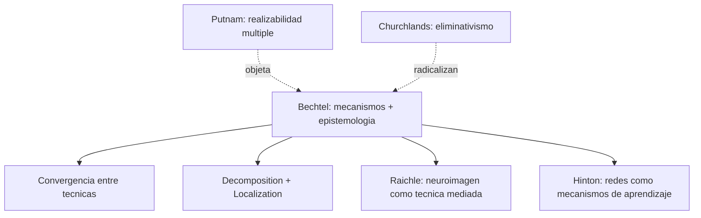

# William Bechtel

> Filosofo de la ciencia, Universidad de California San Diego. Una de las voces mas influyentes en filosofia de la neurociencia cognitiva. Aparece en la bibliografia del curso en tres textos centrales: el manifiesto inaugural con Mandik y Mundale (2001), el ensayo metodologico sobre evidencia (2004) y el capitulo sobre representaciones (2001).

## Posicion central

Bechtel defiende una **filosofia de la neurociencia naturalista, mecanicista y atenta a la practica experimental**. Para el, explicar un fenomeno cognitivo no es subsumirlo bajo una ley general sino **descomponerlo en mecanismos**: identificar las partes, las operaciones que realizan y la organizacion que las hace producir el comportamiento explicandum. La filosofia no juzga la ciencia desde afuera; trabaja con sus instrumentos, sus datos y sus inferencias. Por eso su programa se llama **mechanistic explanation**: una alternativa al modelo deductivo-nomologico de Hempel y a la reduccion teorica de Nagel.

## Argumentos clave

1. **La evidencia neurocientifica esta mediada por instrumentos**. En "The Epistemology of Evidence in Cognitive Neuroscience" (2004) sostiene que ni la lesion, ni el registro unicelular, ni la neuroimagen funcional ofrecen acceso transparente al cerebro. Cada tecnica interviene el fenomeno y puede producir **artefactos**. La confiabilidad de un dato no surge de su aparente evidencia sino de tres operaciones epistemicas: repetibilidad con patrones definidos, **convergencia entre tecnicas independientes** y coherencia con teorias plausibles del mecanismo subyacente.

2. **Explicar es descomponer un mecanismo**. En "Representations: From Neural Systems to Cognitive Systems" (2001) y en su obra mayor *Discovering Complexity* (con Richardson), Bechtel desarrolla una concepcion de la explicacion como **decomposition + localization**: dividir el sistema en partes funcionales, asignar a cada parte una operacion, y mostrar como la organizacion produce el fenomeno. Localizar una funcion en un area cerebral es solo el primer paso; queda por explicar el mecanismo interno y sus relaciones con el resto del sistema.

3. **Representaciones como compromisos funcionales, no como copias internas**. Bechtel rechaza tanto el anti-representacionismo radical (Brooks, Webb) como el representacionismo simbolico ingenuo. Una representacion neural es un estado interno que **se correlaciona sistematicamente con condiciones externas** y que el sistema usa para guiar conducta. No requiere semantica linguistica ni isomorfismo punto a punto.

## Citas y parafrasis del corpus

- Sobre evidencia: "ninguna tecnica por si sola basta; la confiabilidad se construye por convergencia" (parafrasis de [[02_hinton]] no aplica aqui; ver `MetodosYEvidencia/01_bechtel_epistemologia_de_la_evidencia.md`).
- Sobre el campo: la filosofia de las neurociencias nace cuando los problemas clasicos mente-cuerpo "dejan de poder discutirse solo en abstracto y pasan a depender del trabajo cientifico real sobre el cerebro" (Bechtel, Mandik & Mundale 2001, parafraseado en `FundamentosYMarco/01_...`).
- Sobre mecanismos: explicar una actividad cognitiva "no es simplemente asociarla a una zona, sino descomponerla en operaciones y partes organizadas".

## Objeciones principales

- **[[15_putnam|Putnam]] y [[23_fodor|Fodor]]**: la realizabilidad multiple y la autonomia de la psicologia limitan el alcance reductivo de los mecanismos neurales. Bechtel responde que su modelo no es reduccion clasica: las partes mecanicas pueden ser funcionalmente caracterizadas en multiples niveles.
- **[[13_churchland|P. y P. Churchland]]**: los Churchland aceptan el espiritu mecanicista pero presionan hacia el eliminativismo, mientras que Bechtel es mas conservador con las categorias psicologicas.
- **Anti-representacionistas (Brooks, Varela)**: cuestionan que haga falta postular representaciones internas. Ver [[16_varela_thompson|Varela y Thompson]].

## Tabla resumen

| Que postula | Que rechaza | Que evidencia ofrece |
|---|---|---|
| Explicacion mecanicista (partes + operaciones + organizacion) | Modelo deductivo-nomologico; observacionismo ingenuo | Casos historicos en biologia celular, memoria, vision; analisis de fMRI, PET, registro unicelular |
| Representaciones funcionales modestas | Anti-representacionismo radical y representacionismo simbolico fuerte | Triangulacion entre lesiones, registro y neuroimagen |
| Filosofia naturalizada en dialogo con la ciencia | Filosofia *a priori* sobre la mente | Practica experimental real de Marr, Hubel-Wiesel, Posner |

## Lugar en el debate

## Lecturas del workspace

- `Contenidos/Explicaciones/Temas/FundamentosYMarco/01_bechtel_mandik_mundale_filosofia_y_neurociencias.md`
- `Contenidos/Explicaciones/Temas/MetodosYEvidencia/01_bechtel_epistemologia_de_la_evidencia.md`
- `Contenidos/Explicaciones/Temas/VisualizacionesYModelos/02_metodos_evidencia_y_explicacion.md`
- PDFs: `Contenidos/pdf/1 - Bechtel, Mandik, & Mundale - (2001) Philosophy Meets the Neurosciences.pdf`, `Contenidos/pdf/4a - Bechtel - (2004) The Epistemology of Evidence in Cognitive Neuroscience.pdf`, `Contenidos/pdf/13a - Bechtel - (2001) Representations. From Neural Systems to Cognitive Systems.pdf`

## Vinculos con otros autores del curso

- [[03_mundale|Mundale]] y [[04_mandik|Mandik]]: coautores del manifiesto.
- [[21_raichle|Raichle]]: caso paradigmatico de la critica epistemologica.
- [[02_hinton|Hinton]]: las redes como sistemas representacionales distribuidos que encajan en el marco mecanicista.
- [[13_churchland|Churchland]]: comparten naturalismo, divergen en eliminativismo.
- [[15_putnam|Putnam]] y [[23_fodor|Fodor]]: interlocutores criticos sobre autonomia psicologica.
