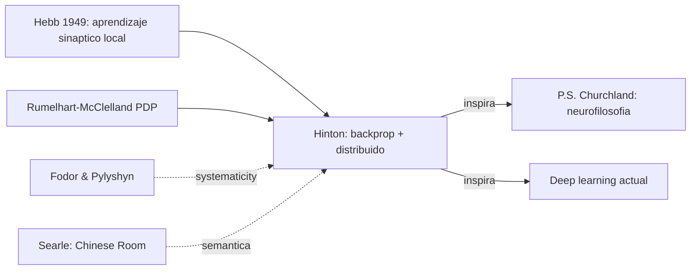

# Geoffrey Hinton

> Psicologo cognitivo y cientifico de la computacion. "Padrino del deep learning". En el curso aparece por su articulo de divulgacion en *Scientific American* (1992) "How Neural Networks Learn from Experience", uno de los textos mas trabajados de toda la bibliografia (varias guias, traduccion cuidada, plan de presentacion). Su importancia filosofica es haber popularizado el conexionismo y las representaciones distribuidas como alternativa al simbolismo clasico.

## Posicion central

Hinton sostiene que **el conocimiento puede emerger en redes de unidades simples ajustando pesos a partir de ejemplos, sin reglas simbolicas explicitas**. La cognicion no requiere un lenguaje del pensamiento ni representaciones localistas: una red multicapa entrenada con descenso por gradiente y retropropagacion del error aprende a categorizar, reconocer y generalizar mediante **representaciones distribuidas en patrones de activacion**. Filosoficamente esto desafia la imagen fodoriana de la mente como manipulador de simbolos.

## Argumentos clave

1. **Las representaciones se aprenden, no se programan**. En un perceptron multicapa las capas ocultas extraen *features* intermedios que el disenador no especifica. El conocimiento esta en la matriz de pesos, no en simbolos discretos. Esto desplaza el problema clasico de la *frame problem* y del simbolismo a la cuestion de **como un sistema fisico desarrolla competencias a partir de su historia de interaccion**.

2. **Distribucion frente a localizacion**. Hinton distingue tres regimenes representacionales: **local** (una neurona = un concepto, fragil ante muerte celular y sin generalizacion), **distribuida** (un patron sobre muchas neuronas, robusto y combinatorio) y **sparse** (subconjunto pequeno activo, equilibrio). La evidencia biologica del experimento de Sparks en coliculo superior, y de Young y Yamane en rostros de monos (RIKEN), apoya el codigo poblacional o demografico. Esto conecta con la *binding problem* de la conciencia.

3. **Limites reconocidos por el propio Hinton**. El articulo no es propaganda: declara cuatro limitaciones. (i) la retropropagacion necesita un instructor (es **aprendizaje supervisado**), (ii) escalabilidad pobre O(n^3), (iii) **minimos locales** del gradiente, (iv) **implausibilidad biologica** porque requiere simetria de pesos y senal de error global que las sinapsis reales no soportan. La alternativa hebbiana (Hebb 1949, "neuronas que se disparan juntas se conectan juntas") y reglas no supervisadas (PCA via Oja, *winner-takes-all*, *sparse coding* de Barlow) son mas plausibles biologicamente pero menos eficientes.

## Citas y parafrasis del corpus

- "Lo mas importante no es la forma de la neurona aislada, sino que el conocimiento queda distribuido en toda la red" (paráfrasis del articulo, recogida en `FundamentosYMarco/03_hinton_redes_neuronales.md`).
- "La retropropagacion sacrifico fidelidad biologica por eficiencia computacional" (sintesis del curso).
- Su comparacion entre neurona artificial y biologica es **deliberadamente idealizada**: la artificial usa valores continuos, la biologica usa potenciales de accion discretos. Este punto reaparece en el GuionCompletoPresentacionHinton.

## Objeciones principales

- **[[23_fodor|Fodor]] y Pylyshyn (1988)**: las redes conexionistas no capturan la **sistematicidad y composicionalidad** del pensamiento simbolico (si pensas "Juan ama a Maria" debes poder pensar "Maria ama a Juan"). Hinton replico con representaciones distribuidas con *tensor product* (Smolensky) y *binding* dinamico.
- **[[08_searle|Searle]]**: cualquier red, por mas que pase el test de Turing, sigue siendo sintaxis sin semantica (argumento de la Habitacion China extendido al conexionismo).
- **[[01_bechtel|Bechtel]] y [[13_churchland|Churchland]]**: aceptan el marco pero exigen anclarlo en mecanismos neurales reales, no solo en modelos abstractos.
- **Anti-representacionistas (Brooks, Webb)**: si la cognicion es accion encarnada, ?para que postular representaciones distribuidas? Ver [[16_varela_thompson|Varela y Thompson]].

## Tabla resumen

| Que postula | Que rechaza | Que evidencia ofrece |
|---|---|---|
| Aprendizaje por ajuste de pesos (backprop) | Reglas simbolicas explicitas como base unica de la cognicion | Funcionamiento empirico de perceptrones multicapa, NETtalk, redes de Hopfield |
| Representaciones distribuidas / sparse | Celulas de la abuela como modelo dominante | Sparks (coliculo), Young & Yamane (rostros), tolerancia a dano |
| Continuidad debil entre cerebro y red artificial | Identidad fuerte; backprop es admitidamente no biologico | Comparacion estructural (input ponderado, activacion, capas) |

## Lugar en el debate

## Lecturas del workspace

- `Curso/Presenacion/2b - Hinton - (1992) How Neural Networks Learn from Experience.md`
- `Curso/Presenacion/2b - Hinton - (1992) Traduccion Cuidada al Espanol.md`
- `Curso/Presenacion/GuionCompletoPresentacionHinton.md`
- `Curso/Presenacion/AsesorRapidoHinton.md`
- `Contenidos/Explicaciones/Temas/FundamentosYMarco/03_hinton_redes_neuronales.md`
- PDF: `Contenidos/pdf/2b - Hinton - (1992) How Neural Networks Learn from Experience.pdf`

## Vinculos con otros autores del curso

- **[[24_hebb|Hebb]]**: regla biologicamente plausible que Hinton reconoce como alternativa.
- **[[01_bechtel|Bechtel]]**: enmarca a Hinton dentro de explicaciones mecanicistas representacionales.
- **[[13_churchland|Patricia y Paul Churchland]]**: convirtieron el conexionismo en programa neurofilosofico (Patricia, *Neurophilosophy* 1986; Paul, *A Neurocomputational Perspective*).
- **[[23_fodor|Fodor]]**: oponente clasico del conexionismo.
- **[[20_zeki|Zeki]] y [[21_raichle|Raichle]]**: evidencia neurobiologica que el modelo conexionista pretende abstraer.
- **[[10_friston|Friston]]**: continua y radicaliza la idea de aprendizaje como minimizacion de error.
