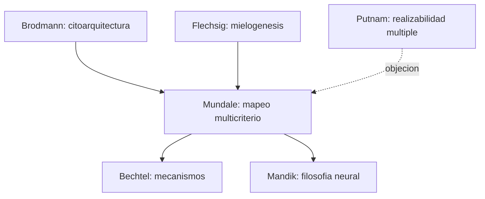

# Jennifer Mundale

> Filosofa de la ciencia, especialista en historia de la neuroanatomia y de los mapas corticales. Coautora con Bechtel y Mandik del articulo *Philosophy Meets the Neurosciences* (2001) que abre la bibliografia del curso. Su contribucion mas citada en filosofia de las neurociencias es "Decomposing the Brain: A Long Term Pursuit" (2002) y trabajos sobre Brodmann y el mapeo cerebral.

## Posicion central

Mundale defiende que **la historia de la cartografia cerebral es la historia de un compromiso entre criterios estructurales y funcionales**. No hay una unica manera "correcta" de descomponer el cerebro en areas; los mapas (Brodmann, Vogt, Flechsig, von Economo) se justifican por la convergencia de citoarquitectura, conectividad, mielogenesis y patrones funcionales. Esto convierte la **localizacion** en un problema epistemologico denso, no en un dato observacional.

## Argumentos clave

1. **El cerebro se descompone segun mas de un criterio**. Citoarquitectura (Brodmann), mielogenesis (Flechsig), conectividad, respuesta funcional y deficit por lesion ofrecen mapas que a veces coinciden y a veces no. Aceptar que la descomposicion es **multidimensional** evita reduccionismos ingenuos y obliga a justificar cada particion.

2. **Filosofia y neurociencia se necesitan para interpretar mapas**. Los mapas no se "leen" del cerebro; se construyen. Sin reflexion epistemologica un mapa corre el riesgo de proyectar las categorias psicologicas del momento sobre el tejido neural (lo que critica como **isomorfismo ingenuo entre teoria y anatomia**).

3. **Continuidad entre psicologia y neurociencia, no autonomia absoluta**. Con Bechtel y Mandik, Mundale argumenta que la **realizabilidad multiple** de [[15_putnam|Putnam]] no implica que la psicologia tenga taxonomias inmunes a la neurociencia. Si las categorias psicologicas no encuentran nunca reflejo neural, hay que **revisarlas**, no defenderlas a priori.

## Citas y parafrasis del corpus

- Del texto coautoral: "la filosofia de las neurociencias aparece cuando los problemas clasicos sobre mente, cuerpo, explicacion y conocimiento dejan de poder discutirse solo en abstracto y pasan a depender del trabajo cientifico real sobre el cerebro" (parafraseado en `FundamentosYMarco/01_...`).
- Su aporte especifico al manifiesto es la perspectiva historico-cartografica: por que la neurociencia cognitiva no surgio antes y como las tecnicas de imagen funcional restructuraron el campo en los 80-90.

## Objeciones principales

- **[[15_putnam|Putnam]] y [[23_fodor|Fodor]]**: defienden la autonomia de la psicologia frente a la cartografia neural. Mundale responde mostrando que las propias categorias psicologicas se han revisado a la luz de la neurociencia (ej. la disociacion de "memoria" en sistemas declarativos vs. procedurales tras los estudios de H.M.).
- **Eliminativistas ([[13_churchland|Churchland]])**: piden ir mas lejos y reemplazar categorias folk. Mundale es mas conservadora: pide **revision continua**, no eliminacion total.
- **Anti-localizacionistas (criticos de Brodmann)**: insisten en redes distribuidas y funcionales que cruzan areas. Mundale acepta el punto: por eso defiende criterios multiples.

## Tabla resumen

| Que postula | Que rechaza | Que evidencia ofrece |
|---|---|---|
| Cartografia cerebral multidimensional | Mapa unico o lectura directa de funciones | Brodmann, Flechsig, von Economo, Vogt; reinterpretaciones via fMRI |
| Continuidad entre psicologia y neurociencia | Autonomia psicologica absoluta | Casos historicos de revision de categorias (memoria, atencion) |
| Naturalismo critico | Filosofia *a priori* sobre la mente | Practica de neuroanatomia comparada y neuroimagen |

## Lugar en el debate

## Lecturas del workspace

- `Contenidos/Explicaciones/Temas/FundamentosYMarco/01_bechtel_mandik_mundale_filosofia_y_neurociencias.md`
- `Contenidos/Explicaciones/Temas/ArchivoGuiasGenerales/00_tabla_autores_y_aportes.md`
- PDF: `Contenidos/pdf/1 - Bechtel, Mandik, & Mundale - (2001) Philosophy Meets the Neurosciences.pdf`

## Vinculos con otros autores del curso

- **[[01_bechtel|Bechtel]]** y **[[04_mandik|Mandik]]**: coautores del manifiesto inaugural del campo.
- **[[20_zeki|Zeki]]**: su trabajo sobre especializacion funcional del sistema visual ilustra el problema cartografico que Mundale teoriza.
- **[[19_miller_cummings|Miller y Cummings]]**: la historia de la cartografia frontal (Gage, Brodmann areas 9/10/11, divisiones orbitofrontal/dorsolateral/cingulada) es un caso central para sus argumentos.
- **[[15_putnam|Putnam]]** y **[[23_fodor|Fodor]]**: interlocutores filosoficos clasicos.
