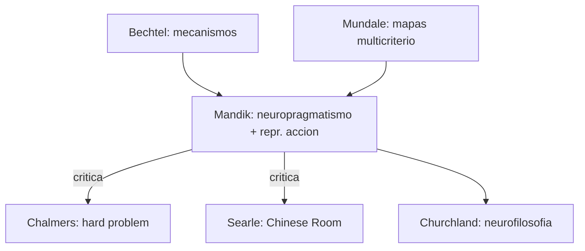

# Pete Mandik

> Filosofo de la mente, William Paterson University. Coautor del manifiesto *Philosophy Meets the Neurosciences* (2001) con Bechtel y Mundale. Su trabajo posterior se concentra en filosofia de la conciencia, *qualia*, representacion neural y *neuropragmatism*.

## Posicion central

Mandik defiende una **filosofia neural pragmatica**: las teorias filosoficas sobre la mente (representacion, conciencia, contenido) deben evaluarse por su utilidad explicativa frente al trabajo neurocientifico real. Rechaza tanto el a priorismo cartesiano como el cientificismo que pretende prescindir de la filosofia. Su tesis fuerte es que **muchas disputas filosoficas clasicas se reconfiguran cuando se las traduce al lenguaje de mecanismos neurales y conducta**.

## Argumentos clave

1. **Action-oriented representations**. Mandik (siguiendo a Clark) sostiene que muchas representaciones neurales son **orientadas a la accion**, no a la descripcion pasiva del mundo. Una representacion motora no es una "copia" del movimiento futuro sino un compromiso entre estado actual, meta y patron de control. Esto desafia la concepcion clasica de representacion como espejo.

2. **Conciencia y *qualia* sin dualismo**. Mandik trabaja sobre el problema de los *qualia* desde una perspectiva neural-funcionalista. Sostiene que las propiedades fenomenicas pueden explicarse en terminos de **propiedades de orden superior de representaciones neurales** (representaciones de representaciones), una posicion proxima a la *higher-order theory* y critica de [[05_chalmers|Chalmers]].

3. **Neuropragmatismo**. La filosofia debe colaborar con la ciencia experimental, no jerarquizarse sobre ella. Esto se traduce en una defensa del **naturalismo metodologico** y en escepticismo hacia argumentos de inconcebibilidad (como el del zombi de [[05_chalmers|Chalmers]] o el espectro invertido).

## Citas y parafrasis del corpus

- En el manifiesto coautoral: el campo nace cuando "los problemas clasicos mente-cuerpo dejan de poder discutirse solo en abstracto" (recogido en `FundamentosYMarco/01_...`).
- Mandik aporta al texto la discusion sobre **por que la filosofia importa para la neurociencia**: para clarificar conceptos de explicacion, evidencia y reduccion.

## Objeciones principales

- **[[05_chalmers|Chalmers]]**: ningun esquema funcional ni representacional puede dar cuenta del *hard problem*; la postura de Mandik seria un caso de "easy problem" sofisticado pero no del problema duro.
- **[[08_searle|Searle]]**: ni representaciones orientadas a la accion ni teorias de orden superior resuelven el problema de la **intencionalidad intrinseca** vs. derivada.
- **Eliminativistas ([[13_churchland|Churchland]])**: piden eliminar el vocabulario representacional, no solo refinarlo.

## Tabla resumen

| Que postula | Que rechaza | Que evidencia ofrece |
|---|---|---|
| Representaciones orientadas a la accion | Representaciones-espejo pasivas | Neuronas motoras, sistema espejo, control predictivo |
| Naturalismo / neuropragmatismo | Dualismo, a priorismo cartesiano | Practica neurocientifica integrada con filosofia |
| Teoria de orden superior para qualia | Hard problem como problema *sui generis* | Reentry corticotalamico, metacognicion |

## Lugar en el debate

## Lecturas del workspace

- `Contenidos/Explicaciones/Temas/FundamentosYMarco/01_bechtel_mandik_mundale_filosofia_y_neurociencias.md`
- `Contenidos/Explicaciones/Temas/ArchivoGuiasGenerales/00_tabla_autores_y_aportes.md`
- PDF: `Contenidos/pdf/1 - Bechtel, Mandik, & Mundale - (2001) Philosophy Meets the Neurosciences.pdf`

## Vinculos con otros autores del curso

- **[[01_bechtel|Bechtel]]** y **[[03_mundale|Mundale]]**: coautores; comparten naturalismo y atencion a la practica cientifica.
- **[[13_churchland|Patricia y Paul Churchland]]**: aliados en neurofilosofia naturalista; Mandik mas moderado en eliminativismo.
- **[[05_chalmers|Chalmers]]**: oponente clasico sobre conciencia y *qualia*.
- **[[08_searle|Searle]]**: critica de la intencionalidad derivada vs. intrinseca.
- **[[02_hinton|Hinton]]**: las representaciones distribuidas alimentan el marco neuropragmatico.
