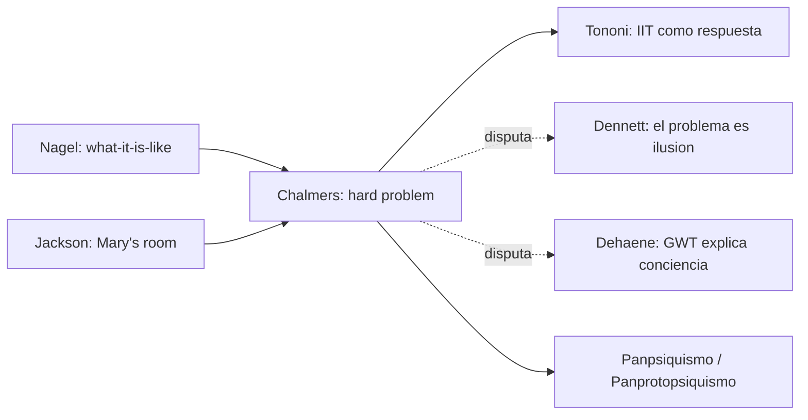

# David J. Chalmers

> Filosofo de la mente australiano-estadounidense, NYU + ANU. Su intervencion mas influyente es la distincion entre **easy problems** y **hard problem of consciousness** (1995, "Facing Up to the Problem of Consciousness"). Aunque no es lectura obligatoria del curso, aparece como referencia transversal cada vez que se discute conciencia, *qualia*, libre albedrio y los limites explicativos de la neurociencia ([[23_obhi_haggard]], [[06_tononi]], [[07_dehaene]], [[15_nave]] sobre cerebro predictivo).

## Posicion central

Chalmers distingue dos tipos de problemas sobre la mente. Los **easy problems** son explicar funciones cognitivas: discriminacion, integracion de informacion, reportabilidad, atencion, control de la conducta. Son "faciles" en sentido tecnico: en principio admiten explicacion en terminos de mecanismos neurales o computacionales. El **hard problem** es explicar por que esos procesos van **acompanados de experiencia subjetiva**, por que hay **algo que se siente** (qualia, *what-it's-like*-ness en sentido de Nagel) al ver rojo, oler cafe o sentir dolor. Su tesis: **ningun modelo funcional o reductivo agota el hard problem**.

## Argumentos clave

1. **Argumento del zombi**. Es concebible un mundo fisicamente identico al nuestro en el que los seres carezcan de experiencia consciente. Si tal mundo es **concebible**, entonces es **metafisicamente posible**, y por tanto la conciencia no es logicamente reducible a lo fisico. Esto motiva su **dualismo de propiedades** o **naturalismo no reductivo**: la conciencia es un aspecto fundamental de la realidad, gobernado por leyes psicofisicas que se anaden a las leyes fisicas.

2. **Espectro invertido y conocimiento de Mary**. Junto a los argumentos clasicos de Jackson (*"What Mary Didn't Know"*) y Block, Chalmers sostiene que aunque Mary la neurocientifica supiera **todo lo fisico** sobre la vision del rojo, al salir de su cuarto blanco-y-negro **aprenderia algo nuevo**: que se siente ver rojo. Esto muestra que los hechos fenomenicos no se siguen de los hechos fisicos.

3. **Panpsiquismo / panprotopsiquismo**. En obras posteriores (*The Conscious Mind* 1996, *The Character of Consciousness* 2010, *Reality+* 2022) Chalmers explora que la experiencia podria ser una propiedad fundamental del universo, presente en grado minimo en toda materia. Es una respuesta al hard problem que evita tanto el dualismo cartesiano como el reductivismo fisicalista. Comparte territorio con la **IIT** de [[06_tononi|Tononi]].

## Citas y parafrasis del corpus

El corpus del curso menciona a Chalmers como contraste con autores empiricos. En `ConcienciaAgenciaYModelos/` los textos de Laureys (estado vegetativo) y Obhi & Haggard (libre albedrio) abren preguntas que Chalmers usa como ilustracion del hard problem: aunque sepamos que el cerebro de un paciente vegetativo procesa informacion, **eso no nos dice si hay experiencia**.

## Objeciones principales

- **[[07_dehaene|Dehaene]]** y **Stanislas Dehaene + JP Changeux (GWT)**: el "Global Workspace" explica la conciencia como difusion global de informacion; no hace falta postular un problema duro.
- **[[12_dennett|Dennett]]**: el hard problem es una ilusion generada por intuiciones erradas; los qualia son una "ilusion del usuario" (*Consciousness Explained*).
- **[[13_churchland|Patricia Churchland]]**: la concebibilidad del zombi no implica posibilidad metafisica; es un argumento *a priori* que la neurociencia ira disolviendo.
- **[[08_searle|Searle]]**: coincide con Chalmers en que la conciencia no se reduce a computacion, pero la atribuye a procesos **biologicos especificos** (no a leyes psicofisicas extra).
- **[[06_tononi|Tononi]]** (IIT): comparte la idea de que la conciencia es fundamental, pero la cuantifica como **Phi**.

## Tabla resumen

| Que postula | Que rechaza | Que evidencia ofrece |
|---|---|---|
| Distincion easy/hard problem | Reductivismo fisicalista fuerte | Argumentos modales: zombi, Mary, espectro invertido |
| Dualismo de propiedades / panpsiquismo | Eliminativismo y funcionalismo a secas | Concebibilidad de mundos zombi |
| Conciencia como propiedad fundamental con leyes psicofisicas | Que la GWT o IIT por si solas resuelvan el problema | Continuidad con tradicion Nagel-Jackson |

## Lugar en el debate

## Lecturas del workspace

- `Contenidos/Explicaciones/Temas/ConcienciaAgenciaYModelos/01_laureys_estado_vegetativo.md`
- `Contenidos/Explicaciones/Temas/ConcienciaAgenciaYModelos/04_obhi_haggard_libre_albedrio.md`
- (No hay PDF de Chalmers en el corpus; lectura externa recomendada: Chalmers 1995, *"Facing Up to the Problem of Consciousness"*, JCS)

## Vinculos con otros autores del curso

- **[[06_tononi|Tononi]]** y **[[07_dehaene|Dehaene]]**: representan las dos grandes respuestas neurocientificas al hard problem (IIT y GWT).
- **[[12_dennett|Dennett]]**: el oponente sistematico que niega que haya un hard problem.
- **[[08_searle|Searle]]** y **[[09_block|Block]]**: comparten escepticismo hacia el funcionalismo computacional puro pero divergen en metafisica.
- **[[14_place_smart|Place y Smart]]**: la teoria de identidad tipo-tipo que Chalmers considera insuficiente.
- **[[16_varela_thompson|Varela y Thompson]]**: la enactivismo es otra ruta para reformular el hard problem.
