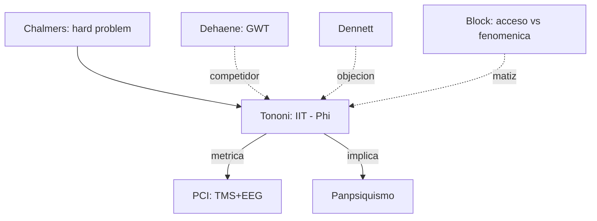

# Giulio Tononi

> Neurocientifico italoamericano (Universidad de Wisconsin-Madison). Autor de la **Integrated Information Theory** (IIT) de la conciencia. Su programa es complementario al de [[07_dehaene|Dehaene]] (GWT) y constituye una de las respuestas mas ambiciosas al hard problem planteado por [[05_chalmers|Chalmers]].

## Posicion central

La conciencia es **informacion integrada irreducible**, cuantificable mediante una magnitud llamada **Phi (Phi)**. Un sistema es consciente en la medida en que (a) contiene mucha informacion (es altamente diferenciable, distingue muchos estados) y (b) esa informacion esta **integrada**, es decir, no puede dividirse en partes informacionalmente independientes sin perdida. Esto invierte el enfoque clasico: en vez de partir del cerebro y buscar correlatos neuronales, Tononi parte de la **fenomenologia** (cinco axiomas: existencia intrinseca, composicion, informacion, integracion, exclusion) y deduce las propiedades que debe tener un sustrato fisico consciente (cinco postulados correspondientes).

## Argumentos clave

1. **Phi como medida de conciencia**. Phi cuantifica cuanta informacion genera el sistema por encima y mas alla de la suma de sus partes. Un sistema con Phi alto (cerebro humano despierto, corticotalamico) es muy consciente. Un sistema con Phi bajo o nulo (un fotodiodo, una camara digital, una red feedforward pura) no lo es, **por mas que procese mucha informacion**. Esto distingue inteligencia (procesamiento) de conciencia (integracion intrinseca).

2. **Distincion entre conciencia y conducta**. Pacientes en estado vegetativo o anestesiados profundamente muestran baja Phi aunque mantengan algun procesamiento. La IIT predice (y empieza a verificar con el **PCI, Perturbational Complexity Index** medido con TMS + EEG, Casali et al. 2013) que la conciencia se asocia con la **complejidad integrada** de la respuesta cerebral, no con la actividad metabolica total.

3. **Panpsiquismo cuantitativo**. La IIT implica que **cualquier sistema con Phi > 0 tiene algun grado de conciencia**, aunque sea minimo. Esto la acerca al panpsiquismo de [[05_chalmers|Chalmers]] pero con base matematica. Tononi acepta la consecuencia: incluso sistemas simples tendrian un grado de experiencia, mientras que un cerebro dividido (split-brain de Sperry) tendria **dos conciencias**.

## Citas y parafrasis del corpus

El corpus del curso aborda conciencia desde la clinica (Laureys, estado vegetativo) y desde el procesamiento predictivo (Nave, Friston). Tononi es referencia obligada para discutir **por que un paciente puede tener actividad cerebral residual sin conciencia plena** y como **medir** ese contraste objetivamente. El indice PCI esta validado en `ConcienciaAgenciaYModelos/01_laureys_estado_vegetativo.md`.

## Objeciones principales

- **[[07_dehaene|Dehaene]] (GWT)**: la conciencia no requiere una propiedad metafisica especial; basta con la **difusion global** de informacion en una red corticotalamica (workspace neuronal global). La IIT explica menos y postula mas.
- **[[12_dennett|Dennett]]**: Phi es un concepto matematico interesante pero la pretension de identificarlo con conciencia fenomenica es un salto injustificado.
- **Aaronson (computer scientist)**: contraejemplos formales muestran que sistemas inertes con la conectividad adecuada (XOR grids) tendrian Phi alto, lo cual es contraintuitivo.
- **[[01_bechtel|Bechtel]]**: la IIT corre el riesgo de ser un modelo abstracto sin anclaje mecanicista.
- **[[09_block|Block]]**: aporta una distincion crucial (acceso vs. fenomenica) que la IIT acepta pero tiende a colapsar.

## Tabla resumen

| Que postula | Que rechaza | Que evidencia ofrece |
|---|---|---|
| Conciencia = informacion integrada (Phi) | Identidad conciencia = procesamiento global | PCI con TMS+EEG: distingue vigilia/sueno/anestesia/EV |
| Axiomas fenomenologicos -> postulados fisicos | Funcionalismo computacional puro | Cerebelo (muchas neuronas, baja integracion) no es consciente |
| Panpsiquismo cuantitativo gradual | Dualismo cartesiano | Predicciones falsables sobre complejidad cortical |

## Lugar en el debate

## Lecturas del workspace

- `Contenidos/Explicaciones/Temas/ConcienciaAgenciaYModelos/01_laureys_estado_vegetativo.md`
- `Contenidos/Explicaciones/Temas/ConcienciaAgenciaYModelos/00_indice.md`
- PDF: `Contenidos/pdf/10b - Laureys - (2007) Eyes Open, Brain Shut.pdf` (introduce el problema de conciencia en EV que IIT busca cuantificar)
- (Lectura externa recomendada: Tononi 2008 "Consciousness as Integrated Information"; Tononi et al. 2016 "Integrated Information Theory: from consciousness to its physical substrate", Nat Rev Neurosci)

## Vinculos con otros autores del curso

- **[[05_chalmers|Chalmers]]**: la IIT acepta el desafio del hard problem y responde con metrica.
- **[[07_dehaene|Dehaene]]**: rival amistoso; ambos buscan explicar conciencia con neurociencia.
- **[[09_block|Block]]**: la distincion acceso/fenomenica orienta como leer Phi.
- **[[12_dennett|Dennett]]**: critico desde el funcionalismo.
- **[[25_koch|Koch]]**: colaborador frecuente de Tononi; ambos buscan **correlatos neuronales de la conciencia (NCC)**.
- **[[19_miller_cummings|Miller y Cummings]]**: la clinica de los frontales muestra disociaciones que la IIT y la GWT deben acomodar.
