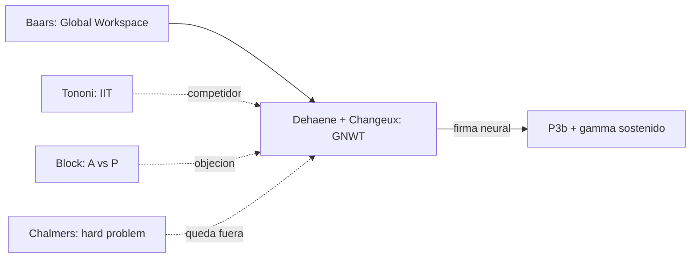

# Stanislas Dehaene

> Neurocientifico cognitivo frances, College de France y NeuroSpin. Autor de la **Global Neuronal Workspace Theory** (GNWT, con Jean-Pierre Changeux), basada en el *Global Workspace* de Bernard Baars. Investigador clave en numeros, lectura y conciencia. En el corpus aparece en `ArchivoGuiasGenerales/00_tabla_autores_y_aportes.md` como autor que "explora imagenes y visualizacion de la mente en neurociencia".

## Posicion central

La conciencia es **acceso global**: un contenido se vuelve consciente cuando es **difundido a una red distribuida fronto-parietal de neuronas piramidales de capa V con axones largos** que lo mantienen disponible para multiples procesos (lenguaje, memoria, planificacion, reporte verbal). El umbral perceptual no es gradual sino **abrupto, all-or-nothing**: hay una ignicion ("ignition") cortical caracterizada por una P3b tardia (~300 ms), gamma sostenido y reentry tardio. Por debajo del umbral, los estimulos procesan inconscientemente; por encima, ingresan al workspace.

## Argumentos clave

1. **Ignition y firma neuronal de la conciencia**. En paradigmas de enmascaramiento visual y atencional, Dehaene y colaboradores mostraron que la diferencia entre estimulo visto y no visto se asocia con una **activacion no lineal**: el procesamiento sensorial temprano (~100-200 ms) es similar; lo distintivo es una **propagacion tardia, prolongada, masiva** a corteza prefrontal y parietal. Esto es la *ignition*. Define la **firma neural de la conciencia de acceso**.

2. **Conciencia y aprendizaje**. En *Consciousness and the Brain* (2014) y *How We Learn* (2020) Dehaene argumenta que el acceso consciente es necesario para algunos tipos de aprendizaje (regla simbolica, lenguaje, transferencia entre dominios) pero no para otros (perceptual implicito, motor). Esto matiza tanto a [[12_dennett|Dennett]] (todo es funcional) como a [[05_chalmers|Chalmers]] (todo es hard).

3. **Reciclaje neuronal y numerosidad**. Dehaene defiende que capacidades culturales (leer, contar) **reciclan** circuitos preexistentes para otras funciones (reconocimiento de objetos, percepcion de magnitudes). La VWFA (Visual Word Form Area) es el caso paradigmatico. Esto conecta con la cartografia funcional de [[03_mundale|Mundale]] y con la representacion distribuida de [[02_hinton|Hinton]].

## Citas y parafrasis del corpus

- Del `tabla_autores_y_aportes.md`: "Dehaene: explora imagenes y visualizacion de la mente en neurociencia."
- El corpus discute el problema de **medir conciencia** en contextos clinicos (Laureys) y emocionales (LeDoux: procesos preconscientes en amigdala). Dehaene aporta el marco experimental para distinguir procesos conscientes de inconscientes con paradigmas reproducibles (priming subliminal, *attentional blink*, binocular rivalry).

## Objeciones principales

- **[[06_tononi|Tononi]] (IIT)**: la conciencia no es difusion global sino **integracion intrinseca**; un sistema feedforward que difunde no es consciente si no integra. Sistemas con baja integracion pero alta difusion serian conscientes segun GNWT pero no segun IIT.
- **[[05_chalmers|Chalmers]]**: la GNWT explica el acceso pero deja intacto el hard problem (por que hay experiencia subjetiva al acceder globalmente).
- **[[09_block|Block]]**: la **distincion entre P-conciencia (fenomenica) y A-conciencia (acceso)** ataca directamente la GNWT, que para Block colapsa ambas. Habria experiencia fuera del workspace (overflow argument).
- **[[12_dennett|Dennett]]**: aliado parcial; comparte el rechazo del hard problem pero discute si la "ignition" es un mecanismo necesario o un epifenomeno.

## Tabla resumen

| Que postula | Que rechaza | Que evidencia ofrece |
|---|---|---|
| Conciencia = ignition global en red fronto-parietal | Conciencia gradual; conciencia sin acceso | Enmascaramiento, attentional blink, fMRI, MEG, intracranial recording |
| Reciclaje neuronal para lectura y numeros | Modulos innatos rigidos al estilo Fodor fuerte | VWFA, sistema numerico aproximado (ANS) |
| Procesos inconscientes ricos pero no conscientes | Identidad procesamiento = conciencia | Priming subliminal cuantificado |

## Lugar en el debate

## Lecturas del workspace

- `Contenidos/Explicaciones/Temas/ArchivoGuiasGenerales/00_tabla_autores_y_aportes.md`
- `Contenidos/Explicaciones/Temas/ConcienciaAgenciaYModelos/01_laureys_estado_vegetativo.md`
- (Lectura externa: Dehaene 2014, *Consciousness and the Brain*; Dehaene & Changeux 2011, "Experimental and theoretical approaches to conscious processing", Neuron)

## Vinculos con otros autores del curso

- **[[06_tononi|Tononi]]**: rival explicativo de la conciencia (acceso vs. integracion).
- **[[05_chalmers|Chalmers]]** y **[[09_block|Block]]**: criticos filosoficos.
- **[[22_ledoux|LeDoux]]**: aliado en mostrar que el procesamiento emocional puede ser inconsciente (amigdala antes que workspace).
- **[[02_hinton|Hinton]]**: la GNWT es coherente con representaciones distribuidas que se vuelven globalmente accesibles.
- **[[21_raichle|Raichle]]**: el *default mode network* descubierto por Raichle es otro nodo del workspace.
- **[[10_friston|Friston]]**: el cerebro predictivo y la GNWT se han propuesto como complementarios (precision attention modulates ignition).
