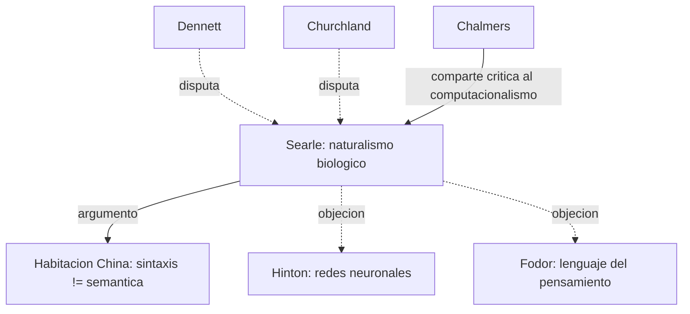

# John R. Searle

> Filosofo de la mente y del lenguaje, UC Berkeley. Famoso por el **argumento de la Habitacion China** (*Minds, Brains and Programs*, 1980, *Behavioral and Brain Sciences*) y por su **naturalismo biologico**. Referencia obligada en cualquier discusion de IA fuerte, conciencia e intencionalidad, contraste critico con [[02_hinton|Hinton]] y el conexionismo.

## Posicion central

Searle defiende el **naturalismo biologico**: la conciencia es un fenomeno biologico real, causado por procesos neurobiologicos especificos del cerebro, e **irreducible** a manipulacion sintactica de simbolos. Rechaza tanto el dualismo cartesiano como el funcionalismo computacional. La conciencia tiene **ontologia subjetiva** (existe solo en primera persona) pero es **objetivamente real** y causalmente eficaz. No es separable del cerebro, pero **no se identifica** con la mera implementacion algoritmica.

## Argumentos clave

1. **Habitacion China**. Un hablante de ingles encerrado en una habitacion con un manual de reglas formales puede manipular simbolos chinos y producir respuestas que aprueben el test de Turing, **sin entender nada de chino**. Conclusion: la sintaxis (manipulacion formal) **no es suficiente** para la semantica (significado). Por tanto la IA fuerte (la tesis de que el programa adecuado es una mente) es falsa. Las redes conexionistas de [[02_hinton|Hinton]] caen en el mismo problema: pueden discriminar y categorizar sin entender.

2. **Distincion intencionalidad intrinseca vs. derivada**. Los estados mentales humanos tienen intencionalidad *intrinseca*: son **acerca de** algo por su propia naturaleza. Los signos linguisticos, los mapas y los programas tienen intencionalidad *derivada*: significan solo porque seres con intencionalidad intrinseca los interpretan. Una computadora ejecutando un programa tiene tanta intencionalidad como una piedra: ninguna.

3. **Naturalismo biologico**. La conciencia es un fenomeno biologico, como la digestion o la fotosintesis. Esta **causada** por la actividad neural (causacion ascendente) y **realizada** en el cerebro (no flotante). No es dualismo de propiedades (Chalmers) ni eliminativismo (Churchland) ni funcionalismo computacional (Fodor). Es un quinto camino: la conciencia es **biologicamente especifica**.

## Citas y parafrasis del corpus

El corpus alude a Searle como referencia transversal cuando se discute si una red neuronal artificial "entiende" lo que procesa o si los programas pueden tener semantica. En `Curso/Presenacion/AsesorRapidoHinton.md` y en las discusiones sobre conexionismo aparece la pregunta "?puede una red de Hinton entender?" — la respuesta searleana es: solo si esta hecha del material adecuado con los poderes causales adecuados.

## Objeciones principales

- **[[12_dennett|Dennett]]**: la Habitacion China comete una falacia de composicion: el hombre no entiende, pero el **sistema completo** (hombre + manual + papel) podria entender. Searle responde con la "internalizacion": que el hombre memorice todo el manual; aun asi no entendera chino.
- **Respuesta sistemica y robotica**: si el programa se conecta a sensores y actuadores en un cuerpo, ?adquiere semantica? Searle dice no: la causalidad sigue siendo simbolica.
- **[[02_hinton|Hinton]] y conexionistas**: las representaciones distribuidas no son manipulacion simbolica; el argumento no se aplica directamente. Searle replica que cualquier implementacion fisica del mismo computo padece el mismo defecto.
- **[[05_chalmers|Chalmers]]**: coincide con Searle en que la conciencia no se reduce a computo, pero no acepta que la **biologia carbonica especifica** sea la unica via. Las leyes psicofisicas son mas generales.
- **[[13_churchland|Churchland]]**: el argumento de Searle es un argumento de intuicion folk que sera disuelto por la neurociencia.

## Tabla resumen

| Que postula | Que rechaza | Que evidencia ofrece |
|---|---|---|
| Naturalismo biologico | IA fuerte (sintaxis = mente) | Argumento de la Habitacion China |
| Intencionalidad intrinseca biologica | Intencionalidad derivada como modelo de mente | Diferencia humano/manual/computadora |
| Conciencia subjetiva pero ontologicamente real | Dualismo, eliminativismo, funcionalismo | Apelacion a poderes causales del cerebro |

## Lugar en el debate

## Lecturas del workspace

- `Curso/Presenacion/AsesorRapidoHinton.md` (contraste implicito con la IA fuerte)
- `Contenidos/Explicaciones/Temas/FundamentosYMarco/03_hinton_redes_neuronales.md`
- (Lectura externa: Searle 1980 "Minds, Brains and Programs", BBS; Searle 1992 *The Rediscovery of the Mind*)

## Vinculos con otros autores del curso

- **[[02_hinton|Hinton]]**: la Habitacion China es el contrapunto filosofico al conexionismo.
- **[[23_fodor|Fodor]]**: ambos rechazan el conexionismo pero por razones opuestas (Fodor defiende simbolos; Searle rechaza tambien los simbolos como modelo de mente).
- **[[12_dennett|Dennett]]**: opositor sistematico.
- **[[13_churchland|Churchland]]**: opositor eliminativista.
- **[[05_chalmers|Chalmers]]**, **[[09_block|Block]]**: aliados parciales contra el funcionalismo computacional, divergentes en metafisica.
- **[[01_bechtel|Bechtel]]**: Bechtel acepta el reclamo searleano de que las representaciones no se reducen a programas, pero ofrece una via mecanicista mas modesta.
