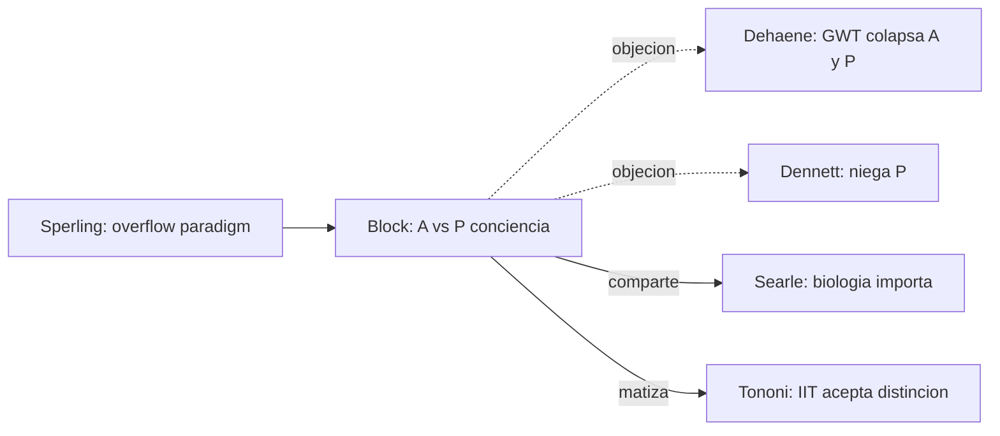

# Ned Block

> Filosofo de la mente, NYU. Su contribucion central es la **distincion entre A-conciencia (acceso) y P-conciencia (fenomenica)** (1995, "On a Confusion about a Function of Consciousness", BBS). Defensor del **superveniencismo** sin reduccion y critico tanto del funcionalismo computacional como de teorias de conciencia que colapsan ambos sentidos.

## Posicion central

Block argumenta que la palabra "conciencia" oculta dos fenomenos diferentes que deben mantenerse separados. La **A-conciencia (access consciousness)** es la disponibilidad de un contenido para el control racional de la accion, el reporte verbal y el razonamiento. La **P-conciencia (phenomenal consciousness)** es la experiencia subjetiva, el *what-it's-like* de Nagel, los qualia. Ambas suelen ir juntas, pero **se pueden disociar**: puede haber experiencia sin acceso (overflow) y acceso sin experiencia (zombi tipo Chalmers, blindsight superatento). Esta distincion es prerequisito para evaluar cualquier teoria de la conciencia.

## Argumentos clave

1. **Overflow argument**. En paradigmas de Sperling (matriz de letras presentadas brevemente) los sujetos reportan haber **visto** mas letras de las que pueden **reportar**. La fenomenologia "desborda" el reporte. Block lee esto como evidencia de que la P-conciencia es mas rica que la A-conciencia y que las teorias de conciencia = acceso (GWT de [[07_dehaene|Dehaene]]) son insuficientes.

2. **Critica al funcionalismo: China-Brain y Blockhead**. Block construyo dos *gedanken*. (i) Si toda la poblacion de China implementa funcionalmente el patron causal de un cerebro humano durante una hora, ?es consciente China? Block dice que no, contra el funcionalismo. (ii) Blockhead: una *lookup table* gigante que responde a cualquier conversacion humana posible podria pasar el test de Turing sin tener mente. La conducta no basta.

3. **Realizacion fisica importa**. Block defiende el **fisicalismo no funcionalista**: lo que constituye la conciencia son ciertas propiedades fisicas del cerebro, no solo su rol funcional. Por eso simpatiza parcialmente con [[08_searle|Searle]] (la biologia importa) sin compartir su rechazo a la IA.

## Citas y parafrasis del corpus

El corpus discute conciencia clinica (Laureys, EV) y emocional (LeDoux, procesos preconscientes). Block es referencia obligada para preguntar **que clase de conciencia se evalua** en un paciente vegetativo (?A o P?), y para advertir contra la tentacion de inferir P-conciencia desde A-conciencia (o viceversa).

## Objeciones principales

- **[[12_dennett|Dennett]]**: la distincion A/P es ilusoria; la P-conciencia es una entidad metafisicamente sospechosa.
- **[[07_dehaene|Dehaene]] (GNWT)**: el overflow puede explicarse como contenido **fragil** en buffers visuales sin necesidad de postular P-conciencia separada.
- **[[06_tononi|Tononi]] (IIT)**: la integracion intrinseca explica la P-conciencia mejor que el acceso, pero la IIT acepta de hecho la distincion blockiana.
- **[[05_chalmers|Chalmers]]**: aliado en defender la P-conciencia, pero Chalmers es mas dualista; Block prefiere fisicalismo de tipo.
- **[[13_churchland|Churchland]]**: los qualia son una categoria a eliminar; la distincion A/P es un sintoma de psicologia folk.

## Tabla resumen

| Que postula | Que rechaza | Que evidencia ofrece |
|---|---|---|
| Distincion A-conciencia / P-conciencia | Identidad acceso = experiencia | Overflow (Sperling), blindsight, sleepwalking |
| Fisicalismo no funcionalista | Funcionalismo computacional puro | China-Brain, Blockhead |
| Realizacion fisica especifica importa | Multiple realizability radical | Casos clinicos donde A y P se disocian |

## Lugar en el debate

## Lecturas del workspace

- `Contenidos/Explicaciones/Temas/ConcienciaAgenciaYModelos/01_laureys_estado_vegetativo.md`
- `Contenidos/Explicaciones/Temas/ConcienciaAgenciaYModelos/00_indice.md`
- (Lectura externa: Block 1995, "On a Confusion about a Function of Consciousness", BBS; Block 2007 "Consciousness, accessibility, and the mesh between psychology and neuroscience")

## Vinculos con otros autores del curso

- **[[05_chalmers|Chalmers]]**: aliado teorico sobre P-conciencia; divergencia metafisica.
- **[[07_dehaene|Dehaene]]** y **[[06_tononi|Tononi]]**: las dos teorias neurocientificas mayores deben acomodar la distincion A/P.
- **[[08_searle|Searle]]**: comparten rechazo del funcionalismo computacional.
- **[[22_ledoux|LeDoux]]**: el procesamiento emocional inconsciente ilustra disociaciones que invitan a la distincion A/P.
- **[[12_dennett|Dennett]]** y **[[13_churchland|Churchland]]**: opositores sistematicos.
