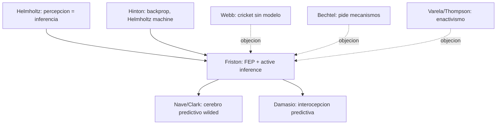

# Karl Friston

> Neurocientifico britanico, UCL. Autor del **Free Energy Principle** (FEP) y del marco de **active inference**. Heredero de Helmholtz (percepcion como inferencia inconsciente), Marr y Hinton. En el corpus, es figura sombra detras del texto de Nave, Deane, Miller y Clark sobre **cerebro predictivo** (`ConcienciaAgenciaYModelos/02_nave_cerebro_predictivo.md`).

## Posicion central

El cerebro (y todo organismo autoorganizado que persiste) minimiza una cantidad llamada **energia libre variacional**, equivalente bayesiano del **error de prediccion** ponderado por precision. La percepcion es **inferencia bayesiana aproximada**: el sistema construye y actualiza un **modelo generativo** del mundo y del propio cuerpo para predecir el flujo sensorial. La accion es **active inference**: el organismo no solo actualiza el modelo ante sorpresa, tambien **modifica el mundo** para que coincida con el modelo (ejecuta predicciones propioceptivas). Es un marco unificador: percepcion, accion, atencion, emocion y aprendizaje son aspectos de la misma minimizacion.

## Argumentos clave

1. **Free Energy Principle**. Un sistema que mantiene su estado contra el segundo principio (que no se desintegra) debe minimizar la **divergencia** entre sus estados sensoriales esperados y observados. Esta divergencia es una cota superior de la sorpresa (negative log evidence). Bajo supuestos modestos, minimizar energia libre = maximizar evidencia del modelo = mantenerse vivo. El principio es **matematico, no empirico estricto**: pretende ser un teorema sobre todo lo autoorganizado.

2. **Active inference y precision attention**. La accion no se explica como ejecucion de un plan previo sino como **cancelacion de error de prediccion propioceptivo**. Si mi modelo predice "mi mano va al vaso", actuo para que la senal propioceptiva confirme la prediccion. La **precision** (inverso de la varianza esperada) modula cuanto error pesa: la atencion es precision sobre canales sensoriales; la creencia es precision sobre estados ocultos.

3. **Cerebro encarnado, afectivo y predictivo (Wilding)**. Nave et al. (2020) y Clark generalizan el FEP: el cerebro predictivo no es un cerebro encerrado calculando, sino un sistema **encarnado, social y nicho-construido**. La emocion es interocepcion predictiva ([[11_damasio|Damasio]], Barrett, Seth). La salud mental es regulacion de precision. La psicopatologia es desajuste sistematico de precision (esquizofrenia: precision excesiva en lo abstracto y deficiente en lo sensorial; autismo: dificultad de modular precision).

## Citas y parafrasis del corpus

De `ConcienciaAgenciaYModelos/02_nave_cerebro_predictivo.md`: "El cerebro puede entenderse como un sistema que genera predicciones y minimiza error, pero ese proceso involucra cuerpo, accion, emocion y entorno, no solo computacion intracraneal." Y: "el sistema debe estimar cuanto peso darle a ciertas senales y a ciertos errores. Eso conecta el modelo con atencion, valor, relevancia y emocion." Esta es la version "wilded" del FEP de Friston.

## Objeciones principales

- **Anti-representacionistas (Brooks, Webb)**: el FEP requiere modelos internos. ?Hace falta? La cricket robot de Webb realiza fonotaxis sin modelo generativo (ver `ConcienciaAgenciaYModelos/03_webb_grillo_robot.md`).
- **[[16_varela_thompson|Thompson y enactivistas]]**: el FEP es bayesianismo computacional que reintroduce **inferencia interna** descartada por el enactivismo; insisten en sense-making encarnado.
- **[[01_bechtel|Bechtel]]**: el FEP es elegante pero puede caer en **vacuidad explicativa** (todo organismo lo cumple por definicion). Bechtel pide mecanismos especificos, no principios universales.
- **Chirimuuta**: las simplificaciones del FEP a teorema unico borran la complejidad historica del campo.

## Tabla resumen

| Que postula | Que rechaza | Que evidencia ofrece |
|---|---|---|
| FEP: organismos minimizan energia libre | Percepcion como recepcion pasiva | Modelos predictivos de vision (Rao & Ballard), aprendizaje hierarchico |
| Active inference (accion como cancelacion de error) | Plan motor separado de percepcion | Predictive coding en V1, modelos de movimiento ocular |
| Precision como base de atencion, creencia, emocion | Atencion como mecanismo separado | Esquizofrenia y autismo como desajustes de precision |

## Lugar en el debate

## Lecturas del workspace

- `Contenidos/Explicaciones/Temas/ConcienciaAgenciaYModelos/02_nave_cerebro_predictivo.md`
- `Contenidos/Explicaciones/Temas/ConcienciaAgenciaYModelos/03_webb_grillo_robot.md` (contraargumento)
- `Contenidos/Explicaciones/Temas/VisualizacionesYModelos/08_cerebro_predictivo_y_formalizacion.md`
- PDF: `Contenidos/pdf/15a - Nave et al. - (2020) Wilding the Predictive Brain.pdf`
- (Lectura externa: Friston 2010, "The free-energy principle: a unified brain theory?", Nat Rev Neurosci)

## Vinculos con otros autores del curso

- **[[02_hinton|Hinton]]**: la Helmholtz machine y la backpropagation son antecedentes computacionales del FEP.
- **[[11_damasio|Damasio]]**: la interocepcion como inferencia predictiva conecta FEP con marcadores somaticos.
- **[[16_varela_thompson|Varela y Thompson]]**: rivalidad amistosa enactivismo vs. predictivismo.
- **[[01_bechtel|Bechtel]]**: tension entre principio universal y mecanismos especificos.
- **[[15_putnam|Putnam]]**: el FEP es indiferente al sustrato (multiple realizability) pero exige cierta autoorganizacion.
- **[[20_zeki|Zeki]]** y **[[21_raichle|Raichle]]**: los mapas funcionales se reinterpretan como jerarquias predictivas.
