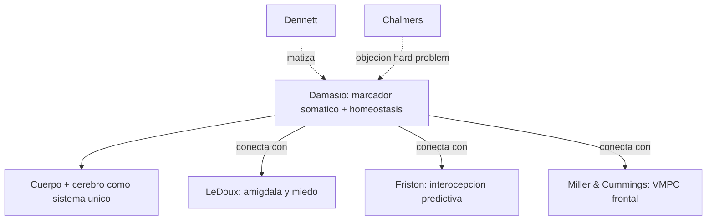

# Antonio Damasio

> Neurologo y neurocientifico portugues-estadounidense, USC. Autor de *Descartes' Error* (1994), *The Feeling of What Happens* (1999), *Self Comes to Mind* (2010) y *The Strange Order of Things* (2018). Su contribucion central es la **hipotesis del marcador somatico** y la idea de que **la conciencia y la racionalidad estan ancladas en la regulacion homeostatica del cuerpo**. En el corpus es referente para `EmocionInterocepcionYNeuropsiquiatria/`.

## Posicion central

La razon no se opone a la emocion; **la razon depende constitutivamente de la emocion**. Decisiones complejas, especialmente en dominios sociales y eticos, requieren senales emocionales corporales (somaticas) que orientan la valoracion antes y durante el razonamiento explicito. Los **marcadores somaticos** son estados corporales asociados a memorias de resultados, que sesgan la deliberacion futura. Sin ellos, la deliberacion racional **no converge**: pacientes con lesion ventromedial prefrontal (caso Elliot, paciente EVR) tienen inteligencia y conocimiento moral preservados pero toman decisiones desastrosas porque carecen de senales somaticas.

## Argumentos clave

1. **Hipotesis del marcador somatico**. Cuando enfrentamos una decision compleja, el cortex ventromedial prefrontal (VMPC) evoca estados corporales asociados a opciones pasadas. Estos estados (cambios viscerales, autonomicos, musculares) son **leidos** por la insula y otras areas, y sesgan la eleccion antes de la deliberacion consciente. La **Iowa Gambling Task** muestra que sujetos sanos generan respuestas autonomicas anticipatorias (SCR) ante mazos perdedores antes de poder verbalizar por que; pacientes VMPC nunca las generan.

2. **Conciencia anidada: protoself, core consciousness, autobiographical self**. Damasio distingue tres niveles. (i) **Protoself**: representacion neural continua del estado corporal en estructuras de tronco y hipotalamo. (ii) **Core consciousness**: la sensacion momentanea de un yo afectado por un objeto. (iii) **Autobiographical self**: el yo narrativo extendido en el tiempo, dependiente de memoria y lenguaje. La conciencia se construye **desde el cuerpo hacia arriba**, no desde el pensamiento hacia abajo.

3. **Homeostasis como matriz de la mente**. En *The Strange Order of Things*, Damasio amplia: la mente y la cultura emergen de la **regulacion homeostatica** que comparten con la vida unicelular. Sentimientos son la lectura consciente de estados homeostaticos. Esto conecta con interocepcion (Chen, Barrett, Seth) y con cerebro predictivo de [[10_friston|Friston]].

## Citas y parafrasis del corpus

El corpus discute en `EmocionInterocepcionYNeuropsiquiatria/`: "el aprendizaje emocional modifica memoria, conducta y preparacion corporal" ([[22_ledoux|LeDoux]] sobre amigdala), y la interocepcion como marco amplio (Chen et al., Barrett). Damasio articula estos hilos: VMPC + amigdala + insula + tronco como circuito de **mente encarnada**. La referencia clinica explicita es el caso de Phineas Gage (ver `FuncionesEjecutivasYLobulosFrontales/02_miller_cummings_lobulos_frontales.md`): Damasio reconstruyo el cerebro de Gage con neuroimagen post-craneal para mostrar dano VMPC selectivo.

## Objeciones principales

- **Racionalistas (kantianos contemporaneos)**: la ética y la racionalidad no se reducen a marcadores somaticos; tienen estructura normativa independiente.
- **[[12_dennett|Dennett]]**: la conciencia narrativa autobiografica de Damasio se solapa con su propia *narrative center of gravity*, pero Dennett rechaza la jerarquia ontologica protoself > core > autobiographical.
- **[[05_chalmers|Chalmers]]**: Damasio describe el **acceso** y el **substrato** pero no resuelve el hard problem: por que el protoself tiene **experiencia subjetiva**.
- **Criticos metodologicos**: la Iowa Gambling Task ha sido replicada con resultados mixtos; algunos cuestionan si SCR refleja realmente marcadores somaticos o solo arousal generico.
- **[[13_churchland|Churchland]]**: comparte naturalismo pero pide mayor cautela con conceptos como "self" que pueden ser psicologia folk renombrada.

## Tabla resumen

| Que postula | Que rechaza | Que evidencia ofrece |
|---|---|---|
| Marcador somatico (VMPC + cuerpo) | Razon descorporeizada cartesiana | Iowa Gambling Task; caso EVR; lesiones VMPC |
| Conciencia anidada: protoself / core / autobiographical | Conciencia como cosa unica | Lesiones tronco vs. cortical, anosognosia, *deep coma* |
| Homeostasis como matriz de mente y cultura | Dualismo mente-cuerpo | Continuidad evolutiva, biologia celular y afecto |

## Lugar en el debate

## Lecturas del workspace

- `Contenidos/Explicaciones/Temas/EmocionInterocepcionYNeuropsiquiatria/00_indice.md`
- `Contenidos/Explicaciones/Temas/EmocionInterocepcionYNeuropsiquiatria/01_ledoux_emocion_memoria_y_cerebro.md`
- `Contenidos/Explicaciones/Temas/EmocionInterocepcionYNeuropsiquiatria/03_barrett_emocion_y_enfermedad.md`
- `Contenidos/Explicaciones/Temas/FuncionesEjecutivasYLobulosFrontales/02_miller_cummings_lobulos_frontales.md`
- PDF: `Contenidos/pdf/11a - Chen et al. - (2021) Emerging Science of Interoception.pdf`, `Contenidos/pdf/11b - Barrett - (2017) Emotion and Illness.pdf`
- (Lectura externa: Damasio 1994, *Descartes' Error*; Damasio 2018, *The Strange Order of Things*)

## Vinculos con otros autores del curso

- **[[22_ledoux|LeDoux]]**: la amigdala como hub del miedo complementa el circuito somatico ventromedial.
- **[[19_miller_cummings|Miller y Cummings]]**: la division orbitofrontal/cingulada/dorsolateral organiza el VMPC.
- **[[10_friston|Friston]]**: interocepcion predictiva como base del marcador somatico.
- **[[18_ramirez_bermudez|Ramirez-Bermudez]]**: los constructos neuropsiquiatricos requieren articular cuerpo + cerebro + conducta.
- **[[16_varela_thompson|Varela y Thompson]]**: aliados en mente encarnada y autopoiesis homeostatica.
- **[[05_chalmers|Chalmers]]** y **[[12_dennett|Dennett]]**: interlocutores filosoficos sobre conciencia y self.
