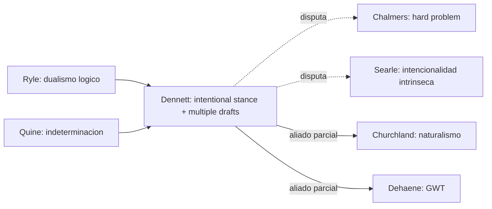

# Daniel C. Dennett

> Filosofo de la mente estadounidense (Tufts, 1942-2024). Autor de *Content and Consciousness* (1969), *Brainstorms* (1978), *The Intentional Stance* (1987), *Consciousness Explained* (1991), *From Bacteria to Bach and Back* (2017). Una de las voces mas combativas en favor del **funcionalismo evolutivo** y critico sistematico del hard problem.

## Posicion central

Dennett defiende un **funcionalismo naturalista** en el que la mente es lo que el cerebro hace, donde "lo que hace" se describe en multiples niveles: fisico, de diseno e **intencional**. La conciencia no es una sustancia ni una propiedad fundamental: es un **patron de competencia** producido por procesos cerebrales paralelos, distribuidos, sin centro unico (modelo de los **multiple drafts**). Los qualia y el hard problem son **ilusiones cognitivas** generadas por intuiciones erradas (el "Cartesian Theater" sigue vivo en quienes los defienden).

## Argumentos clave

1. **Intentional stance**. Para predecir y explicar el comportamiento de un sistema complejo (un cerebro, un perro, un termostato, una empresa) podemos adoptar tres posturas: **fisica** (leyes naturales), **de diseno** (su funcion programada) o **intencional** (atribuirle creencias y deseos racionales). Adoptar la postura intencional **no requiere** que el sistema tenga intencionalidad metafisicamente sustantiva; basta con que sea **predictivamente util** tratarlo asi. Esto desinfla la pregunta de si una IA "realmente" tiene mente.

2. **Multiple drafts model**. No hay un punto unico ("Cartesian Theater") donde "la pelicula" de la conciencia se proyecta. El cerebro produce multiples narraciones paralelas, competidoras, en distintos momentos y lugares. Cual de ellas se vuelve "la consciente" depende de probes, atencion, demanda de reporte. Es una **fama en el cerebro** mas que un destello en un teatro. Esto disuelve preguntas como "?cuando exactamente fui consciente del estimulo?" — son mal planteadas.

3. **Critica al hard problem y a los qualia**. Dennett sostiene que las intuiciones sobre qualia (espectro invertido, Mary, zombis) son **bombas de intuicion mal calibradas**. Si analizamos en detalle lo que se requiere para que un zombi sea fisicamente identico a nosotros pero sin experiencia, descubrimos que la situacion es incoherente o trivialmente vacia. Su lema: *"there seems to be phenomenology, but it does not follow that there really is phenomenology"*. Es una posicion proxima al **iluminismo** sobre los qualia.

## Citas y parafrasis del corpus

El corpus discute conciencia en `ConcienciaAgenciaYModelos/` (Laureys, Obhi-Haggard) y procesos inconscientes en `EmocionInterocepcionYNeuropsiquiatria/` ([[22_ledoux|LeDoux]]: emociones pre-conscientes). La perspectiva dennettiana ayuda a leer estos materiales sin postular un yo cartesiano que "recibe" las senales: el self autobiografico es un **centro narrativo de gravedad**, no una cosa.

## Objeciones principales

- **[[05_chalmers|Chalmers]]**: Dennett "cambia el tema" — explica funciones, no experiencia. Lo llama "Dennett the deflator" del hard problem.
- **[[08_searle|Searle]]**: la postura intencional es **predicacion as if**, no intencionalidad real. La pregunta de Searle es por la intencionalidad intrinseca, no por su utilidad predictiva.
- **[[09_block|Block]]**: la distincion A/P pone presion sobre Dennett: si negas P-conciencia, debes explicar el overflow argument. Block lo acusa de **deflacionismo prematuro**.
- **[[11_damasio|Damasio]]** y **[[06_tononi|Tononi]]**: defienden niveles ontologicos de conciencia (protoself, Phi) que Dennett considera reificaciones.

## Tabla resumen

| Que postula | Que rechaza | Que evidencia ofrece |
|---|---|---|
| Funcionalismo + intentional stance | Hard problem; teatro cartesiano | Pragmatica predictiva en multiples sistemas |
| Multiple drafts (sin centro) | Pelicula unica de la conciencia | Experimentos de Libet, color phi, *cutaneous rabbit* |
| Iluminismo sobre qualia | Qualia como entidades reales | Analisis de bombas de intuicion (Mary, zombi) |

## Lugar en el debate

## Lecturas del workspace

- `Contenidos/Explicaciones/Temas/ConcienciaAgenciaYModelos/04_obhi_haggard_libre_albedrio.md`
- `Contenidos/Explicaciones/Temas/ConcienciaAgenciaYModelos/00_indice.md`
- (Lectura externa: Dennett 1991 *Consciousness Explained*; Dennett 1987 *The Intentional Stance*)

## Vinculos con otros autores del curso

- **[[05_chalmers|Chalmers]]**: oponente sistematico sobre conciencia.
- **[[08_searle|Searle]]**: oponente sistematico sobre intencionalidad e IA.
- **[[13_churchland|Churchland]]**: aliados parciales en naturalismo, pero Dennett es menos eliminativista.
- **[[07_dehaene|Dehaene]]** y **[[06_tononi|Tononi]]**: relacion ambivalente — Dennett aprueba la base empirica pero desconfia de la reificacion.
- **[[02_hinton|Hinton]]**: el conexionismo encaja con el modelo de multiples borradores.
- **[[23_fodor|Fodor]]**: opositor clasico sobre la naturaleza de la creencia y el lenguaje del pensamiento.
