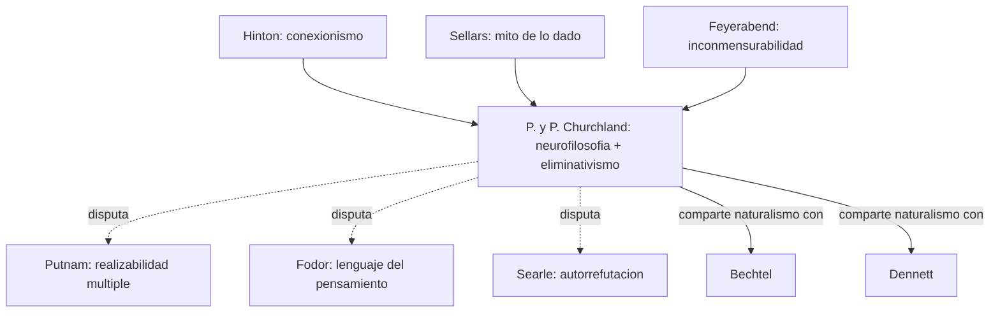

# Patricia y Paul Churchland

> Patricia Smith Churchland (UCSD) y Paul M. Churchland (UCSD). Pareja filosofica fundadora de la **neurofilosofia**. Patricia: *Neurophilosophy* (1986), *Touching a Nerve* (2013), *Conscience* (2019). Paul: *Matter and Consciousness* (1984), *A Neurocomputational Perspective* (1989), *The Engine of Reason, the Seat of the Soul* (1995). En el corpus aparecen explicitamente en el capitulo de **Bickle - The Neurophilosophies of Patricia and Paul Churchland** (`FundamentosYMarco/05_bickle_churchland_y_neurofilosofias.md`).

## Posicion central

Los Churchland defienden el **materialismo eliminativo** y la **neurofilosofia** como programa: la filosofia de la mente debe ser **continua con la neurociencia**, y muchas categorias de la psicologia del sentido comun (creencias, deseos, intenciones tal como las usamos en explicacion folk) pueden no aparecer en la ciencia madura del cerebro. Su programa es **naturalismo radical**: nada de a priorismo cartesiano, nada de autonomia psicologica fuerte (contra Putnam y Fodor), y conexionismo como vehiculo computacional preferido sobre el simbolismo.

## Argumentos clave

1. **Materialismo eliminativo (vs. reductivo)**. La teoria folk de la mente (folk psychology) es una **teoria empirica** sobre el cerebro, y podria resultar **falsa**. Como la astrologia, el flogisto o el calorico, sus terminos podrian no referirse a nada real cuando la teoria madura llegue. Tres razones (las del capitulo de Bickle): (i) explica mal demasiados fenomenos (sueno, memoria, enfermedad mental, aprendizaje), (ii) lleva milenios sin progreso teorico significativo, (iii) la neurociencia conexionista ofrece recursos explicativos radicalmente distintos. Importante: **eliminativismo no es la tesis de que ya se demostro que no hay creencias**, sino una **prediccion programatica**.

2. **Reduccion como relacion entre teorias**. Mas alla del eliminativismo, su aporte mas duradero es **convertir el problema mente-cerebro en un problema de relaciones interteoricas**. La pregunta no es "?la mente es el cerebro?" sino "?como se relacionan las taxonomias psicologicas y las neurobiologicas: por reduccion limpia, revision, reemplazo parcial o inconmensurabilidad?". Esto cambia el terreno del debate.

3. **Conexionismo y representacion como espacio de estados**. Paul Churchland desarrolla una semantica de **espacio de estados**: el significado de un concepto se identifica con su **posicion en un espacio vectorial de actividad neuronal**. Aprender es ajustar la geometria del espacio. Esto enlaza directamente con [[02_hinton|Hinton]] y con vector representations distribuidas. Es una **teoria semantica naturalizada**: el significado emerge del entrenamiento y la conectividad, no de simbolos atomicos.

## Citas y parafrasis del corpus

De `FundamentosYMarco/05_bickle_churchland_y_neurofilosofias.md`: "la psicologia del sentido comun falla al explicar demasiado... casi no ha cambiado desde la Antiguedad... la neurociencia y luego el conexionismo ofrecen recursos explicativos muy distintos." Y: "Eliminativismo no significa que 'ya se demostro' que no hay creencias; significa una prediccion y una propuesta teorica." Y: "lo mas fuerte de los Churchland es la naturalizacion de problemas filosoficos."

## Objeciones principales

- **[[15_putnam|Putnam]] y [[23_fodor|Fodor]]**: la realizabilidad multiple y la autonomia de la psicologia bloquean la reduccion neurocientifica. Los Churchland responden que la "autonomia" es defendida por razones a priori, no empiricas.
- **[[08_searle|Searle]]**: el eliminativismo es **autorrefutante**: si no hay creencias, ?como afirmas la tesis del eliminativismo, que es ella misma una creencia? Los Churchland replican que la objecion presupone justamente lo que esta en disputa.
- **[[12_dennett|Dennett]]**: comparten naturalismo pero Dennett es **mas conservador** (intentional stance preserva el vocabulario folk como predictivamente util).
- **[[01_bechtel|Bechtel]]** y **[[03_mundale|Mundale]]**: aliados en naturalismo pero piden **revision continua** mas que eliminacion.
- **[[05_chalmers|Chalmers]]**: ninguna teoria neurocomputacional, por buena que sea, agota el hard problem; Patricia replica que el hard problem es una intuicion folk a disolver.

## Tabla resumen

| Que postula | Que rechaza | Que evidencia ofrece |
|---|---|---|
| Materialismo eliminativo (folk psych como mala teoria) | Autonomia psicologica; dualismo; hard problem | Estancamiento explicativo de folk psych; conexionismo |
| Reduccion como relacion interteorica | Reduccion clasica tipo-tipo unica | Casos historicos (calorico -> termodinamica) |
| Espacio de estados como semantica neural | Lenguaje del pensamiento simbolico (Fodor) | Modelos PDP, vision computacional, *neurocomputational perspective* |

## Lugar en el debate

## Lecturas del workspace

- `Contenidos/Explicaciones/Temas/FundamentosYMarco/05_bickle_churchland_y_neurofilosofias.md`
- `Contenidos/Explicaciones/Temas/FundamentosYMarco/03_hinton_redes_neuronales.md` (base conexionista)
- PDF: `Contenidos/pdf/3b - Bickle - The Neurophilosophies of Patricia and Paul Churchland.pdf`
- (Lectura externa: P.S. Churchland 1986 *Neurophilosophy*; P.M. Churchland 1981 "Eliminative Materialism and the Propositional Attitudes")

## Vinculos con otros autores del curso

- **[[02_hinton|Hinton]]**: el conexionismo es vehiculo computacional natural del programa.
- **[[01_bechtel|Bechtel]]**, **[[03_mundale|Mundale]]**, **[[04_mandik|Mandik]]**: aliados en naturalismo, divergentes en grado de eliminativismo.
- **[[12_dennett|Dennett]]**: aliado parcial.
- **[[15_putnam|Putnam]]**, **[[23_fodor|Fodor]]**, **[[08_searle|Searle]]**: opositores filosoficos sistematicos.
- **[[14_place_smart|Place y Smart]]**: precursores fisicalistas; los Churchland radicalizan su programa.
- **[[06_tononi|Tononi]]** y **[[07_dehaene|Dehaene]]**: las teorias neurocientificas de conciencia son terreno natural del programa neurofilosofico.
