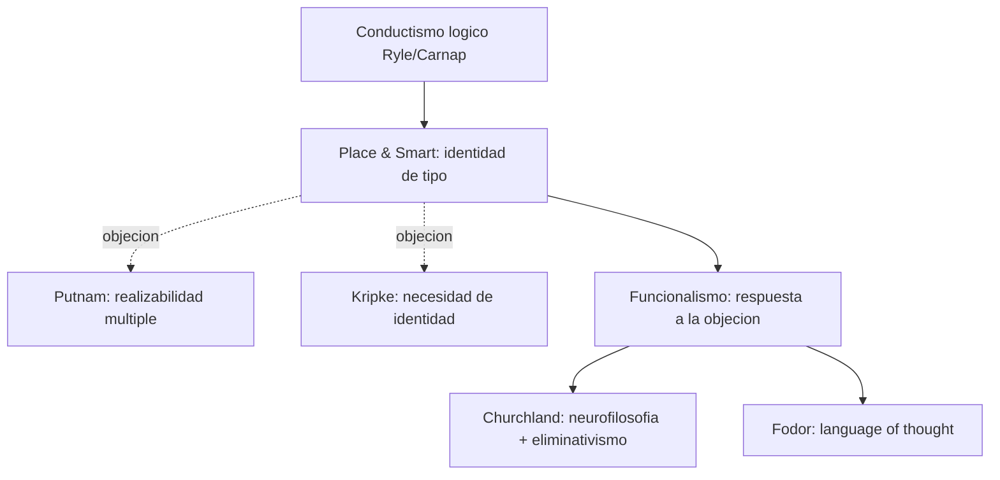

# U.T. Place y J.J.C. Smart

> Ullin Thomas Place (1924-2000) y John Jamieson Carswell Smart (1920-2012). Filosofos australianos. Fundadores de la **teoria de identidad mente-cerebro** (Identity Theory) en los anos 1950. Place: "Is Consciousness a Brain Process?" (1956, *British Journal of Psychology*). Smart: "Sensations and Brain Processes" (1959, *Philosophical Review*). Punto de partida historico ineludible para cualquier discusion materialista contemporanea en filosofia de la mente y de las neurociencias.

## Posicion central

Los estados mentales **son identicos a estados cerebrales** en el sentido en que "el agua es identica a H2O" o "el rayo es identico a una descarga electrica". Es una **identidad de tipo (type-type identity)**: para cada tipo de estado mental hay un tipo de estado fisico-neural con el que se identifica. La identidad es **a posteriori** (descubierta empiricamente por la ciencia) y **necesaria** (no contingente, una vez establecida). No es una mera correlacion: "tener dolor" y "tener fibras-C activadas" no son dos cosas; son **la misma cosa descrita de dos maneras**.

## Argumentos clave

1. **"Is Consciousness a Brain Process?" (Place 1956)**. Place introduce la nocion de **is of composition** (es de composicion) frente al **is of predication** (es de predicacion). Decir "este destello es un proceso cerebral" no es atribuir una propiedad sino afirmar **identidad cientifica**: el destello en cuanto fenomeno mental se compone, en el ultimo analisis, del mismo proceso fisico. Place desactiva la objecion de Descartes (los estados mentales no parecen procesos cerebrales) apelando a que la apariencia introspectiva no agota la naturaleza del referente, igual que la apariencia del agua no agota su naturaleza H2O.

2. **"Sensations and Brain Processes" (Smart 1959)**. Smart amplia el argumento y propone su famoso **topic-neutral analysis**: cuando reporto "tengo una sensacion de algo rojo" el contenido no compromete metafisicamente nada — es topicamente neutral. Lo que sea esa sensacion (cualquier estado interno que normalmente se produce cuando hay algo rojo delante) podria perfectamente ser un proceso cerebral. La objecion de los qualia (Stevens, Bradley) presupone propiedades irreducibles; Smart las disuelve con analisis topic-neutral. Posicion afin al **fisicalismo de tipo** clasico.

3. **Identidad cientifica como modelo de reduccion**. Place y Smart toman casos exitosos de la ciencia (agua = H2O, rayo = descarga, gen = secuencia ADN) como modelo para mente = cerebro. La identidad **se descubre, no se estipula**; se justifica por convergencia de leyes y por el rendimiento explicativo de la teoria fisica.

## Citas y parafrasis del corpus

El corpus no incluye textos directos de Place o Smart pero los presupone como **trasfondo historico**. La discusion de [[15_putnam|Putnam]] sobre realizabilidad multiple (`FundamentosYMarco/01_...`) es precisamente la **objecion clasica** a la identidad de tipo: si el dolor puede realizarse en cerebros humanos, en pulpos y en marcianos, no puede ser identico a un tipo neural especifico. El curso usa este punto para mostrar por que la filosofia de la mente paso del fisicalismo de tipo al funcionalismo (y luego al fisicalismo de instancia).

## Objeciones principales

- **[[15_putnam|Putnam]] - realizabilidad multiple**: si un mismo tipo mental se realiza en sustratos fisicos heterogeneos (cerebros humanos, pulpos, computadoras hipoteticas), no puede haber un tipo fisico unico que lo identifique. Es la objecion estandar contra la identidad tipo-tipo.
- **[[23_fodor|Fodor]]**: las taxonomias psicologicas y neurobiologicas se cruzan, no se identifican. La psicologia tiene autonomia como ciencia especial.
- **Kripke (Naming and Necessity, 1980)**: si la identidad mente = cerebro es a posteriori, debe ser **necesariamente verdadera** si verdadera; pero parece concebible que el dolor exista sin fibras-C activadas. Eso muestra que la identidad falla.
- **[[05_chalmers|Chalmers]]**: ninguna identidad fisicalista de tipo agota la fenomenologia (hard problem).
- **[[12_dennett|Dennett]]** y **[[13_churchland|Churchland]]**: simpatizan con la identidad pero piden refinamientos (funcionalismo + eliminativismo).

## Tabla resumen

| Que postula | Que rechaza | Que evidencia ofrece |
|---|---|---|
| Identidad de tipo: estado mental = estado cerebral | Dualismo cartesiano; conductismo logico | Analogias cientificas (agua = H2O, rayo = descarga) |
| Analisis topic-neutral de los qualia | Qualia como propiedades irreducibles | Disolucion semantica de objecciones folk |
| Reduccion empirica a posteriori | Identidades estipuladas o conceptuales | Modelo de identidades cientificas exitosas |

## Lugar en el debate

## Lecturas del workspace

- `Contenidos/Explicaciones/Temas/FundamentosYMarco/01_bechtel_mandik_mundale_filosofia_y_neurociencias.md` (menciona Putnam y Fodor como objeciones al programa)
- `Contenidos/Explicaciones/Temas/FundamentosYMarco/05_bickle_churchland_y_neurofilosofias.md` (Churchlands como herederos radicales)
- (Lectura externa: Place 1956; Smart 1959; *The Mind-Body Problem* de J. Heil para sintesis)

## Vinculos con otros autores del curso

- **[[15_putnam|Putnam]]**: el critico clasico que motivo el giro al funcionalismo.
- **[[23_fodor|Fodor]]**: defensor de la autonomia psicologica contra el reduccionismo de Place y Smart.
- **[[13_churchland|Churchland]]**: continuadores radicales del programa materialista.
- **[[01_bechtel|Bechtel]]** y **[[03_mundale|Mundale]]**: el manifiesto fundacional contextualiza historicamente esta secuencia (identidad -> funcionalismo -> mecanismos).
- **[[08_searle|Searle]]**: alternativa biologica que rechaza tanto la identidad de tipo como el funcionalismo.
- **[[05_chalmers|Chalmers]]**: el hard problem es respuesta a la insuficiencia explicativa que Place y Smart consideraron resuelta.
