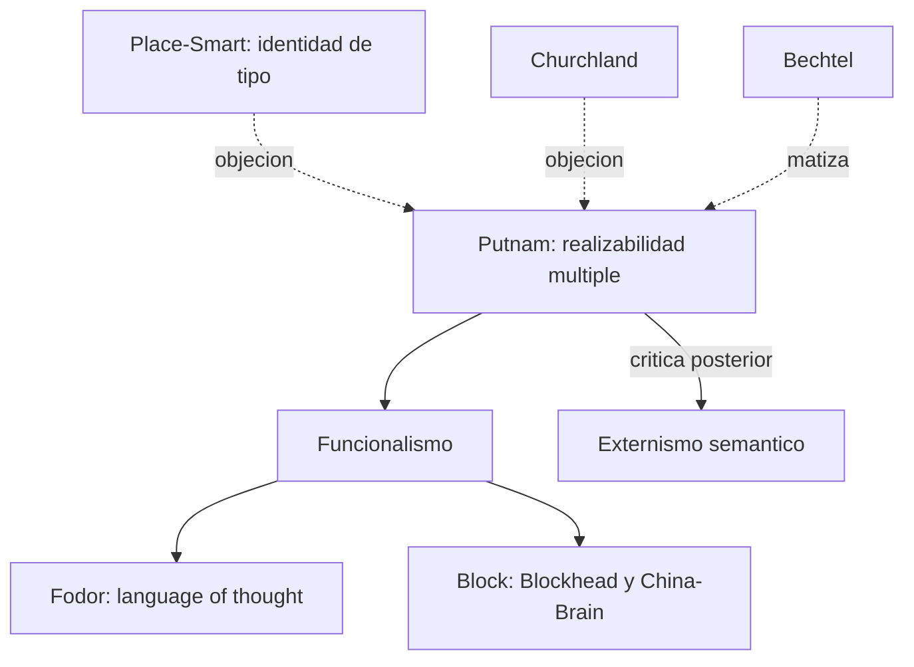

# Hilary Putnam

> Filosofo estadounidense (Harvard, 1926-2016). Autor de *The Nature of Mental States* (1967), *Reason, Truth and History* (1981) y *Representation and Reality* (1988). En el corpus aparece mencionado explicitamente en `FundamentosYMarco/01_bechtel_mandik_mundale_filosofia_y_neurociencias.md` como interlocutor clasico que defendio la realizabilidad multiple y por tanto la autonomia de la psicologia frente a la reduccion neurocientifica.

## Posicion central

Putnam defendio en los anos 1960 el **funcionalismo** computacional como sucesor de la teoria de identidad de [[14_place_smart|Place y Smart]]. La tesis central: los estados mentales se individuan **por su rol funcional** (su relacion causal con inputs, otros estados internos y outputs), no por su composicion fisica. Como diferentes sistemas fisicos pueden realizar el mismo rol funcional, un mismo estado mental es **multiplemente realizable** y no se identifica con ningun tipo de estado fisico-cerebral particular. Mas tarde (decadas de 1980-90) Putnam **se retracto** del funcionalismo computacional clasico y adopto posiciones cada vez mas pluralistas y pragmatistas; pero el argumento de realizabilidad multiple quedo como una de las contribuciones decisivas del siglo XX.

## Argumentos clave

1. **Realizabilidad multiple**. "El dolor" se realiza en cerebros humanos (fibras-C), en cerebros de pulpos (otra arquitectura), y plausiblemente en cualquier sistema con la organizacion funcional adecuada. Si la identidad tipo-tipo de Place y Smart fuese correcta, el dolor seria identico a un tipo neural especifico — pero esto implicaria que un pulpo no puede tener dolor, lo cual es contraintuitivo. Por tanto, los estados mentales son **tipos funcionales** mas abstractos que cualquier tipo fisico unico.

2. **Funcionalismo de la maquina de Turing**. En su formulacion temprana, los estados mentales son **estados de una maquina de Turing probabilista**. Cada estado se define por sus transiciones a otros estados condicionadas por inputs y outputs. Esto da pie a la idea de mente como **software** ejecutandose sobre **hardware neural** (analogia que el propio Putnam termina considerando demasiado simple).

3. **Critica a la propia tesis funcionalista**. En *Representation and Reality* (1988), Putnam argumenta que el funcionalismo computacional no puede dar cuenta de la **referencia semantica** ni del **contenido intencional**: dos sistemas con la misma organizacion funcional pueden, segun el experimento mental de **Tierra Gemela**, tener contenidos mentales diferentes (un terricola y un gemelo en un mundo donde "agua" es XYZ piensan sobre cosas diferentes aunque sus estados funcionales coincidan). Esta autocritica abre el espacio para el externismo semantico (que comparte con Burge).

## Citas y parafrasis del corpus

De `FundamentosYMarco/01_...`: "Putnam defendio la realizabilidad multiple: un mismo estado mental podria realizarse de maneras biologicas diferentes." Y: "con esto se defendia cierta autonomia de la psicologia frente a la reduccion neurocientifica." Este es **el punto de partida** que Bechtel, Mandik y Mundale aceptan como serio pero matizan: la realizabilidad multiple no implica autonomia psicologica absoluta. Es la tension central del manifiesto inaugural del curso.

## Objeciones principales

- **[[13_churchland|Churchland]]**: la realizabilidad multiple es una intuicion empirica, no un argumento a priori. Si la neurociencia descubre que los estados mentales en humanos, pulpos y marcianos son menos parecidos de lo que la psicologia folk supone, la objecion pierde fuerza.
- **[[01_bechtel|Bechtel]] y [[03_mundale|Mundale]]**: aceptan la realizabilidad multiple pero proponen una **descomposicion mecanicista** que la integra: las partes funcionales pueden ser caracterizadas en varios niveles sin renunciar a la neurociencia.
- **Kim (1989, 1992)** y otros: la realizabilidad multiple deja sin explicar la **eficacia causal** de las propiedades mentales (problema de la sobredeterminacion).
- **[[08_searle|Searle]]**: el funcionalismo computacional ignora la intencionalidad intrinseca; la Habitacion China muestra que un programa puede "tener" los estados funcionales correctos sin entender nada.
- **[[02_hinton|Hinton]] y conexionistas**: las representaciones distribuidas borran la separacion limpia hardware/software que el funcionalismo presupone.

## Tabla resumen

| Que postula | Que rechaza | Que evidencia ofrece |
|---|---|---|
| Funcionalismo: rol causal define estado mental | Identidad tipo-tipo (Place-Smart) | Realizabilidad multiple (pulpos, marcianos) |
| Autonomia (al menos parcial) de la psicologia | Reduccionismo neurocientifico fuerte | Diferencia humano vs. animal vs. IA hipotetica |
| Externismo semantico (mas tarde) | Funcionalismo solipsista | Experimento mental Tierra Gemela |

## Lugar en el debate

## Lecturas del workspace

- `Contenidos/Explicaciones/Temas/FundamentosYMarco/01_bechtel_mandik_mundale_filosofia_y_neurociencias.md`
- `Contenidos/Explicaciones/Temas/FundamentosYMarco/05_bickle_churchland_y_neurofilosofias.md`
- PDF: `Contenidos/pdf/1 - Bechtel, Mandik, & Mundale - (2001) Philosophy Meets the Neurosciences.pdf`
- (Lectura externa: Putnam 1967 "The Nature of Mental States"; 1988 *Representation and Reality*)

## Vinculos con otros autores del curso

- **[[14_place_smart|Place y Smart]]**: oponentes directos en la teoria de identidad.
- **[[23_fodor|Fodor]]**: aliado funcionalista; comparten la defensa de la autonomia psicologica.
- **[[01_bechtel|Bechtel]]**, **[[03_mundale|Mundale]]**, **[[04_mandik|Mandik]]**: matizan su tesis sin abandonarla.
- **[[13_churchland|Churchland]]**: oponentes naturalistas que radicalizan el reduccionismo.
- **[[09_block|Block]]**: heredero funcionalista que problematiza el funcionalismo (China-Brain).
- **[[08_searle|Searle]]**: rechaza el funcionalismo por razones de intencionalidad.
