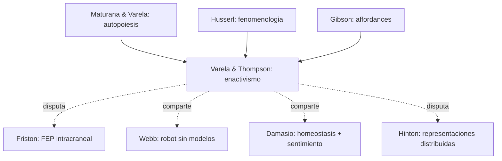

# Francisco Varela y Evan Thompson

> Francisco J. Varela (Chile, 1946-2001): biologo y filosofo, coautor con Maturana de la **autopoiesis**. Evan Thompson (UBC Vancouver): filosofo, alumno y continuador de Varela. Junto con Eleanor Rosch publicaron *The Embodied Mind* (1991), texto fundacional del **enactivismo**. Thompson amplio el programa en *Mind in Life* (2007) y *Waking, Dreaming, Being* (2014). En el corpus, su enfoque enactivo es referencia transversal para conceptos de cognicion encarnada, autonomia biologica y la version "wilded" del cerebro predictivo.

## Posicion central

La cognicion no es **procesamiento de informacion** representacional, ni se ubica solo "dentro del cerebro". La cognicion es **enaccion**: la actividad de un organismo autopoietico que **hace emerger un mundo de significado** (Umwelt) a traves de su **acoplamiento estructural** con el entorno. Mente, vida y cuerpo son inseparables: **donde hay vida hay mente** (continuidad mente-vida). La conciencia subjetiva, las emociones y la cognicion superior emergen del organismo entero acoplado con el medio social, no de circuitos neurales aislados.

## Argumentos clave

1. **Autopoiesis y autonomia biologica**. Un sistema autopoietico (Maturana y Varela 1972) **se produce a si mismo**: sus componentes y procesos generan los componentes y procesos que los sostienen. La celula es el caso paradigmatico. La cognicion comienza con autopoiesis: un organismo autonomo establece una **distincion** entre si y entorno, y a partir de esa distincion **construye sentido** (sense-making). Esto desplaza el problema de la cognicion del cerebro al **organismo vivo**.

2. **Enaccion: cognicion como accion encarnada**. La percepcion no es recuperacion de informacion del mundo, es **accion sensoriomotor guiada**: lo que veo depende de lo que puedo hacer (affordances de Gibson, sensorimotor contingencies de O'Regan y Noe). Thompson extiende el programa: la cognicion es **continua con la vida** y la conciencia se construye desde abajo, anidando autopoiesis celular, regulacion homeostatica, comportamiento sensoriomotor, intersubjetividad y narracion.

3. **Neurofenomenologia**. Varela propuso (1996) la **neurofenomenologia** como metodo para abordar el hard problem: combinar disciplinadamente reportes en primera persona (fenomenologia husserliana, meditacion mindfulness) con registros neurodinamicos en tercera persona. No reduccion ni dualismo, sino **mutual constraints** entre ambos niveles. Es una respuesta metodologica que comparte territorio con [[10_friston|Friston]] (modelos generativos), pero rechaza el bayesianismo intracraneal.

## Citas y parafrasis del corpus

El corpus discute el **cerebro predictivo encarnado** en `ConcienciaAgenciaYModelos/02_nave_cerebro_predictivo.md`: "el cuerpo y el entorno no son anexos, sino parte del modelo". Esto resuena con enactivismo, aunque Nave et al. lo enmarcan en active inference. Tambien `15b - Webb - (1996) A Cricket Robot.pdf` ilustra el espiritu enactivista: una conducta inteligente (fonotaxis) emerge sin representacion interna ni modelo bayesiano, solo por **acoplamiento sensoriomotor**.

## Objeciones principales

- **[[10_friston|Friston]] y predictivistas**: el enactivismo es atractivo pero **no formaliza**. El FEP puede absorber la enaccion como caso de inferencia activa con modelos minimos.
- **[[01_bechtel|Bechtel]]**: las representaciones son utiles incluso bajo enactivismo; no hace falta eliminarlas.
- **[[12_dennett|Dennett]]**: comparte la critica al Cartesian Theater pero no acepta la continuidad mente-vida como tesis metafisica fuerte.
- **[[13_churchland|Churchland]]**: el enactivismo respeta poco la neurociencia detallada; la cognicion "se produce" en cerebros reales, no flota en el organismo entero.
- **Reduccionistas en general**: la apelacion a primera persona via fenomenologia introduce problemas metodologicos.

## Tabla resumen

| Que postula | Que rechaza | Que evidencia ofrece |
|---|---|---|
| Autopoiesis como base de la cognicion | Computacionalismo y representacionalismo clasico | Biologia celular; comportamiento de unicelulares |
| Enaccion: percepcion = accion sensoriomotor | Vision como inferencia bayesiana intracraneal | Experimentos con sensores tactiles para ciegos (TVSS), grilo robot |
| Neurofenomenologia (1ra + 3ra persona) | Reduccion fisicalista; dualismo cartesiano | EEG + reportes meditativos; estudios en epilepsia |

## Lugar en el debate

## Lecturas del workspace

- `Contenidos/Explicaciones/Temas/ConcienciaAgenciaYModelos/02_nave_cerebro_predictivo.md`
- `Contenidos/Explicaciones/Temas/ConcienciaAgenciaYModelos/03_webb_grillo_robot.md`
- `Contenidos/Explicaciones/Temas/VisualizacionesYModelos/08_cerebro_predictivo_y_formalizacion.md`
- PDF: `Contenidos/pdf/15b - Webb - (1996) A Cricket Robot.pdf` (ilustracion clasica de cognicion sin representacion)
- (Lectura externa: Varela, Thompson & Rosch 1991 *The Embodied Mind*; Thompson 2007 *Mind in Life*)

## Vinculos con otros autores del curso

- **[[10_friston|Friston]]**: rivalidad amistosa entre enactivismo y predictivismo.
- **[[11_damasio|Damasio]]**: aliado en mente encarnada y continuidad con homeostasis.
- **[[01_bechtel|Bechtel]]**: representacionista moderado; interlocutor para discutir si las representaciones son necesarias.
- **[[02_hinton|Hinton]]**: oponente teorico sobre representaciones distribuidas.
- **[[05_chalmers|Chalmers]]**: la neurofenomenologia es una respuesta metodologica al hard problem.
- **Webb (cricket robot)**: aliado conceptual aunque mas pragmatico.
