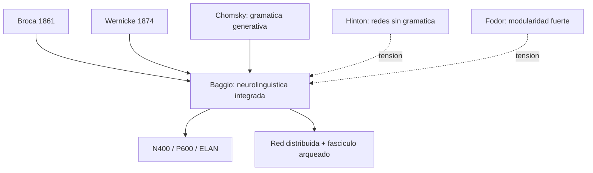

# Giosue Baggio

> Neurolinguista italiano, Norwegian University of Science and Technology. Autor de *Neurolinguistics* (2022, Cambridge University Press, Elements in Linguistics). En el corpus es la referencia obligada para el bloque de **lenguaje** (`Lenguaje/01_baggio_neurolinguistica.md`, PDF `8a - Baggio - (2022) Neurolinguistics`).

## Posicion central

La neurolinguistica debe estudiar el lenguaje atendiendo **simultaneamente al tiempo y al espacio del procesamiento cerebral**, y siempre en **dialogo con la linguistica teorica**. Sin teoria linguistica no se sabe **que** se intenta mapear; sin neurociencia no se sabe **donde, cuando ni como** ocurre el procesamiento. Baggio rechaza tanto el localizacionismo ingenuo (un area = una funcion) como el reduccionismo computacional ciego (el cerebro como caja negra que ejecuta un parser). La neurolinguistica es una **disciplina puente** que requiere triangulacion permanente.

## Argumentos clave

1. **Tres hitos historicos del campo**. (i) **Broca** (1861) y la lesion frontal asociada al habla productiva — origen del localizacionismo del lenguaje. (ii) **Chomsky** (1957, 1965) y la idea del lenguaje como **sistema computacional** con sintaxis generativa autonoma — origen del programa cognitivista. (iii) Las **tecnologias de medicion in vivo** (EEG, MEG, ERPs como N400 y P600; fMRI; intracraneal) y el **analisis computacional masivo** — origen de la neurolinguistica contemporanea.

2. **Tiempo importa tanto como espacio**. El lenguaje desplegado en ms requiere tecnicas de alta resolucion temporal (EEG, MEG). El **N400** marca anomalias semanticas (~400 ms post-estimulo). El **P600** marca anomalias sintacticas o reanalisis (~600 ms). El **ELAN** (early left anterior negativity) marca violaciones de categoria sintactica tempranas (~150 ms). Estos componentes muestran que el cerebro procesa lenguaje en **fases jerarquicas y temporalmente disociables**, no como un bloque unico.

3. **Red distribuida en lugar de "el area del lenguaje"**. El procesamiento linguistico recluta una red que incluye **giro frontal inferior izquierdo** (Broca, BA 44/45 + 47), **lobulo temporal superior y medio** (Wernicke clasico, areas de comprension lexica y semantica), **gyrus angular**, **fasciculo arqueado** (lesionado en afasias de conduccion), areas subcorticales (talamo, ganglios basales) y conexion cerebelosa. La afasia de Broca o de Wernicke no es solo cuestion de localizacion sino de **dano a la red y sus conexiones**.

## Citas y parafrasis del corpus

De `Lenguaje/01_baggio_neurolinguistica.md`: "Baggio insiste en que para estudiar como el cerebro procesa lenguaje hace falta saber tambien que estructuras linguisticas estan en juego: sonido, gramatica, significado." Y: "esto es muy importante para la materia porque evita una vision simplista donde el lenguaje quedaria encerrado en un punto del cerebro." El texto del corpus subraya el triple punto: la neurolinguistica no es solo localizacion, importa el tiempo del procesamiento, y la linguistica teorica es necesaria.

## Objeciones principales

- **Localizacionistas tradicionales (post-Broca, post-Wernicke)**: pueden objetar que la insistencia en redes diluye el valor explicativo de los grandes hallazgos clinicos. Baggio responde que las redes y la localizacion son **complementarias**, no opuestas.
- **Conexionistas radicales ([[02_hinton|Hinton]])**: el lenguaje emerge de redes sin gramatica explicita; la linguistica teorica chomskyana no seria necesaria. Baggio insiste en que **necesitamos categorias formales** (sintagma, fonema, rasgo) para interpretar los datos cerebrales.
- **Lenguaje encarnado (Lakoff, Glenberg)**: la semantica esta corporizada; las areas motoras se activan al leer verbos de accion. Baggio acepta el dato pero matiza: no toda semantica es motor-tangible.
- **[[23_fodor|Fodor]]**: defiende modularidad fuerte; Baggio prefiere modularidad **flexible y conectada**.

## Tabla resumen

| Que postula | Que rechaza | Que evidencia ofrece |
|---|---|---|
| Neurolinguistica como triangulacion | Localizacionismo ingenuo; reduccionismo ciego | EEG, MEG, fMRI, lesiones; componentes N400, P600, ELAN |
| Tiempo y espacio del procesamiento | Lenguaje en "un area" | Disociacion temporal de procesos semanticos y sintacticos |
| Red distribuida con nodos especializados | Modulo unico Broca/Wernicke | Afasias de conduccion, lesiones subcorticales, fasciculo arqueado |

## Lugar en el debate

## Lecturas del workspace

- `Contenidos/Explicaciones/Temas/Lenguaje/01_baggio_neurolinguistica.md`
- `Contenidos/Explicaciones/Temas/VisualizacionesYModelos/05_lenguaje_y_arquitecturas.md`
- PDF: `Contenidos/pdf/8a - Baggio - (2022) Neurolinguistics (pp. 13-25, 37-47).pdf`
- Complementario: `Contenidos/pdf/8b - Hickok et al. - (2001) Sign Language in the Brain.pdf` (lengua de senas y organizacion cerebral)

## Vinculos con otros autores del curso

- **Hickok, Bellugi y Klima (8b)**: muestran que la lengua de senas es lenguaje pleno con organizacion cerebral comparable.
- **[[20_zeki|Zeki]]** y **[[21_raichle|Raichle]]**: aportes generales sobre especializacion y neuroimagen funcional.
- **[[01_bechtel|Bechtel]]**: la critica epistemologica a la evidencia aplica directamente a estudios de lenguaje.
- **[[19_miller_cummings|Miller y Cummings]]**: lobulos frontales y lenguaje (Broca historico).
- **[[02_hinton|Hinton]]**: el debate sobre representaciones distribuidas vs. simbolicas vuelve en lenguaje.
- **[[18_ramirez_bermudez|Ramirez-Bermudez]]**: afasias y trastornos del lenguaje como constructos neuropsiquiatricos.
