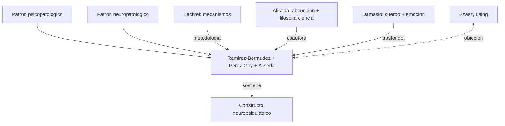

# Jesus Ramirez-Bermudez (con Perez-Gay y Aliseda)

> Neuropsiquiatra mexicano (Instituto Nacional de Neurologia y Neurocirugia, UNAM), novelista, ensayista. Coautor con Fernanda Perez-Gay y la filosofa de la ciencia Atocha Aliseda del articulo *"Neuropsychiatric Constructs as Bridges between Psychopathology and Neuropathology: A Medical Perspective"* (2024). En el corpus es referente del bloque `EmocionInterocepcionYNeuropsiquiatria/`.

## Posicion central

Los **constructos neuropsiquiatricos** funcionan como **puentes epistemicos** entre dos dominios que la tradicion medica del siglo XX separo artificialmente: la **psicopatologia** (sintomas y experiencias vinculadas a conducta y vida subjetiva) y la **neuropatologia** (alteraciones neurobiologicas demostrables). Ni se identifican (no toda psicopatologia tiene neuropatologia conocida, ni viceversa) ni son mundos independientes: existen casos donde se establece una **relacion causal significativa** que justifica un constructo unificado. Neuropsiquiatria es el espacio clinico-teorico de esos puentes.

## Argumentos clave

1. **Tres condiciones de un constructo neuropsiquiatrico**. (i) un **patron psicopatologico identificable** (sindromico, fenomenologico), (ii) un **patron neuropatologico identificable** (lesional, funcional, metabolico, molecular), (iii) una **relacion significativa** entre ambos, sostenida por evidencia (epidemiologica, mecanistica o longitudinal). Esto convierte al constructo en una **hipotesis medica progresiva**, no en una esencia cerrada. Ejemplos paradigmaticos: delirium, demencia frontotemporal, encefalitis anti-NMDAR, sindromes neuropsiquiatricos del lupus, trastornos del sueno REM ligados a synucleinopatias.

2. **Distinguir niveles: enfermedad, trastorno, signo, sintoma, sindrome**. Antes de proponer constructos hay que aclarar el vocabulario medico. Una **enfermedad** tiene etiologia, fisiopatologia y curso conocidos; un **trastorno** es un patron clinico sin etiologia plena; un **sindrome** es una asociacion estable de signos y sintomas. Los autores muestran que muchas categorias del DSM o ICD son **sindromes** o trastornos, no enfermedades, y por tanto admiten **revision** mas profunda.

3. **Tres estrategias para establecer relaciones**. (i) **Epidemiologia clinica** (correlaciones poblacionales entre fenotipo psicopatologico y marcador neural), (ii) **Neurociencia clinica con modelo mecanicista** (lesion o intervencion molecular -> sintoma, al estilo del programa mecanicista de [[01_bechtel|Bechtel]]), (iii) **Seguimiento longitudinal de casos** (trayectoria individual que ata patrones psicopatologicos y neuropatologicos en el tiempo). Cada estrategia tiene fortalezas y limites, y la mejor evidencia combina las tres.

## Citas y parafrasis del corpus

De `EmocionInterocepcionYNeuropsiquiatria/04_ramirez_bermudez_constructos_neuropsiquiatricos.md`: "Los constructos neuropsiquiatricos son puentes entre patrones psicopatologicos y patrones neuropatologicos. Neurologia y psiquiatria no deben tratarse como mundos completamente separados." Y: "muchas categorias clinicas no son esencias totalmente cerradas, sino hipotesis medicas progresivas." Y: "muy util para discutir biomarcadores y diagnostico."

## Objeciones principales

- **Anti-psiquiatria fuerte (Szasz, Laing)**: la psiquiatria patologiza experiencia humana; el "constructo" sigue siendo construccion social. Los autores responden que la **falsabilidad clinica** y la **respuesta a intervenciones** distinguen un constructo de una mera etiqueta.
- **Reduccionistas neurobiologicos**: la psicopatologia se subsumira en neuropatologia. Los autores defienden la **autonomia parcial** del nivel fenomenologico (similar a la matizacion de [[15_putnam|Putnam]] frente a [[14_place_smart|Place y Smart]]).
- **Operacionalismo del DSM**: el manual define trastornos por criterios observables sin pretension causal. Los autores piden ir mas alla del operacionalismo hacia mecanismos.
- **[[13_churchland|Patricia Churchland]]**: simpatiza con el naturalismo pero pediria mayor rigor sobre el estatus de las "experiencias" psicopatologicas (folk psychology a revisar).

## Tabla resumen

| Que postula | Que rechaza | Que evidencia ofrece |
|---|---|---|
| Constructos como puentes (psico- + neuropatologia + relacion) | Separacion total neurologia/psiquiatria | Delirium, demencia FT, encefalitis anti-NMDAR |
| Categorias clinicas como hipotesis progresivas | Esencialismo nosologico | Cambios historicos en DSM/ICD; sindromes "moviles" |
| Triple estrategia: epidemio + mecanismo + longitudinal | Confiar en una sola via | Casos en que las tres convergen (ej. CTE en boxeadores) |

## Lugar en el debate

## Lecturas del workspace

- `Contenidos/Explicaciones/Temas/EmocionInterocepcionYNeuropsiquiatria/04_ramirez_bermudez_constructos_neuropsiquiatricos.md`
- `Contenidos/Explicaciones/Temas/EmocionInterocepcionYNeuropsiquiatria/00_indice.md`
- `Contenidos/Explicaciones/Temas/EmocionInterocepcionYNeuropsiquiatria/03_barrett_emocion_y_enfermedad.md` (interocepcion + enfermedad)
- PDF: `Contenidos/pdf/5a - Ramírez-Bermúdez, Pérez-Gay, & Aliseda - (2024) Neuropsychiatric Constructs.pdf`

## Vinculos con otros autores del curso

- **[[01_bechtel|Bechtel]]**: el programa mecanicista es metodologia central de la "neurociencia clinica con modelo mecanicista".
- **[[11_damasio|Damasio]]**: marcadores somaticos como ejemplo de constructo neuropsiquiatrico bien formado (VMPC + conducta).
- **[[22_ledoux|LeDoux]]**: amigdala y trastornos de ansiedad como constructo.
- **[[19_miller_cummings|Miller y Cummings]]**: sindromes frontales son ejemplos paradigmaticos.
- **[[18_ramirez_bermudez|Aliseda (coautora)]]**: aporta filosofia de la ciencia y logica de la abduccion al programa.
- **[[15_putnam|Putnam]]**: autonomia psicologica matizada conecta con autonomia de la fenomenologia psicopatologica.
