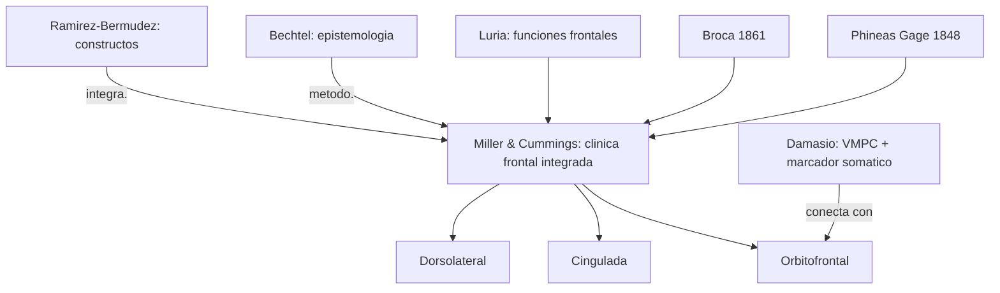

# Bruce L. Miller y Jeffrey L. Cummings

> Bruce L. Miller (UCSF Memory and Aging Center) y Jeffrey L. Cummings (Cleveland Clinic Lou Ruvo Center). Editores y autores del clasico *The Human Frontal Lobes: Functions and Disorders* (Guilford, 3a ed. 2017; capitulo introductorio 2018). Referencia clinica e historica obligada del bloque `FuncionesEjecutivasYLobulosFrontales/` del curso.

## Posicion central

Los **lobulos frontales** son decisivos para conducta compleja, cognicion social, control, motivacion y organizacion del comportamiento, pero su estudio fue **tardio y dificil** porque sus funciones no se revelan en pruebas estandar y sus sintomas se confunden con cuadros psiquiatricos. Miller y Cummings construyen una **historia integrada** y una **clinica diferencial** que articula neurologia y psiquiatria, en linea con el espiritu de los constructos de [[18_ramirez_bermudez|Ramirez-Bermudez]]. Defienden una **division funcional tripartita** de la corteza prefrontal — orbitofrontal, cingulada anterior, dorsolateral — como esquema heuristico, sin pretender que agote la complejidad.

## Argumentos clave

1. **Historia tardia y problematica del campo**. El estudio del lobulo frontal arranca con **Phineas Gage** (1848, lesion orbitofrontal por barra de hierro, cambio de personalidad sin deficit cognitivo aparente) y con **Broca** (1861, afasia frontal izquierda). Pero durante decadas la "silent area" frontal parecio sin funcion clara. La separacion institucional entre **psiquiatria y neurologia** retraso el reconocimiento clinico. Recien con **Penfield, Yakovlev, Luria, Geschwind y Benson** (decadas de 1940-70) el lobulo frontal se reconoce como **organizador de la conducta**, no solo de lenguaje y motor.

2. **Tres divisiones funcionales clasicas de la corteza prefrontal**.
   - **Orbitofrontal (OFC)**: control inhibitorio, regulacion emocional, juicio social, valoracion de recompensa. Lesion: desinhibicion, conducta socialmente inapropiada, impulsividad. Caso paradigmatico: Phineas Gage. Articula con [[11_damasio|Damasio]] (marcadores somaticos, VMPC).
   - **Cingulada anterior (ACC)**: motivacion, monitoreo de conflicto, atencion sostenida. Lesion: apatia, mutismo akinetico, abulia.
   - **Dorsolateral (DLPFC)**: funciones ejecutivas "frias", memoria de trabajo, planificacion, flexibilidad cognitiva. Lesion: sindrome disejecutivo, perseveracion (test de Wisconsin), dificultad en planificacion (Tower of London).

3. **Fenomenologia clinica como fuente de evidencia**. Miller y Cummings insisten en que las pruebas neuropsicologicas formales **no capturan** muchas de las alteraciones frontales mas significativas (confabulacion, anosognosia, conducta antisocial adquirida, perdida de empatia). La observacion clinica directa y los relatos de familiares son evidencia central. Esto es relevante metodologicamente: complementa la critica epistemologica de [[01_bechtel|Bechtel]] (ninguna tecnica basta por si sola).

## Citas y parafrasis del corpus

De `FuncionesEjecutivasYLobulosFrontales/02_miller_cummings_lobulos_frontales.md`: "Phineas Gage y Broca marcan un comienzo, pero durante mucho tiempo los lobulos frontales siguieron siendo poco comprendidos. La separacion entre psiquiatria y neurologia contribuyo a ese retraso." Y: "los frontales no son solo 'inteligencia'; involucran conducta social y monitoreo." Y: "la idea de grandes divisiones funcionales en corteza prefrontal: orbitofrontal, cingulada y dorsolateral. Esa triparticion ayudo a organizar sintomas y funciones, aunque no resuelve toda la complejidad del sistema frontal."

## Objeciones principales

- **Anti-localizacionistas y conectivistas modernos**: las funciones ejecutivas dependen de **redes distribuidas** (red ejecutiva central, default mode network de Raichle, salience network) que cruzan las tres divisiones. Miller y Cummings aceptan; la triparticion es heuristica.
- **[[03_mundale|Mundale]]**: la cartografia frontal ilustra el problema multicriterio — citoarquitectura (Brodmann 9, 10, 11, 24, 32, 46), conectividad y funcion no siempre se alinean.
- **Operacionalistas neuropsicologicos**: defenderan tests cuantificables (Wisconsin Card Sorting, Stroop, Iowa Gambling) por encima de la clinica fenomenologica. Miller y Cummings responden que ambos son necesarios.
- **[[13_churchland|Churchland]]**: simpatiza con el naturalismo pero pediria revision de categorias como "conducta social" o "personalidad".

## Tabla resumen

| Que postula | Que rechaza | Que evidencia ofrece |
|---|---|---|
| Lobulos frontales como organizadores de conducta compleja | Frontal como "sede de la inteligencia" abstracta | Phineas Gage; demencia frontotemporal; lesion balistica |
| Triparticion OFC / ACC / DLPFC | Vision monolitica del prefrontal | Patrones clinicos diferenciados |
| Clinica fenomenologica como evidencia central | Sola dependencia de tests estandar | Reportes familiares, observacion en consulta, demencia FT |

## Lugar en el debate

## Lecturas del workspace

- `Contenidos/Explicaciones/Temas/FuncionesEjecutivasYLobulosFrontales/02_miller_cummings_lobulos_frontales.md`
- `Contenidos/Explicaciones/Temas/FuncionesEjecutivasYLobulosFrontales/01_suchy_funciones_ejecutivas.md` (lectura previa complementaria)
- PDF: `Contenidos/pdf/12b - Miller & Cummings - (2018) The Human Frontal Lobes. An Introduction.pdf`
- Complementario: `Contenidos/pdf/12a - Suchy - (2023) _Neuroscience of Executive Functioning_.pdf`

## Vinculos con otros autores del curso

- **[[11_damasio|Damasio]]**: VMPC y marcadores somaticos son piezas centrales del cuadro orbitofrontal.
- **[[01_bechtel|Bechtel]]**: la epistemologia de la evidencia se ilustra perfectamente en estudios frontales (lesion, fMRI, neuropsicologia).
- **[[03_mundale|Mundale]]**: cartografia frontal multicriterio.
- **[[18_ramirez_bermudez|Ramirez-Bermudez]]**: sindromes frontales como constructos neuropsiquiatricos.
- **[[17_baggio|Baggio]]**: Broca y afasia conectan lobulo frontal y lenguaje.
- **[[22_ledoux|LeDoux]]**: regulacion descendente OFC -> amigdala en el miedo.
- **[[12_dennett|Dennett]]** y **[[16_varela_thompson|Varela y Thompson]]**: la agencia y el control intencional necesitan apoyarse en clinica frontal.
