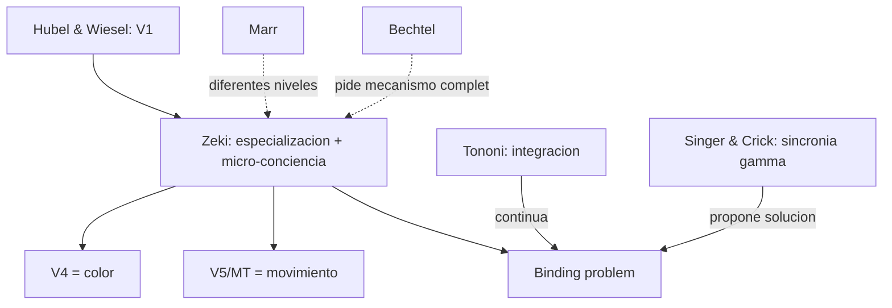

# Semir Zeki

> Neurobiologo britanico (UCL), pionero en el estudio de la corteza visual y de la **especializacion funcional**. Autor del articulo *"The Visual Image in Mind and Brain"* (*Scientific American*, 1992) y de obras como *A Vision of the Brain* (1993) e *Inner Vision* (1999). Referencia central del bloque `PercepcionYVision/` y de la pregunta sobre construccion de la experiencia visual.

## Posicion central

La vision **no se procesa en un unico centro**. Distintas areas de la corteza visual de primates se especializan en atributos diferentes (color, movimiento, forma, orientacion, profundidad), funcionan en **paralelo** y solo despues se integran en una experiencia visual unificada. La experiencia perceptual coherente es **resultado** de procesos distribuidos y temporalmente disociables, no un dato bruto. Esto tiene consecuencias filosoficas: complica la intuicion ingenua de la percepcion directa y plantea el **binding problem** (como se unifican atributos procesados por separado).

## Argumentos clave

1. **Especializacion funcional documentada anatomica y fisiologicamente**. Zeki, partiendo del trabajo de **Hubel y Wiesel** sobre V1, identifico que la corteza visual extraestriada tiene multiples areas con preferencias selectivas. **V4** se especializa en **color** (Zeki 1973-83): neuronas que responden a longitudes de onda independientemente de la iluminacion. **V5/MT** se especializa en **movimiento**: neuronas selectivas a direccion y velocidad. Areas occipito-temporales se especializan en **forma**. La via dorsal ("where/how") y ventral ("what") de Ungerleider y Mishkin amplian el cuadro.

2. **Evidencia lesional: disociaciones**. **Acromatopsia cerebral** (perdida selectiva de color por lesion V4, percepcion del mundo en escala de grises pese a retina intacta) y **akinetopsia** (perdida selectiva de percepcion de movimiento por lesion V5/MT, caso L.M. de Zihl, von Cramon & Mai 1983: ve el mundo como una secuencia de fotografias estaticas) son **disociaciones dobles** que confirman especializacion funcional. La acromatopsia respeta movimiento y forma; la akinetopsia respeta color y forma.

3. **Binding problem y micro-conciencia**. Si cada atributo se procesa en una via distinta, ?como se experimenta un objeto unificado en movimiento y a color? Zeki propone la nocion radical de **micro-conciencias multiples**: cada modulo visual generaria su propia "micro-conciencia" del atributo que procesa, y la conciencia visual seria una **federacion temporalmente alineada**. Esta tesis se vincula con [[09_block|Block]] (P-conciencia distribuida), [[06_tononi|Tononi]] (integracion) y la teoria de **temporal binding** por sincronia gamma de Singer y Crick.

## Citas y parafrasis del corpus

De `PercepcionYVision/02_zeki_imagen_visual_mente_y_cerebro.md`: "la vision no se procesa en un unico centro. Distintas areas de la corteza visual se especializan en atributos como color, movimiento, forma u orientacion." Y: "el valor filosofico del texto esta en que complica la intuicion de una percepcion unitaria y directa. Si el cerebro trata por separado tantas dimensiones del mundo visible, entonces la experiencia visual coherente es el resultado de una integracion, no un dato bruto."

## Objeciones principales

- **Marr (Vision, 1982)**: el cerebro construye representaciones de tres niveles (computacional, algoritmico, implementacional). La especializacion zekiana es solo un aspecto del nivel implementacional; lo computacional es comun.
- **[[02_hinton|Hinton]] y conexionismo**: las representaciones distribuidas borran lineas claras entre areas; la especializacion es gradiente, no modularidad estricta.
- **[[01_bechtel|Bechtel]]**: la especializacion funcional es solo el primer paso; falta describir el **mecanismo** y la integracion. Zeki aporta la decomposicion pero no completa la explicacion mecanicista.
- **Anti-modularistas**: la especializacion es relativa al diseno experimental; con estimulos naturales las areas responden a multiples atributos.
- **[[05_chalmers|Chalmers]]**: ni la micro-conciencia ni la sincronia gamma resuelven por que cualquiera de esas activaciones es subjetivamente experimentada (hard problem).

## Tabla resumen

| Que postula | Que rechaza | Que evidencia ofrece |
|---|---|---|
| Especializacion funcional en areas visuales | Vision como procesamiento serial unitario | V4 = color; V5/MT = movimiento; via dorsal vs. ventral |
| Procesamiento paralelo y disociable | Una unica "imagen" cortical | Acromatopsia, akinetopsia, prosopagnosia |
| Micro-conciencia multiple + binding por sincronia | Conciencia visual centralizada | Sincronia gamma (Singer, Crick) |

## Lugar en el debate

## Lecturas del workspace

- `Contenidos/Explicaciones/Temas/PercepcionYVision/02_zeki_imagen_visual_mente_y_cerebro.md`
- `Contenidos/Explicaciones/Temas/PercepcionYVision/01_trivino_mosquera_vision.md` (base anatomica en espanol)
- `Contenidos/Explicaciones/Temas/VisualizacionesYModelos/03_vision_y_representacion_visual.md`
- PDF: `Contenidos/pdf/6b - Zeki - (1992) The Visual Image in Mind and Brain.pdf`
- Complementario: `Contenidos/pdf/6a - Triviño-Mosquera et al. - Visión.pdf`

## Vinculos con otros autores del curso

- **[[01_bechtel|Bechtel]]**: la especializacion zekiana es input para la explicacion mecanicista; Bechtel pide ir mas lejos.
- **[[03_mundale|Mundale]]**: cartografia visual multicriterio (citoarquitectura + funcion + lesion).
- **[[21_raichle|Raichle]]**: la neuroimagen funcional confirma especializaciones zekianas en humanos vivos.
- **[[02_hinton|Hinton]]**: representaciones distribuidas como modelo computacional.
- **[[06_tononi|Tononi]]** y **[[09_block|Block]]**: el binding problem conecta con teorias de la conciencia.
- **[[05_chalmers|Chalmers]]**: la fenomenologia visual unificada sigue siendo desafio para el hard problem.
