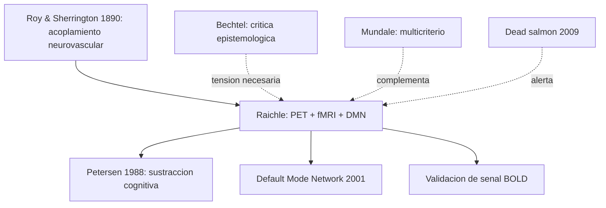

# Marcus E. Raichle

> Neurologo y neurocientifico estadounidense (Washington University in St. Louis). Pionero del **PET cognitivo** y descubridor (con Shulman, Snyder, Powers, Gusnard) del **default mode network (DMN)**. Autor del articulo *"Visualizing the Mind"* (*Scientific American*, 1994), texto central del bloque `MetodosYEvidencia/` del curso. Su trabajo definio el estandar metodologico de la neuroimagen funcional contemporanea.

## Posicion central

La neuroimagen funcional (PET, fMRI) permite **asociar cambios de actividad cerebral con tareas cognitivas** y, por tanto, pasar de una neurociencia de la **estructura** a una de la **funcion in vivo**. Pero la imagen **no muestra el pensamiento directamente**: lo que se ve es una **senal fisiologica indirecta** (flujo sanguineo, metabolismo de oxigeno, glucosa) que se interpreta a traves de un **diseno experimental** (sustraccion de condiciones, promediado, contrastes estadisticos). La validez del resultado depende del diseno, no de la imagen en si misma.

## Argumentos clave

1. **Acoplamiento neurovascular como base de la neuroimagen**. La actividad neuronal local provoca cambios en flujo sanguineo cerebral regional (rCBF) y en metabolismo. PET mide rCBF con O15 marcado y metabolismo con FDG; fMRI mide la senal **BOLD** (Blood Oxygen Level Dependent) que aprovecha el cambio en proporcion oxihemoglobina/desoxihemoglobina. **La senal es indirecta**: refleja consumo metabolico ligado a procesamiento, no spikes directamente. El acoplamiento neurovascular es robusto pero no perfecto (problemas en astrocitos, vasos enfermos, anestesia).

2. **Sustraccion cognitiva**. El metodo paradigmatico de Raichle, Petersen y colaboradores: comparar un estado de **tarea** con un estado de **control** que comparte todo menos el proceso de interes; la diferencia revela el correlato neural. Ejemplo clasico (Petersen et al. 1988): leer palabras vs. ver pseudopalabras vs. mirar puntos de fijacion permite aislar areas para procesamiento ortografico, fonologico y semantico. La sustraccion **presupone aditividad pura** (que las areas de la tarea suman su activacion a la del control), supuesto que [[01_bechtel|Bechtel]] critica como sobreidealizado.

3. **Descubrimiento del default mode network (DMN)**. Raichle observo que ciertas areas (corteza prefrontal medial, precuneo, corteza cingulada posterior, lobulo parietal inferior) estaban **mas activas en reposo** que durante tareas exigentes — opuesto a lo que se esperaba. Esto identifico un **modo por defecto** del cerebro asociado a mente errante, autorreferencia, memoria autobiografica y simulacion del futuro (Raichle et al. 2001; Buckner et al. 2008). El DMN se altera en Alzheimer, depresion y esquizofrenia, lo cual lo convirtio en un **fenotipo de imagen** clinicamente relevante.

## Citas y parafrasis del corpus

De `MetodosYEvidencia/02_raichle_visualizando_la_mente.md`: "las tecnicas de imagen funcional permiten asociar cambios de actividad cerebral con tareas cognitivas, pero esos resultados dependen de comparaciones experimentales e interpretaciones cuidadosas." Y: "la imagen no 'muestra' el pensamiento de forma directa. Muestra una senal fisiologica interpretada a traves de un diseño experimental." Y: "PET y fMRI permiten pasar de estructura a funcion. La imagen funcional compara estados, no fotografias de ideas. Este texto se entiende mejor junto con Bechtel."

## Objeciones principales

- **[[01_bechtel|Bechtel]]**: la neuroimagen es un caso paradigmatico del **problema del artefacto**. Aditividad pura es supuesto fuerte; "neural activity" no es lo que el voxel mide; areas multiples se activan por contaminacion vascular o atencion. Pide convergencia con otras tecnicas.
- **"Dead salmon" experiment (Bennett et al. 2009)**: un salmon muerto en el fMRI mostraba "activacion" frente a estimulos emocionales si no se aplicaban correcciones por multiples comparaciones. Demostro la importancia de la **correccion estadistica** (FDR, FWER, cluster-based) que Raichle siempre defendio.
- **Anti-localizacionistas**: la "blob" del fMRI no es la funcion; es una correlacion estadistica con resolucion espacio-temporal limitada (segundos, milimetros). Lo que importa son **redes** y dinamicas.
- **[[03_mundale|Mundale]]**: la cartografia funcional requiere criterios multiples; la activacion BOLD por si sola es insuficiente.
- **[[02_hinton|Hinton]]**: el procesamiento distribuido no se "ve" en un voxel; se infiere de patrones (de ahi multivariate pattern analysis, MVPA).

## Tabla resumen

| Que postula | Que rechaza | Que evidencia ofrece |
|---|---|---|
| Neuroimagen funcional como ventana a la cognicion in vivo | Imagen como fotografia directa de pensamientos | PET cognitivo (Petersen 1988); fMRI BOLD |
| Sustraccion cognitiva como diseno paradigmatico | Tareas sin condicion control adecuada | Estudios de lectura, memoria, atencion |
| Default mode network como propiedad estructural | Cerebro inactivo en reposo | DMN identificado por reduccion en PET; Alzheimer, depresion |

## Lugar en el debate

## Lecturas del workspace

- `Contenidos/Explicaciones/Temas/MetodosYEvidencia/02_raichle_visualizando_la_mente.md`
- `Contenidos/Explicaciones/Temas/MetodosYEvidencia/01_bechtel_epistemologia_de_la_evidencia.md` (lectura cruzada obligatoria)
- `Contenidos/Explicaciones/Temas/VisualizacionesYModelos/02_metodos_evidencia_y_explicacion.md`
- PDF: `Contenidos/pdf/4b - Raichle - (1994) Visualizing the Mind.pdf`

## Vinculos con otros autores del curso

- **[[01_bechtel|Bechtel]]**: par dialectico obligatorio; la neuroimagen es el ejemplo central de su epistemologia.
- **[[03_mundale|Mundale]]**: cartografia funcional multicriterio reinterpreta el aporte de Raichle.
- **[[20_zeki|Zeki]]**: la especializacion funcional se confirma con neuroimagen humana.
- **[[02_hinton|Hinton]]**: el procesamiento distribuido invita a leer fMRI con MVPA, no con sustraccion ingenua.
- **[[07_dehaene|Dehaene]]**: el DMN se relaciona con el global workspace (oposicion modo por defecto / modo de tarea ignita).
- **[[18_ramirez_bermudez|Ramirez-Bermudez]]**: el DMN como biomarcador imaging en psiquiatria.
- **[[19_miller_cummings|Miller y Cummings]]**: la neuroimagen revela disfuncion frontal en demencia FT.
