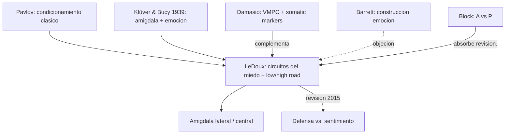

# Joseph LeDoux

> Neurocientifico estadounidense (NYU, Center for Neural Science). Especialista en circuitos del miedo. Autor de *The Emotional Brain* (1996), *Synaptic Self* (2002), *Anxious* (2015) y *The Deep History of Ourselves* (2019). Referencia central del bloque `EmocionInterocepcionYNeuropsiquiatria/` (texto 9b - LeDoux 1994, *"Emotion, Memory and the Brain"*).

## Posicion central

Las **emociones** — y en particular el **miedo** — pueden estudiarse como **procesos neurales bien organizados** que enlazan percepcion, memoria y accion. No son fenomenos vagos ni inaccesibles a la neurociencia experimental. El miedo condicionado, un paradigma simple y replicable, ha permitido **mapear los circuitos** que lo subyacen, con la **amigdala** como hub central. Importante: gran parte del procesamiento emocional **no requiere conciencia reflexiva** — opera con latencias de decenas de ms, antes de que el contenido llegue al workspace consciente. En *Anxious* (2015) LeDoux refino esta tesis: hay que distinguir entre **respuestas defensivas inconscientes** (mediadas por amigdala) y **sentimientos conscientes de miedo** (que requieren corteza y workspace), evitando atribuir "miedo subjetivo" a circuitos subcorticales.

## Argumentos clave

1. **Miedo condicionado como modelo experimental**. Un estimulo inicialmente neutro (tono) se empareja con un estimulo aversivo (shock). Tras pocos ensayos, el tono solo evoca respuestas defensivas (freezing, taquicardia, sudoracion, sobresalto potenciado). El paradigma es **simple, replicable, manipulable molecularmente**, y conserva estructura entre roedores y humanos. Permite vincular conducta, fisiologia y biologia molecular del aprendizaje (LTP en sinapsis tálamo-amigdala lateral).

2. **Dos vias al amigdala: "low road" y "high road"**. LeDoux postulo (1986-96) que la informacion sensorial llega a la amigdala por dos rutas. La **low road** (talamo -> amigdala lateral, ~12 ms) es rapida pero gruesa: detecta caracteristicas crudas (forma de serpiente) y activa respuestas defensivas antes de identificacion cortical. La **high road** (talamo -> corteza sensorial -> amigdala, ~30-40 ms) es lenta pero precisa: confirma o cancela. Esto explica el "miedo antes de pensar". La hipotesis ha sido matizada (algunos discuten su peso en humanos) pero el principio de procesamiento emocional rapido y preconsciente esta solido.

3. **Distincion respuesta defensiva vs. sentimiento de miedo (Anxious, 2015)**. En revision de su propia tesis, LeDoux argumenta que llamar "miedo" a las conductas de freezing en ratas con amigdala intacta pero corteza danada es un **error categorial**: el sistema defensivo subcortical existe en muchos animales, pero el **sentimiento subjetivo de miedo** requiere monitoreo cortical superior y reentrada al workspace (cerca de [[07_dehaene|Dehaene]]). Esto reordena la psiquiatria de la ansiedad: hay que tratar respuestas defensivas y sentimientos conscientes con estrategias distintas.

## Citas y parafrasis del corpus

De `EmocionInterocepcionYNeuropsiquiatria/01_ledoux_emocion_memoria_y_cerebro.md`: "Las emociones, y en particular el miedo, pueden estudiarse como procesos neurales bien organizados que enlazan percepcion, memoria y accion." Y: "Una consecuencia importante es que emocion y cognicion no son dominios aislados. El aprendizaje emocional modifica memoria, conducta y preparacion corporal." Y: "algunos procesos emocionales pueden ser relativamente rapidos y poco dependientes de la conciencia reflexiva."

## Objeciones principales

- **[[09_block|Block]]**: la distincion respuesta defensiva / sentimiento de miedo refleja la propia distincion A/P conciencia. LeDoux la suscribe.
- **Lisa Feldman Barrett (texto 11b del corpus)**: las emociones son **constructos culturales** y conceptuales; no hay "circuito del miedo" universal. LeDoux acepta cierto constructivismo pero defiende que las **respuestas defensivas** (no el sentimiento de miedo) si tienen circuitos relativamente conservados.
- **[[11_damasio|Damasio]]**: aliado en mente encarnada, pero Damasio enfatiza marcadores somaticos ventromediales mientras LeDoux la amigdala — son **circuitos complementarios**, no rivales.
- **[[16_varela_thompson|Varela y Thompson]]**: el enfasis molecular y lesional de LeDoux corre el riesgo de descontextualizar la emocion del organismo entero.
- **[[12_dennett|Dennett]]**: la atribucion de "miedo" a circuitos especificos es heuristicamente util pero metafisicamente sospechosa.

## Tabla resumen

| Que postula | Que rechaza | Que evidencia ofrece |
|---|---|---|
| Miedo condicionado como modelo neural | Emocion como reino inaccesible o vago | Lesiones de amigdala (Bechara et al.); LTP en talamo-amigdala |
| Amigdala como hub central del miedo | Centralidad de la corteza para respuesta defensiva | Disociacion lesional cortex/amigdala |
| Distincion respuesta defensiva (subcortical) / sentimiento (cortical) | Llamar "miedo" a freezing en ratas decorticadas | Estudios humanos con SM (amigdala bilateral lesionada): muestra ausencia selectiva de miedo cognitivo |

## Lugar en el debate

## Lecturas del workspace

- `Contenidos/Explicaciones/Temas/EmocionInterocepcionYNeuropsiquiatria/01_ledoux_emocion_memoria_y_cerebro.md`
- `Contenidos/Explicaciones/Temas/EmocionInterocepcionYNeuropsiquiatria/03_barrett_emocion_y_enfermedad.md` (interlocutor critico)
- `Contenidos/Explicaciones/Temas/EmocionInterocepcionYNeuropsiquiatria/00_indice.md`
- PDF: `Contenidos/pdf/9b - LeDoux - (1994) Emotion, Memory and the Brain.pdf`
- Complementario: `Contenidos/pdf/11b - Barrett - (2017) Emotion and Illness.pdf`

## Vinculos con otros autores del curso

- **[[11_damasio|Damasio]]**: amigdala (LeDoux) + VMPC (Damasio) = circuito emocional integrado.
- **[[18_ramirez_bermudez|Ramirez-Bermudez]]**: trastornos de ansiedad como constructos neuropsiquiatricos.
- **[[19_miller_cummings|Miller y Cummings]]**: regulacion descendente OFC -> amigdala.
- **[[09_block|Block]]**: la distincion respuesta defensiva / sentimiento ilustra A vs. P conciencia.
- **[[07_dehaene|Dehaene]]**: la "ignition" cortical es requisito del sentimiento subjetivo en la revision LeDoux 2015.
- **[[05_chalmers|Chalmers]]**: por que un circuito amigdalino activado genera (o no) experiencia subjetiva sigue siendo hard problem.
