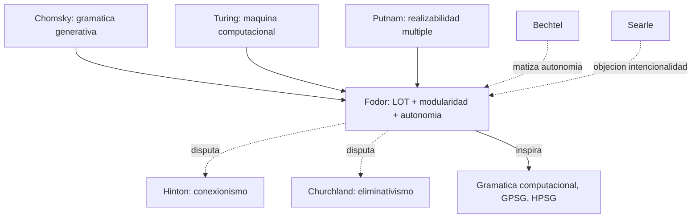

# Jerry Fodor

> Filosofo de la mente y del lenguaje estadounidense (Rutgers, 1935-2017). Autor de *The Language of Thought* (1975), *The Modularity of Mind* (1983), *Psychosemantics* (1987) y *The Mind Doesn't Work That Way* (2000). En el corpus aparece mencionado explicitamente en `FundamentosYMarco/01_bechtel_mandik_mundale_filosofia_y_neurociencias.md` como interlocutor clasico de la filosofia de la neurociencia, defensor de la **autonomia de la psicologia** frente a la reduccion.

## Posicion central

Fodor defendio un programa de **psicologia cognitiva computacional simbolica** con tres tesis interconectadas. (1) **Language of Thought (LOT)**: el pensamiento se realiza en un **lenguaje del pensamiento** con sintaxis y semantica composicional (a veces llamado "mentales"); las operaciones cognitivas son **manipulaciones de simbolos** en este lenguaje. (2) **Modularidad**: el sistema cognitivo se compone de **modulos** especializados, encapsulados informacionalmente, rapidos y obligatorios, mas un sistema central no modular para inferencia general. (3) **Autonomia de la psicologia**: las taxonomias psicologicas no se reducen a las neurobiologicas (por realizabilidad multiple, siguiendo a [[15_putnam|Putnam]]); la psicologia es una **ciencia especial** con leyes propias.

## Argumentos clave

1. **Argumento de la sistematicidad y composicionalidad (Fodor & Pylyshyn 1988)**. Si penso "Juan ama a Maria" puedo pensar "Maria ama a Juan". Si entiendo "el perro mordio al gato" puedo entender "el gato mordio al perro". Estas habilidades reflejan que el pensamiento tiene **estructura composicional**: significados de oraciones se construyen a partir de significados de constituyentes y reglas combinatorias. Esto requiere un **sistema simbolico** con elementos discretos y reglas. El **conexionismo** de [[02_hinton|Hinton]] no captura sistematicidad sin volverse "implementational" (una mera implementacion de un sistema simbolico).

2. **Modularidad de la mente**. Hay sistemas perifericos (vision, audicion, parsing linguistico) que son **modulares**: rapidos (200 ms), obligatorios (no se evita reconocer una palabra), encapsulados (la creencia "es una ilusion" no cancela la ilusion de Muller-Lyer), con base neural dedicada y deficit caracteristicos. El **sistema central** (creencia, decision, planificacion, inferencia abductiva) **no** es modular: es global y holistico. Fodor argumento que esto hace al sistema central **resistente a la ciencia cognitiva computacional** ("the mind doesn't work that way" — el problema de la **abduccion** y de la relevancia es intratable computacionalmente).

3. **Autonomia de la psicologia**. Si los estados mentales son **multiplemente realizables** (Putnam), entonces las taxonomias psicologicas no coinciden con las neurobiologicas: el dolor humano y el del pulpo son el mismo tipo psicologico pero tipos neurales distintos. Las leyes psicologicas son leyes de **ciencia especial** que cuantifican sobre tipos funcionales, no fisicos. Esto justifica metodologicamente la independencia de la psicologia cognitiva (a la que Fodor era leal) frente a la neurociencia.

## Citas y parafrasis del corpus

De `FundamentosYMarco/01_bechtel_mandik_mundale_filosofia_y_neurociencias.md`: "Fodor sostuvo que las taxonomias psicologicas y neurobiologicas se cruzan y no tienen por que coincidir. Con esto se defendia cierta autonomia de la psicologia frente a la reduccion neurocientifica." El manifiesto del curso usa explicitamente a Fodor como **paradigma del obstaculo filosofico** que la neurociencia cognitiva tuvo que superar, no por refutarlo sino por mostrar que **la cooperacion empirica es posible aun aceptando autonomia parcial**.

## Objeciones principales

- **[[13_churchland|Patricia y Paul Churchland]]**: el LOT es una hipotesis empirica fallida; el cerebro no manipula simbolos sino patrones distribuidos. La sistematicidad puede emergir en conexionismo (Smolensky tensor products, transformers actuales).
- **[[02_hinton|Hinton]]**: la representacion distribuida es alternativa real al LOT, no mera "implementacion". La frontera entre simbolico y subsimbolico es porosa.
- **[[01_bechtel|Bechtel]]** y **[[03_mundale|Mundale]]**: aceptan parte de la autonomia pero piden **descomposicion mecanicista** que no es reducible al simbolismo LOT.
- **[[08_searle|Searle]]**: el LOT es manipulacion sintactica; no resuelve el problema de la intencionalidad intrinseca (Habitacion China).
- **[[12_dennett|Dennett]]**: la modularidad masiva (Carruthers, Cosmides) o ninguna modularidad (Dennett) son alternativas viables al esquema central/periferia.

## Tabla resumen

| Que postula | Que rechaza | Que evidencia ofrece |
|---|---|---|
| Language of Thought (mentales simbolico) | Conexionismo no-simbolico como modelo de pensamiento | Sistematicidad, composicionalidad, productividad |
| Modularidad de sistemas perifericos | Cerebro completamente plastico y global | Ilusiones perceptuales persistentes, dobles disociaciones (Marr) |
| Autonomia de psicologia como ciencia especial | Reduccionismo neurocientifico de la psicologia | Realizabilidad multiple (siguiendo a Putnam) |

## Lugar en el debate

## Lecturas del workspace

- `Contenidos/Explicaciones/Temas/FundamentosYMarco/01_bechtel_mandik_mundale_filosofia_y_neurociencias.md`
- `Contenidos/Explicaciones/Temas/FundamentosYMarco/03_hinton_redes_neuronales.md` (contraposicion conexionismo vs. simbolismo)
- `Contenidos/Explicaciones/Temas/FundamentosYMarco/05_bickle_churchland_y_neurofilosofias.md` (oposicion Churchland vs. Fodor)
- (Lectura externa: Fodor 1975 *The Language of Thought*; Fodor 1983 *The Modularity of Mind*; Fodor & Pylyshyn 1988 "Connectionism and Cognitive Architecture")

## Vinculos con otros autores del curso

- **[[15_putnam|Putnam]]**: aliado en realizabilidad multiple y autonomia.
- **[[02_hinton|Hinton]]**: oponente paradigmatico (simbolismo vs. conexionismo).
- **[[13_churchland|Patricia y Paul Churchland]]**: oponentes radicales (eliminativismo y conexionismo).
- **[[01_bechtel|Bechtel]]**, **[[03_mundale|Mundale]]**, **[[04_mandik|Mandik]]**: interlocutores del manifiesto fundacional.
- **[[14_place_smart|Place y Smart]]**: la identidad de tipo es lo que Fodor rechaza.
- **[[17_baggio|Baggio]]**: la modularidad linguistica es referencia obligada para la neurolinguistica.
- **[[08_searle|Searle]]**: oponente sobre intencionalidad e IA.
