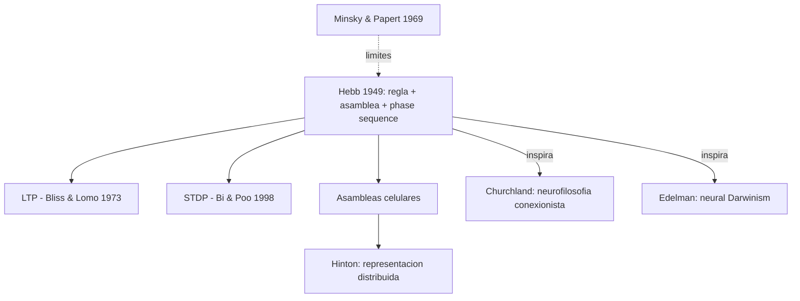

# Donald O. Hebb

> Psicologo canadiense (McGill, 1904-1985). Autor de *The Organization of Behavior: A Neuropsychological Theory* (1949), obra fundacional de la neurociencia moderna. Introdujo la **regla de Hebb** y el concepto de **asamblea celular** (cell assembly). En el corpus aparece referenciado como antecedente clave del conexionismo en `FundamentosYMarco/03_hinton_redes_neuronales.md` y en las guias sobre aprendizaje.

## Posicion central

El **comportamiento y la cognicion** emergen de la organizacion del sistema nervioso, especificamente de cambios en la **eficacia sinaptica** producidos por la experiencia. Hebb propone una **teoria neuropsicologica** que conecta tres niveles: (i) la **sinapsis** y su plasticidad, (ii) las **asambleas celulares** (cell assemblies) como unidades funcionales intermedias, y (iii) la **conducta** y los procesos psicologicos. Su regla y su modelo de asambleas son la base biologica plausible que el conexionismo de [[02_hinton|Hinton]] reconoce como **alternativa** a la retropropagacion (que no es biologicamente plausible).

## Argumentos clave

1. **Regla de Hebb (1949)**. *"When an axon of cell A is near enough to excite cell B and repeatedly or persistently takes part in firing it, some growth process or metabolic change takes place in one or both cells such that A's efficiency, as one of the cells firing B, is increased."* Resumido en el slogan que **Lowel y Singer popularizaron**: *"cells that fire together, wire together"*. Es una regla **local, no supervisada**, que no requiere senal de error global ni simetria de pesos — exactamente lo que Hinton reconoce como **mas biologicamente plausible** que la retropropagacion. La regla anticipa por decadas el descubrimiento de la **Long-Term Potentiation (LTP)** por Bliss y Lomo (1973) en hipocampo.

2. **Asambleas celulares**. Un concepto o percepto no se localiza en una sola neurona ("celula de la abuela") sino en una **asamblea celular**: un conjunto de neuronas interconectadas que se activan conjuntamente y se sostienen por reverberacion. Esto anticipa la **representacion distribuida** de Hinton y la **codificacion poblacional** confirmada empiricamente por Sparks (coliculo superior) y Young & Yamane (corteza temporal de monos). La asamblea es la unidad intermedia entre neurona y conducta.

3. **Phase sequences**. Series de asambleas que se activan secuencialmente sostienen procesos cognitivos extendidos en el tiempo: pensamiento, planificacion, lenguaje interno. Hebb anticipa lo que mas tarde se llamara **dinamica de atractores** y **secuencias neuronales** (place cells en navegacion espacial, Moser y Moser; sequences en hipocampo durante consolidacion de memoria durante el sueno).

## Citas y parafrasis del corpus

De `FundamentosYMarco/03_hinton_redes_neuronales.md`: "La regla de Hebb (1949) propone que las conexiones se fortalecen cuando las neuronas pre y post sinaptica se activan simultaneamente: 'neuronas que se disparan juntas, se conectan juntas.' No requiere senal de error externa ni simetria de pesos. Oja (1982) demostro que el Analisis de Componentes Principales (PCA) puede implementarse con reglas hebbianas locales. Es mas lento y menos preciso que la retropropagacion, pero biologicamente plausible."

## Objeciones principales

- **Limitaciones formales (Minsky y Papert 1969 en *Perceptrons*)**: las reglas de aprendizaje hebbianas puras no pueden aprender funciones no linealmente separables (XOR). Esto motivo el invierno conexionista hasta backpropagation. Pero las **variantes covarianza, BCM (Bienenstock-Cooper-Munro), STDP (spike-timing dependent plasticity)** resuelven parte del problema.
- **[[02_hinton|Hinton]]**: la regla de Hebb es plausible pero ineficiente; backpropagation es mas potente aunque biologicamente sospechosa. Recientemente Hinton y otros han trabajado en **forward-forward**, **predictive coding** y **biologically plausible learning** para reconciliar ambos extremos.
- **Eliminativistas radicales**: la nocion de "asamblea celular" sigue siendo psicologicamente cargada; habria que naturalizar mas.
- **[[01_bechtel|Bechtel]]**: el modelo hebbiano es un mecanismo elegante pero necesita anclaje en sistemas neurales reales documentados.
- **Anti-localizacionistas**: la asamblea celular podria reificar lo que es una dinamica fluida.

## Tabla resumen

| Que postula | Que rechaza | Que evidencia ofrece |
|---|---|---|
| Plasticidad sinaptica como base del aprendizaje | Aprendizaje por instruccion externa unica | LTP (Bliss & Lomo 1973), STDP (Bi & Poo 1998) |
| Asambleas celulares como unidad funcional | Celula de la abuela; representacion local atomica | Codificacion poblacional, dinamica de atractores |
| Phase sequences en cognicion extendida | Cognicion como pulsos aislados | Secuencias hipocampales, replay durante sueno |

## Lugar en el debate

## Lecturas del workspace

- `Contenidos/Explicaciones/Temas/FundamentosYMarco/03_hinton_redes_neuronales.md`
- `Curso/Presenacion/2b - Hinton - (1992) How Neural Networks Learn from Experience.md`
- `Curso/Presenacion/GuionCompletoPresentacionHinton.md`
- (No hay PDF de Hebb en el corpus; lectura externa: Hebb 1949, *The Organization of Behavior*, Wiley; capitulo 4 sobre celulas, asambleas y phase sequences)

## Vinculos con otros autores del curso

- **[[02_hinton|Hinton]]**: heredero conexionista; reconoce la regla hebbiana como mas plausible biologicamente que backprop.
- **[[13_churchland|Patricia y Paul Churchland]]**: usan asambleas celulares como base del programa neurocomputacional.
- **[[01_bechtel|Bechtel]]**: el modelo hebbiano encaja en el marco mecanicista (partes + operaciones + organizacion).
- **[[20_zeki|Zeki]]**: asambleas y especializacion funcional cortical son complementarias.
- **[[22_ledoux|LeDoux]]**: LTP en sinapsis tálamo-amigdala lateral es base molecular del miedo condicionado.
- **[[25_koch|Koch]]**: las asambleas y la sincronia gamma se proponen como NCC (neural correlates of consciousness).
