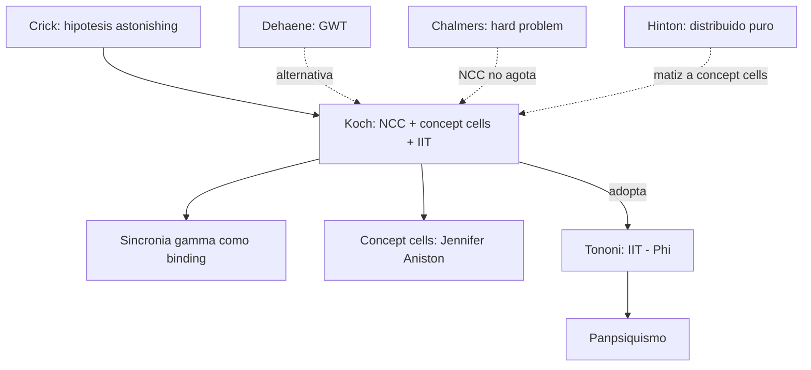

# Christof Koch

> Neurocientifico aleman-estadounidense (Caltech, Allen Institute for Brain Science). Colaborador clave de **Francis Crick** en el programa de **Neural Correlates of Consciousness (NCC)** durante los anos 1990-2000. Mas tarde aliado de [[06_tononi|Tononi]] en el desarrollo de la **IIT**. Autor de *The Quest for Consciousness* (2004) y *Consciousness: Confessions of a Romantic Reductionist* (2012). En el corpus aparece referenciado junto con Quian Quiroga y Fried como autor del trabajo sobre **concept cells** (`ArchivoGuiasGenerales/00_tabla_autores_y_aportes.md`).

## Posicion central

Koch defiende un programa de **busqueda empirica de los Correlatos Neurales de la Conciencia (NCC)**: identificar el conjunto **minimo de mecanismos neurales conjuntamente suficientes** para una experiencia consciente especifica. La pregunta es operacionalmente tratable y debe abordarse con neurociencia experimental (registro unicelular, intracraneal, fMRI, TMS), sin esperar a resolver primero el hard problem. Mas recientemente, Koch acepta la **IIT** de Tononi como mejor marco teorico disponible y, con ella, una version cuantitativa de **panpsiquismo**.

## Argumentos clave

1. **Programa de los NCC con Crick (1990, 1995, 1998)**. Crick y Koch proponen: hay que dejar de discutir filosoficamente y empezar a **buscar los mecanismos neurales especificos** que correlacionan con experiencia consciente. Su hipotesis temprana: la **sincronia gamma (~40 Hz)** entre neuronas piramidales podria ser el "pegamento" que une los atributos visuales dispersos (color, forma, movimiento) en una experiencia unificada — propuesta de **binding por sincronia**. Esta hipotesis es debatida pero abrio una agenda empirica robusta.

2. **Concept cells: neuronas conceptuales en humanos (Quian Quiroga, Fried, Koch 2005)**. Registros intracraneales en pacientes con epilepsia revelaron neuronas en lobulo temporal medial que **disparan selectivamente** ante imagenes, nombres escritos o sonidos de un mismo concepto (la "neurona de Jennifer Aniston" en hipocampo). Esto es evidencia parcial de **codificacion sparse / cuasilocalista** intermedia entre celulas de la abuela y codificacion totalmente distribuida (ver [[02_hinton|Hinton]]). No son "celulas de la abuela" estrictas — responden a multiples instancias del concepto — pero son **mas localistas** de lo que el conexionismo puro predeciria.

3. **Conversion a IIT y panpsiquismo cuantitativo**. Originalmente Koch buscaba NCC como correlatos clasicos. Tras conocer a Tononi (Wisconsin), acepto que la IIT ofrece un marco teorico mas profundo: la conciencia no es solo correlato neural sino **informacion integrada (Phi)**. Esto lo llevo a defender publicamente una version cuantitativa del panpsiquismo: cualquier sistema con Phi > 0 tiene algun grado de experiencia. Su programa actual en Allen Institute combina mapeo conectomico masivo con teoria IIT.

## Citas y parafrasis del corpus

De `ArchivoGuiasGenerales/00_tabla_autores_y_aportes.md`: "Quian Quiroga, Fried y Koch: presentan neuronas muy selectivas o concept cells." Este es el punto especifico que el corpus destaca: las concept cells como **evidencia empirica** que matiza el debate local vs. distribuido en representacion neural (relevante para `FundamentosYMarco/03_hinton_redes_neuronales.md`).

## Objeciones principales

- **Filosofos del hard problem ([[05_chalmers|Chalmers]])**: los NCC son correlacion, no explicacion. Aunque tengamos un mapa completo de NCCs no habremos explicado **por que** esos correlatos van acompanados de experiencia.
- **[[07_dehaene|Dehaene]] (GWT)**: los NCC podrian ser la "ignition" global fronto-parietal, no la sincronia gamma local. Hay alternativa neurocientifica seria al programa Crick-Koch.
- **[[12_dennett|Dennett]]**: el concepto mismo de NCC presupone separabilidad entre correlato y experiencia que es metafisicamente sospechosa.
- **[[02_hinton|Hinton]]**: las concept cells son menos "concept-like" de lo que parecen; siguen siendo nodos de redes distribuidas con campos receptivos amplios.
- **[[01_bechtel|Bechtel]]**: el programa NCC necesita complementarse con **explicacion mecanicista**, no solo identificacion correlacional.

## Tabla resumen

| Que postula | Que rechaza | Que evidencia ofrece |
|---|---|---|
| Programa empirico de NCC | Filosofia *a priori* sobre conciencia | Sincronia gamma; bistabilidad perceptual; binocular rivalry |
| Concept cells: codificacion sparse en MTL | Codificacion solo distribuida o solo localista | Registro intracraneal en epilepticos (Quian Quiroga 2005) |
| IIT + panpsiquismo cuantitativo (post-2010) | Funcionalismo computacional puro | Convergencia con marco Tononi |

## Lugar en el debate

## Lecturas del workspace

- `Contenidos/Explicaciones/Temas/ArchivoGuiasGenerales/00_tabla_autores_y_aportes.md`
- `Contenidos/Explicaciones/Temas/FundamentosYMarco/03_hinton_redes_neuronales.md` (debate local vs. distribuido)
- `Contenidos/Explicaciones/Temas/ConcienciaAgenciaYModelos/01_laureys_estado_vegetativo.md` (NCC en clinica)
- (Lectura externa: Crick & Koch 1990 "Towards a neurobiological theory of consciousness"; Quian Quiroga, Reddy, Kreiman, Koch & Fried 2005 "Invariant visual representation by single neurons in the human brain", *Nature*; Koch 2012 *Consciousness: Confessions of a Romantic Reductionist*)

## Vinculos con otros autores del curso

- **[[06_tononi|Tononi]]**: aliado teorico actual; ambos desarrollan IIT en Allen Institute y Wisconsin.
- **[[05_chalmers|Chalmers]]**: oponente filosofico sobre suficiencia de NCC para explicar conciencia (aunque Koch acepta el hard problem como real).
- **[[07_dehaene|Dehaene]]**: rival cientifico amistoso (GWT vs. IIT).
- **[[02_hinton|Hinton]]** y **[[24_hebb|Hebb]]**: las concept cells matizan el debate local vs. distribuido + asambleas.
- **[[01_bechtel|Bechtel]]**: la critica epistemologica aplica al programa NCC (correlacion vs. mecanismo).
- **[[20_zeki|Zeki]]**: el binding problem que Crick-Koch buscan resolver con sincronia gamma.
- **[[09_block|Block]]**: la distincion A/P-conciencia interpela la nocion de NCC (?correlato de A o de P?).
