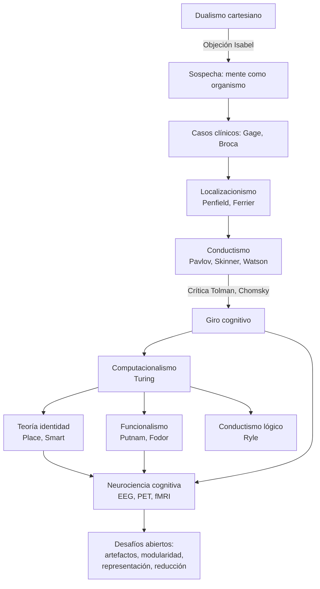

# Primera clase — Del dualismo mente-cuerpo a la neurociencia cognitiva

> **Posición cronológica:** apertura del curso de Filosofía de las Neurociencias.
> **Función pedagógica:** mapa histórico-conceptual que justifica por qué hace falta una *filosofía* de las neurociencias, no solo neurociencia o solo filosofía de la mente.

---

## 1. Tema central

La primera clase organiza un arco de **dos mil años de problema mente-cuerpo** en un solo recorrido y termina entregando el escenario contemporáneo: la **neurociencia cognitiva**. La pregunta de fondo es: *¿cómo sabemos que un ser tiene mente, y cómo se relaciona esa mente con un cuerpo y un cerebro?* La clase parte de Platón y Descartes, pasa por los primeros descubrimientos clínicos (Phineas Gage, Broca), atraviesa el conductismo y el giro cognitivo, y desemboca en el "cerebroscopio" (EEG, PET, fMRI) y en los desafíos epistemológicos abiertos que el resto del curso desplegará.

El profesor enmarca todo bajo una intuición fuerte que recoge de la **Princesa Isabel de Bohemia**: si el alma puede mover al cuerpo, entonces probablemente el alma misma esté constituida por algo físico. Esa intuición funciona como hipótesis-puente: la mente sigue siendo el explanandum, pero su explanans tiene que ser, en algún sentido, material.

## 2. Conceptos clave

- **Dualismo de sustancias** — Descartes: `res extensa` (extensa, divisible, pública) vs `res cogitans` (pensante, indivisible, privada). La objeción de **Isabel de Bohemia** anticipa la imposibilidad de causación entre ambas.
- **Localización cerebral** — del caso Broca (afasia + lesión hemisferio izquierdo) hasta los mapas de **Penfield y Boldrey** (homúnculos motor y sensorial).
- **Conductismo metodológico y radical** — Pavlov (condicionamiento clásico), Skinner (condicionamiento operante), Watson. Reducción: `mente = conducta`.
- **Giro cognitivo** — Tolman (mapas mentales en ratas), Lashley (análisis funcional), Chomsky (gramática universal, crítica a Skinner).
- **Computacionalismo** — Turing, máquina universal; idea de que la mente es el *software* del cerebro.
- **Tres reducciones psicofísicas clásicas** — conductismo, **teoría de la identidad** tipo-tipo (Place, Smart, Feigl: "dolor = fibras C activadas"), y **funcionalismo** (Putnam, Fodor: realizabilidad múltiple, autonomía de la psicología).
- **Neurociencia cognitiva** — disciplina interdisciplinaria que integra técnicas de imagen (EEG, PET, fMRI) con preguntas psicológicas.
- **Modularidad vs. holismo** — tensión entre versiones localizacionistas fuertes y modelos en red.
- **Explicación mecanicista multi-nivel** — descomponer una capacidad psicológica en operaciones y mapearlas sobre estructuras neurales sin eliminar el nivel psicológico.

## 3. Autores y lecturas asociadas

- **Descartes**, *Meditaciones metafísicas* (sustancia pensante vs. extensa).
- **Princesa Isabel de Bohemia**, correspondencia con Descartes (1643) — origen del *problema de la interacción*.
- **Broca (1861)**, "tan tan" — primera demostración pública de localización.
- **Penfield & Boldrey (1937)** — homúnculo cortical.
- **Pavlov, Skinner, Watson** — conductismo.
- **Tolman (1948)**, *Cognitive maps in rats and men*.
- **Chomsky (1959)**, *Review of Skinner's Verbal Behavior*.
- **Turing (1936/1950)** — máquina universal y *Computing Machinery and Intelligence*.
- **Place (1956), Smart (1959), Feigl (1958)** — teoría de la identidad mente-cerebro.
- **Putnam (1967)** — realizabilidad múltiple y funcionalismo de máquina.
- **Fodor (1974)** — *Special Sciences*, autonomía de la psicología.
- **Bechtel, Mandik & Mundale (2001)**, *Philosophy Meets the Neurosciences* — texto base del curso, ver `[[Fuentes/pdf/1 - Bechtel, Mandik, & Mundale - (2001) Philosophy Meets the Neurosciences]]` y `[[02_Lecturas/01_fundamentos_y_marco/01_bechtel_mandik_mundale_filosofia_y_neurociencias]]`.
- **Raichle (1994)**, *Visualizing the Mind* — historia del PET y la neuroimagen.
- **Kanwisher** — área fusiforme del rostro (FFA), citada por el profesor.

## 4. Hilos argumentales

Esta clase es **prólogo y plataforma de todo el curso**. Conecta hacia:

- **Segunda clase** — *metáforas del cerebro y computacionalismo*: el funcionalismo que aquí aparece como tesis filosófica se concreta como modelo (Hobbes-La Mettrie máquinas, Boole-Turing computación, Pitts-McCulloch redes lógicas, Rosenblatt perceptrón).
- **Tercera clase** — *neuroanatomía y representación*: lo que aquí queda como "hay localizaciones pero el cerebro no es solo mosaico" se desarrolla con neuronas, glia, multimodalidad y la metáfora de la "bóveda oscura".
- **Cuarta clase** — *epistemología de la evidencia*: la advertencia de la clase 1 ("las imágenes no son fotos del pensamiento") se vuelve tesis explícita.
- **Quinta clase** — *mente, conducta y cerebro*: la disputa reduccionismo vs. autonomía que aquí aparece tabulada se vuelve discusión emergentista-sistémica.
- **Sexta clase** — *percepción visual*: el caso de Kanwisher mencionado al final se desarrolla con Triviño-Mosquera et al. y el modelo de las dos vías (qué/dónde).

Hacia atrás conecta con la **historia de la filosofía** (Platón, Descartes, Hume, Kant implícito) y hacia adelante con todo el dispositivo formal del curso, incluida la **Presentación sobre Hinton 1992** que opera como caso de estudio del programa conexionista-computacional.

## 5. Glosario mini

- **Res cogitans / res extensa** — las dos sustancias cartesianas; nombres latinos clásicos para "cosa que piensa" y "cosa extensa".
- **Realizabilidad múltiple** — tesis de Putnam: un mismo estado mental puede instanciarse en sustratos físicos distintos (silicio, carbono, neuronas de pulpo). Funda la autonomía de la psicología.
- **Análisis funcional (Lashley)** — descomposición de una capacidad compleja en subprocesos que pueden estudiarse por separado y reintegrarse.
- **Cerebroscopio** — término con que el profesor (siguiendo a Farah) nombra la promesa de las nuevas técnicas de imagen: "ver el cerebro pensando".
- **Identidad psicofísica tipo-tipo** — `tipo de estado mental ↔ tipo de estado cerebral`. Contrasta con identidad token-token, mucho más débil.

## 6. Estructura conceptual (Mermaid)

## 7. Tabla comparativa: tres reducciones psicofísicas

| Postura | Identifica mente con | Autor canónico | Fortaleza | Debilidad |
|---|---|---|---|---|
| Conductismo lógico | Conducta y disposiciones | Ryle, Hempel, Skinner | Operacionalidad, criterio público | Pierde la fenomenología, *qualia* |
| Teoría de la identidad | Tipo de estado cerebral | Place, Smart, Feigl | Compatible con fisicalismo fuerte | Chovinismo de especie: ¿solo cerebros con fibras C? |
| Funcionalismo | Rol causal en una economía de estados | Putnam, Fodor | Realizabilidad múltiple, autonomía | Liberalismo: ¿una nación funcional tiene dolor? (Block) |

## 8. Preguntas guía

1. ¿Por qué la objeción de la Princesa Isabel marca, *en clave histórica*, el inicio de la neurociencia? ¿Qué le exige al dualismo que el dualismo no puede pagar?
2. ¿Qué diferencia hay entre **localizar** una función mental (Broca, Penfield) y **explicarla**? (Esta pregunta reaparece formalizada en la clase 4.)
3. Si el funcionalismo de Putnam-Fodor es correcto, ¿por qué necesitaríamos neurociencia y no solo psicología cognitiva pura? Es decir, ¿qué *no* puede capturar el nivel funcional?
4. La clase menciona la tensión entre modelos modularistas (FFA, Broca) y modelos en red. ¿Es una tensión empírica, conceptual, o ambas?
5. ¿Por qué la mera correlación BOLD-tarea no equivale a una explicación causal-mecanicista de una función cognitiva?

## 9. Cross-refs al backup

- `[[01_Clases/clase-01-dualismo-a-neurociencia-cognitiva/00_notas]]` — apuntes en bruto del profesor.
- `[[01_Clases/clase-01-dualismo-a-neurociencia-cognitiva/modelos_y_diagramas]]` — diagramas auxiliares.
- `[[02_Lecturas/01_fundamentos_y_marco/01_bechtel_mandik_mundale_filosofia_y_neurociencias]]` — desarrollo del texto base.
- `[[Fuentes/pdf/1 - Bechtel, Mandik, & Mundale - (2001) Philosophy Meets the Neurosciences]]` — PDF fuente.
- `[[Fuentes/pdf/4b - Raichle - (1994) Visualizing the Mind]]` — historia del PET y la promesa del "cerebroscopio".
- `[[01_Clases/clase-02-metaforas-y-cerebro-computacional/00_notas]]` — continuación natural: metáforas del cerebro.

## 10. Para el estudiante

Si tuvieras que defender esta clase en un parcial oral en **dos minutos**: lo central es mostrar el *camino del problema*. No partimos de la neurociencia, sino del **problema mente-cuerpo en su versión cartesiana**. La objeción de Isabel desplaza el problema hacia una hipótesis materialista. Las lesiones (Gage, Broca) y la estimulación cortical (Penfield) lo convierten en programa empírico. El siglo XX introduce dos giros: el conductismo (que niega el problema renunciando a la mente) y el giro cognitivo (que lo recupera con herramientas computacionales). Las tres reducciones psicofísicas son los tres modos en que la filosofía intentó cerrar el problema. La neurociencia cognitiva, con su `cerebroscopio`, abre un nuevo capítulo: ya no preguntar *si* la mente depende del cerebro, sino *cómo* y bajo qué *condiciones epistemológicas* podemos saberlo. Las clases siguientes desplegarán esos *cómo* y esos *bajo qué*.
