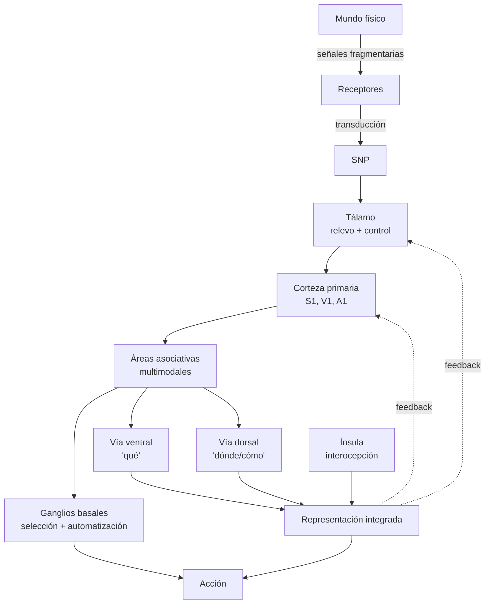

# Tercera clase — Neuroanatomía funcional, representación y multimodalidad

> **Posición cronológica:** tercera sesión. Aterriza el marco histórico-filosófico (clases 1-2) en el **sistema nervioso real**: células, regiones, vías, principios de organización.
> **Texto de cabecera:** Ray, *Introduction to Human Neuroscience* (cap. 3); complementario Bechtel (2001), *Representations. From Neural Systems to Cognitive Systems*.

---

## 1. Tema central

Esta clase entrega el **vocabulario empírico mínimo** que el curso necesitará después. Pero no es un repaso descriptivo de anatomía: introduce dos tesis filosóficas fuertes en clave neuroanatómica.

1. **El cerebro está en una *bóveda oscura*.** Nunca toca el mundo: solo recibe señales electroquímicas. Toda percepción es por fuerza una **representación reconstruida** a partir de señales empobrecidas. Esta tesis bechteliana convierte a la representación en categoría no opcional para una neurociencia adulta.
2. **El procesamiento es *multimodal* y *en red*.** No hay una vía única por sentido que termina en un homúnculo. Hay un grafo de áreas que intercambian, integran y retroalimentan información proveniente de canales heterogéneos.

El recorrido neuroanatómico (neuronas, glia, mielina, ventrículos, sustancia gris/blanca, lóbulos, surcos/giros, homúnculos, ganglios basales, ínsula, tálamo) está organizado *para sostener esas dos tesis*, no como inventario académico.

## 2. Conceptos clave

- **Neurona y glia** — la neurona ya no es la "estrella solitaria": astrocitos regulan ambiente químico y sinapsis tripartita, oligodendrocitos producen mielina (SNC), microglia hace poda sináptica e inmunidad. Cambio paradigmático: la glia es *parte computacional* del sistema, no soporte trófico.
- **Sinapsis** — punto funcional de transmisión química/eléctrica. La sinapsis es donde *vive el aprendizaje* (LTP, LTD).
- **Mielina y conducción saltatoria** — el axón mielinizado conduce por nodos de Ranvier; multiplica velocidad y eficiencia energética.
- **SNC vs SNP** — encéfalo y médula vs nervios periféricos. La división respeta la barrera hematoencefálica.
- **Términos de orientación** — rostral/caudal, dorsal/ventral, medial/lateral, superior/inferior. Imprescindibles para leer cualquier figura.
- **Ventrículos y LCR** — el cerebro flota en líquido cefalorraquídeo producido por los plexos coroideos. *Hidrocefalia* cuando se altera flujo o reabsorción.
- **Sustancia gris vs sustancia blanca** — cuerpos celulares y procesamiento vs tractos axónicos mielinizados.
- **Lóbulos, surcos y giros** — frontal, parietal, temporal, occipital, ínsula. Cisuras de Rolando (central), Silvio (lateral).
- **Homúnculos motor y sensorial** — Penfield-Boldrey. Mapas distorsionados según densidad de inervación, no según tamaño anatómico.
- **Multimodalidad** — convergencia de información de varios sentidos en áreas asociativas heteromodales (parietal posterior, temporal superior, prefrontal).
- **Ganglios basales** — núcleo caudado, putamen, globo pálido; selección de acción, automatización motora y cognitiva; circuito cortico-estriado-tálamo-cortical.
- **Tálamo como *relevo*** — todas las vías sensoriales (excepto la olfativa) pasan por núcleos talámicos antes de llegar a corteza. Pero también *retroalimenta* a corteza: no es solo relevo, es nodo de control.
- **Ínsula** — "pequeño cerebro dentro del cerebro"; sede principal de la **interocepción**; clave en teorías contemporáneas de emoción (Damasio, Craig, Barrett).
- **Conexionismo neural** — el cerebro como grafo dinámico: la información se propaga, se redistribuye, se retroalimenta. Anti-localizacionismo ingenuo, sin caer en holismo místico.
- **Plasticidad** — sináptica (Hebb: *cells that fire together wire together*), estructural y de mapas. Permite aprendizaje y reorganización post-lesión.

## 3. Autores y lecturas asociadas

- **Ray** — *Introduction to Human Neuroscience* (cap. 3, lectura central): `[[Fuentes/pdf/3a - Ray - Introduction to Human Neuroscience]]`.
- **Bickle** — *The Neurophilosophies of Patricia and Paul Churchland*: `[[Fuentes/pdf/3b - Bickle - The Neurophilosophies of Patricia and Paul Churchland]]`. Aporta el contraste eliminativista para la discusión de representación.
- **Bechtel (2001)** — *Representations. From Neural Systems to Cognitive Systems*: `[[Fuentes/pdf/13a - Bechtel - (2001) Representations. From Neural Systems to Cognitive Systems]]`. La tesis de la "bóveda oscura" es bechteliana.
- **Moser & Moser (2015)** — *Where Am I. Where Am I Going*: `[[Fuentes/pdf/13b - Moser & Moser - (2015) Where Am I. Where Am I Going]]`. Células de lugar y de red — paradigma de representación neural moderna.
- **Hebb (1949)** — *The Organization of Behavior*. Postulado hebbiano.
- **Damasio** — somatic markers; ínsula e interocepción.
- **Craig** (2003, 2009) — *How do you feel?*: ínsula como sede de la consciencia interoceptiva.
- **Friston** — free-energy principle (anticipa la clase de cerebro predictivo).

## 4. Hilos argumentales

Esta clase es la **base anatómica** del curso. Recibe de la clase 2 la idea de que el cerebro se piensa hoy en términos conexionistas y la sostiene con datos concretos (vías cruzadas, áreas asociativas, ganglios basales, redes corteza-tálamo). Entrega:

- A la **cuarta clase**, las *unidades observacionales* sobre las que recae la pregunta epistemológica: qué mide un fMRI, qué dice una lesión, qué infiere un registro unicelular.
- A la **quinta clase**, los *casos clínicos* que motivan la discusión emergentista-sistémica: Anton, Cotard, anosognosia; todos requieren más que mapas locales para explicarse.
- A la **sexta clase**, las *vías visuales* (dorsal y ventral) sobre las que se construye toda la fenomenología clínica del capítulo de visión.
- A la **presentación Hinton**, los *correlatos biológicos* contra los que la red artificial se mide: dendrita-axón-sinapsis-peso, codificación poblacional, distribución vs localización.

## 5. Glosario mini

- **Bóveda oscura** — metáfora del profesor (con raíz en Helmholtz y Bechtel): el cerebro no accede a *cosas*, solo a *señales*; toda percepción es inferencia.
- **Multimodalidad** — capacidad de integrar información heterogénea (visual, auditiva, propioceptiva, interoceptiva) en una representación estable.
- **Sinapsis tripartita** — terminal presináptico + dendrita postsináptica + astrocito envolvente; el astrocito modula la transmisión.
- **Interocepción** — percepción de señales internas del cuerpo (latido, hambre, dolor visceral, balance autonómico).
- **Plasticidad hebbiana** — modificación de la fuerza sináptica en función de la coactividad pre- y postsináptica.

## 6. Estructura conceptual (Mermaid)

## 7. Tabla comparativa: localización vs. red

| Eje | Postura localizacionista fuerte | Postura conexionista-red |
|---|---|---|
| Unidad explicativa | Área-función (FFA = caras) | Patrón de activación distribuido |
| Evidencia favorita | Lesión + déficit selectivo | fMRI multivariado, conectómica |
| Plasticidad | Reorganización limitada | Esperable y bien tipificada |
| Riesgo conceptual | Frenología 2.0 | Holismo vago si no hay modelo |
| Aliados teóricos | Modularismo (Fodor) | Funcionalismo distribuido, predictive processing (Friston) |
| Anclaje en clase 3 | Penfield, áreas primarias | Multimodalidad, áreas asociativas |

## 8. Preguntas guía

1. ¿Por qué decir que el cerebro está en una *bóveda oscura* compromete a una teoría de la **representación**? ¿Podría un anti-representacionalista (enactivista, e.g. Varela-Thompson) responder a Bechtel sin negar el dato neural?
2. La glia ha pasado de "soporte trófico" a "componente computacional". ¿Qué cambio metodológico fuerza esto en las técnicas de medida que se discuten en la clase 4?
3. Los homúnculos motor y sensorial son **dispositivos pedagógicos**. ¿Hasta qué punto reflejan organización neural real y hasta qué punto la simplifican peligrosamente?
4. Tálamo como *relevo* es una metáfora del siglo XX. ¿Por qué hoy se prefiere hablar de tálamo como *hub de control*? ¿Qué consecuencias tiene para el modelo de la conciencia (Llinás, Tononi)?
5. ¿Por qué la ínsula resulta el órgano-clave para teorías contemporáneas de la emoción (Damasio, Barrett) y no la amígdala (LeDoux)?

## 9. Cross-refs al backup

- `[[01_Clases/clase-03-neuroanatomia/00_notas]]` — apuntes en bruto.
- `[[01_Clases/clase-03-neuroanatomia/01_neuronas]]`, `[[01_Clases/clase-03-neuroanatomia/02_astrocitos]]`, `[[01_Clases/clase-03-neuroanatomia/03_oligodendrocitos_y_mielina]]`, `[[01_Clases/clase-03-neuroanatomia/04_microglia]]` — fichas por tipo celular.
- `[[01_Clases/clase-03-neuroanatomia/05_sinapsis_y_neurotransmisores]]` — sinapsis y NT.
- `[[01_Clases/clase-03-neuroanatomia/glosario_clase]]` — glosario y mindmap.
- `[[01_Clases/clase-03-neuroanatomia/07_sistema_nervioso_central_y_periferico]]`, `[[01_Clases/clase-03-neuroanatomia/08_orientacion_neuroanatomica]]`, `[[01_Clases/clase-03-neuroanatomia/09_ventriculos_liquido_cefalorraquideo_e_hidrocefalia]]`, `[[01_Clases/clase-03-neuroanatomia/10_sustancia_gris_y_sustancia_blanca]]`, `[[01_Clases/clase-03-neuroanatomia/11_lobulos_cerebrales]]`, `[[01_Clases/clase-03-neuroanatomia/12_surcos_giros_y_otras_formas_de_describir_la_corteza]]` — anatomía sistemática.
- `[[01_Clases/clase-03-neuroanatomia/13_homunculo_motor_y_somatosensorial]]` — Penfield.
- `[[01_Clases/clase-03-neuroanatomia/14_representaciones_multimodalidad_y_flujo]]` — *bóveda oscura* + multimodalidad.
- `[[01_Clases/clase-03-neuroanatomia/15_ganglios_basales_talamo_e_insula]]` — subcortical.
- `[[01_Clases/clase-03-neuroanatomia/16_aprendizaje_plasticidad_e_ideas_previas_del_cerebro]]` — plasticidad y priors.
- `[[01_Clases/clase-03-neuroanatomia/17_automatizacion_y_conciencia]]` — puente hacia clase 5.
- `[[Fuentes/pdf/13a - Bechtel - (2001) Representations. From Neural Systems to Cognitive Systems]]` — texto de cabecera filosófico.
- `[[Fuentes/pdf/13b - Moser & Moser - (2015) Where Am I. Where Am I Going]]` — células de lugar.

## 10. Para el estudiante

Si en un parcial te piden *resumir la tercera clase en una frase*: **el cerebro es un grafo dinámico de células heterogéneas que construye representaciones multimodales del mundo y del propio cuerpo, a partir de señales empobrecidas que recibe en una bóveda oscura**. Esa frase contiene los cinco compromisos teóricos centrales: grafo (no mosaico), dinámico (no estático), heterogéneo (neuronas + glia + circuitos), representaciones multimodales (no copias unimodales), señales empobrecidas (no acceso directo). Cada uno de esos cinco compromisos será defendido o cuestionado en las clases que siguen. La cuarta los pondrá a prueba epistemológicamente; la quinta los discutirá ontológicamente; la sexta los aplicará al caso visual.
