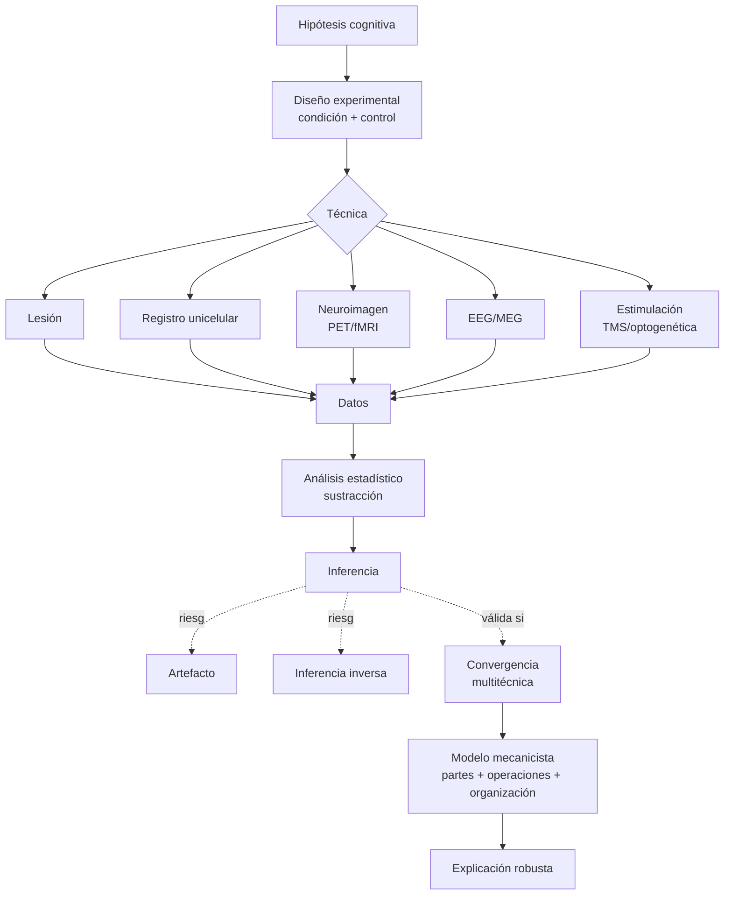

# Cuarta clase — Evidencia, mecanismo y los límites de la inferencia neural

> **Posición cronológica:** cuarta sesión. Es el **corazón epistemológico** del curso. Tras tener vocabulario histórico (1-2) y anatómico (3), pregunta: *¿cómo justificamos lo que decimos saber del cerebro?*
> **Texto de cabecera:** Bechtel (2004), *The Epistemology of Evidence in Cognitive Neuroscience*; complementario Raichle (1994), *Visualizing the Mind*.

---

## 1. Tema central

La clase desmonta dos imágenes ingenuas de la neurociencia:

1. *El mito de la observación directa* — "vi una activación, luego el cerebro hace X". Las técnicas no observan funciones: producen señales a través de mediaciones (transducción, sustracción, estadística, supuestos sobre fisiología). **No hay dato bruto neural**.
2. *El mito de la localización como explicación* — "encontré la zona que se enciende, ya está explicado". Localizar es identificar participación; explicar es exhibir un **mecanismo**: partes + operaciones + organización. La diferencia es decisiva.

La consecuencia metodológica es la **convergencia multitécnica** como criterio: una hipótesis se vuelve robusta cuando lesión, registro unicelular, neuroimagen funcional, conducta y modelo computacional apuntan al mismo patrón. Ninguna técnica basta sola.

## 2. Conceptos clave

- **Evidencia mediada** — todo dato neurocientífico depende de instrumentos, diseños y supuestos auxiliares. El proceso "registro → análisis → publicación" no es transparente; cada eslabón puede introducir distorsión.
- **Artefacto** — resultado producido por la técnica o el diseño, no por el fenómeno. Ejemplos: movimientos de cabeza en fMRI, artefactos de promediado en EEG, efecto de la condición de control mal elegida.
- **Estudios de lesión** — paradigma clásico (Broca, Gage). Inferencia: *si lesión → déficit*, entonces zona involucrada. Pero: reorganización, déficits indirectos por desconexión (diasquisis), heterogeneidad de pacientes, base de comparación.
- **Doble disociación** — herramienta clave de neuropsicología (Shallice, Caramazza): paciente A pierde X y conserva Y; paciente B pierde Y y conserva X. Permite postular independencia funcional, pero con supuestos fuertes.
- **Registro unicelular** — preciso pero altamente sesgado: muestreo de las neuronas que "se dejan registrar", interpretación de selectividad ≠ representación.
- **PET y fMRI** — basadas en **señal hemodinámica** (BOLD, glucosa), no en actividad neural directa. Resolución espacial buena, temporal mediocre. Dependen de **sustracción experimental**: la imagen "muestra" la diferencia entre condición y control.
- **EEG/MEG** — temporal excelente, espacial pobre (problema inverso). Captura potenciales evocados; corrección artefactual intensa.
- **Estímulo, condición, control, sustracción** — la lógica del experimento por sustracción presupone *aditividad pura*: condición = control + función de interés. Donders ya lo asumía; sigue siendo cuestionable.
- **Localización vs mecanismo** — Bechtel: localizar es asociar una operación a un componente; explicar mecanísticamente es **descomponer la capacidad en operaciones**, **mapearlas a partes** y **mostrar su organización dinámica**. Sin esta segunda parte, la imagen vistosa es solo un punto en un mapa.
- **Convergencia de técnicas** — criterio epistemológico fuerte: la hipótesis robusta es la que sobrevive simultáneamente a lesión, neuroimagen, registro, conducta y modelo formal.
- **Causalidad vs correlación** — la correlación área-tarea no implica que la actividad de la zona *cause* la función. Estudios de **estimulación** (TMS, optogenética) son los que se acercan más a inferencia causal.

## 3. Autores y lecturas asociadas

- **Bechtel (2004)** — *The Epistemology of Evidence in Cognitive Neuroscience*: lectura central. `[[Fuentes/pdf/4a - Bechtel - (2004) The Epistemology of Evidence in Cognitive Neuroscience]]`.
- **Raichle (1994)** — *Visualizing the Mind*: historia y lógica del PET. `[[Fuentes/pdf/4b - Raichle - (1994) Visualizing the Mind]]`.
- **Donders (1869)** — *On the speed of mental processes*: método de sustracción.
- **Shallice (1988)** — *From Neuropsychology to Mental Structure*: doble disociación.
- **Caramazza (1986)** — defensa metodológica de estudios de caso único.
- **Logothetis (2008)** — *What we can do and what we cannot do with fMRI*: límites de la imagen funcional.
- **Bechtel & Richardson (1993)** — *Discovering Complexity*: estrategia de descomposición + localización + recomposición.
- **Craver (2007)** — *Explaining the Brain*: mecanismos en neurociencia (mutually manipulable parts).
- **Vul et al. (2009)** — *Puzzlingly High Correlations in fMRI Studies* ("voodoo correlations"): caso paradigmático de inferencia estadística mal usada.

## 4. Hilos argumentales

Esta clase es **filtro epistemológico** que el resto del curso atraviesa. Recibe de la 2 la advertencia metafórica (toda imagen del cerebro es una construcción) y la transforma en programa metodológico. Recibe de la 3 las áreas y técnicas concretas. Entrega:

- A la **quinta clase**: el caso clínico, ya como objeto de análisis epistemológico y no solo descriptivo. Anton y Cotard ponen a prueba la distinción **localizar / explicar mecanísticamente**.
- A la **sexta clase**: la *vía dorsal/ventral* y la *agnosia visual* son resultados de doble disociación neuropsicológica clásica. La crítica metodológica de Bechtel se aplica directamente.
- A la **presentación Hinton**: la pregunta "¿el modelo computacional explica el cerebro o solo lo simula?" es una variante del problema localización-vs-mecanismo elevado al plano modelo-vs-realidad.
- Al **curso entero**: introduce los estándares de rigor que el profesor exigirá al evaluar afirmaciones neurocientíficas: convergencia, control, causalidad, descomposición.

## 5. Glosario mini

- **Sustracción cognitiva** — operación estadística que estima la actividad neural específica de una función restando la actividad de una condición control. Presupone aditividad pura de procesos cognitivos.
- **Diasquisis** — depresión funcional a distancia tras lesión local; explica por qué un déficit no siempre indica que la zona dañada sea la "sede" de la función.
- **Inferencia inversa** — falacia: "esta área se activa, luego el sujeto está haciendo X". Es inválida sin probabilidad condicional cuidadosa (Poldrack 2006).
- **Doble disociación** — patrón clínico ortogonal que justifica postular dos procesos independientes.
- **Mecanismo (Craver)** — partes, operaciones y organización mutuamente manipulables que producen un fenómeno.

## 6. Estructura conceptual (Mermaid)

## 7. Tabla comparativa: técnicas y sus límites

| Técnica | Resolución espacial | Resolución temporal | Inferencia causal | Riesgo principal |
|---|---|---|---|---|
| Lesión clínica | Variable, gruesa | N/A | Moderada-alta | Lesión no selectiva, diasquisis |
| Registro unicelular | Excelente (μm) | Excelente (ms) | Correlacional | Muestreo sesgado |
| fMRI BOLD | ~mm | ~s | Correlacional | Sustracción, artefactos de movimiento |
| EEG / MEG | Pobre (cm) | Excelente (ms) | Correlacional | Problema inverso, ruido |
| TMS | ~cm | ~ms | Causal (perturbativa) | Difusión de efecto |
| Optogenética | μm | ms | Causal | Solo animal, validez ecológica |
| Modelo computacional | N/A | N/A | Solo simulación | Subdeterminación: muchos modelos ajustan |

## 8. Preguntas guía

1. ¿Por qué la afirmación "la fMRI muestra el pensamiento" es **categóricamente equivocada**, no solo imprecisa? Reconstruye la cadena de mediaciones entre actividad neuronal y voxel coloreado.
2. La doble disociación es el "gold standard" de la neuropsicología clásica. ¿Qué supuestos fuertes esconde? (Pista: pureza modular, ausencia de compensación, selectividad ideal de la lesión.)
3. Bechtel distingue **localización** de **explicación mecanicista**. Aplica la distinción al área de Broca: ¿qué sabríamos si solo localizáramos? ¿Qué hace falta para una explicación mecanicista del habla?
4. Si la convergencia multitécnica es nuestro criterio, ¿cómo evaluar la afirmación "las neuronas espejo explican la empatía"? ¿Qué evidencia falta?
5. ¿Cómo conecta la advertencia epistemológica de esta clase con la advertencia metafórica de Daugman (clase 2)? ¿Son la misma crítica vista desde dos ángulos?

## 9. Cross-refs al backup

- `[[01_Clases/clase-04-epistemologia-de-la-evidencia/00_notas]]` — apuntes en bruto.
- `[[01_Clases/clase-04-epistemologia-de-la-evidencia/00_indice]]` — índice clase 4.
- `[[01_Clases/clase-04-epistemologia-de-la-evidencia/01_que_es_evidencia_en_neurociencia]]` — desarrollo evidencia mediada.
- `[[01_Clases/clase-04-epistemologia-de-la-evidencia/02_instrumentos_intervencion_y_artefactos]]` — instrumentos y artefactos.
- `[[01_Clases/clase-04-epistemologia-de-la-evidencia/03_lesiones_y_deficits]]` — lesión como técnica inferencial.
- `[[01_Clases/clase-04-epistemologia-de-la-evidencia/06_localizacion_mecanismos_y_limites]]` — localización vs mecanismo.
- `[[01_Clases/clase-04-epistemologia-de-la-evidencia/glosario_clase]]` — glosario.
- `[[01_Clases/clase-04-epistemologia-de-la-evidencia/00_notas]]` — notas extendidas (epistemología y filosofía de la mente).
- `[[01_Clases/clase-04-epistemologia-de-la-evidencia/05_pet_fmri_y_neuroimagen_funcional]]` — Visualizacion de la mente, derivado de Raichle.
- `[[Fuentes/pdf/4a - Bechtel - (2004) The Epistemology of Evidence in Cognitive Neuroscience]]` — texto base.
- `[[Fuentes/pdf/4b - Raichle - (1994) Visualizing the Mind]]` — PDF Raichle.
- `[[02_Lecturas/02_metodos_y_evidencia/00_indice]]` — carpeta temática.

## 10. Para el estudiante

Una neurociencia que se respete a sí misma no puede prescindir de epistemología. Esta clase enseña, en realidad, **a leer con sospecha productiva**: cuando un titular dice *"científicos descubren la zona del amor en el cerebro"*, la pregunta no es escéptica genérica sino técnica. ¿Qué tarea usaron? ¿Qué control? ¿Qué tamaño muestral? ¿Qué corrección por comparaciones múltiples? ¿Qué técnica ortogonal lo replica? ¿Se postuló un mecanismo (partes + operaciones + organización) o solo una correlación? Si el curso te entrena a hacer estas preguntas automáticamente, ya pagaste la matrícula. Las clases 5 y 6 te darán ocasión de aplicar la disciplina sobre fenómenos clínicos concretos (anosognosia, ceguera cortical, agnosias) y sobre el caso paradigmático de la visión.
