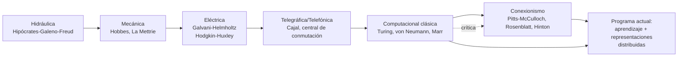

# Segunda clase — Metáforas, máquinas y el cerebro computacional

> **Posición cronológica:** segunda sesión. Sale del marco histórico-filosófico de la clase 1 y entra al **cómo se ha pensado el cerebro a través de metáforas técnicas**.
> **Texto de cabecera:** Daugman (2001), *Brain Metaphor and Brain Theory*, complementado por Hinton (1992) que es a la vez lectura y eje de la **presentación de los estudiantes**.

---

## 1. Tema central

La clase argumenta una tesis fuerte de **filosofía de la ciencia aplicada a la neurociencia**: *las teorías del cerebro siguen, históricamente, a las tecnologías dominantes de cada época*. No es una observación anecdótica; es una clave epistemológica. Si las metáforas modelan lo que vemos, entonces *evaluar críticamente la metáfora vigente* es parte del trabajo filosófico de la neurociencia.

El recorrido va de las **metáforas hidráulicas** (Hipócrates, Galeno, Freud) a las **mecánicas** (Hobbes, La Mettrie, el pato de Vaucanson), de las **eléctricas** (Galvani, von Helmholtz, Hodgkin-Huxley) a las **telegráficas y telefónicas** (Ramón y Cajal + von Helmholtz), y finalmente a las **computacionales** (von Neumann, Turing, Marr) y **conexionistas** (Pitts-McCulloch, Rosenblatt, Hinton). En el camino aparece el **modelo trinitario de Marr** (computación / algoritmo y representación / implementación) como dispositivo para no confundir niveles.

## Plan didáctico de la clase

1. **Apertura.** ¿Por qué hablamos de "neurociencia" en plural? Convergencia interdisciplinar (~1960) entre neuroanatomía, neurofisiología, psicología, lingüística, ciencia cognitiva.
2. **Distinción.** Neurociencia (cerebro) vs ciencia cognitiva (mente) vs filosofía de la neurociencia (qué *hace* la neurociencia, qué explicaciones usa, qué es una representación, qué es una reducción).
3. **Herramientas para el pensamiento.** Las teorías necesitan vocabulario. Las metáforas y analogías son ese vocabulario: medio para un fin, no descripción literal.
4. **Recorrido histórico de metáforas** (núcleo de la clase) en seis capas tecnológicas.
5. **Salto a la computacional.** Turing, von Neumann, niveles de Marr (computacional / algorítmico / implementación).
6. **Conexionismo.** McCulloch–Pitts (1943), Perceptrón de Rosenblatt (1958), distribuido vs localista (preámbulo a Hinton).
7. **Crítica de Daugman.** Cada metáfora abre y a la vez recorta. La computacional no es la metáfora *final*: es la actual.
8. **Apertura a Clase 3.** Si todo es metáfora, ¿qué dice el cerebro *real*? La anatomía funcional como contrapeso material.

## 2. Conceptos clave

- **Metáfora teórica** — no mero adorno; estructura las preguntas legítimas, las técnicas y las explicaciones plausibles. Daugman insiste: cada metáfora ilumina y oculta.
- **Modelos hidráulicos del cuerpo y la mente** — los cuatro humores de Hipócrates-Galeno, y la *dinámica hidráulica* del aparato psíquico de Freud (presión, represión, descarga).
- **Mecanicismo de la modernidad** — La Mettrie, *L'Homme Machine* (1748); pato de Vaucanson (1739) como modelo demostrativo de que la fisiología puede entenderse como mecánica.
- **Electricidad nerviosa** — Galvani (1791), galvanómetro, von Helmholtz mide la velocidad del impulso nervioso (no es instantáneo: ~30 m/s). Apertura para Hodgkin-Huxley (1952) con su modelo matemático del potencial de acción.
- **Metáfora telegráfica/telefónica** — Ramón y Cajal dibuja neuronas con axones-cables. La idea: el sistema nervioso es una **central de conmutación**.
- **Bit y todo-o-nada** — von Neumann lee el potencial de acción como un *bit*; teoría de la información de Shannon entra en escena.
- **Computacionalismo clásico** — Turing (máquina universal), von Neumann (*The Computer and the Brain*, póstumo 1958). La mente como manipulación reglada de símbolos.
- **Niveles de análisis de Marr (1982)** — computacional (qué problema se resuelve), algorítmico (qué procedimiento y representación), implementacional (qué hardware). El profesor lo presenta como herramienta para *dividir y conquistar*, no como ontología.
- **Conexionismo / redes neuronales** — Pitts y McCulloch (1943): neuronas formales como funciones lógicas. Rosenblatt (1958): **perceptrón** con aprendizaje supervisado. Minsky & Papert (1969): crítica que congela el campo. Renacimiento conexionista de los 80 con backprop y Hinton.
- **Vías visuales dorsal y ventral** — `qué` (ventral, hacia temporal) vs `dónde/cómo` (dorsal, hacia parietal). Caso clínico de Goodale-Milner: pacientes que coordinan visomotrizmente pero no identifican; otros (visión ciega/blindsight) muestran lo inverso.

## 3. Autores y lecturas asociadas

- **Daugman (2001)** — *Brain Metaphor and Brain Theory*: lectura central. Ver `[[02_Lecturas/01_fundamentos_y_marco/02_daugman_metaforas_del_cerebro]]` y `[[Fuentes/pdf/2a - Daugman - (2001) Brain Metaphor and Brain Theory]]`.
- **Hinton (1992)** — *How Neural Networks Learn from Experience*, lectura central, base de la presentación estudiantil. `[[Fuentes/pdf/2b - Hinton - (1992) How Neural Networks Learn from Experience]]` y `[[Fuentes/pdf/2b - Hinton - (1992) How Neural Networks Learn from Experience]]`.
- **Hipócrates / Galeno** — teoría de los humores.
- **Hobbes**, *Leviathan*, cap. I — pensamiento como movimientos en la cabeza.
- **La Mettrie (1748)**, *L'Homme Machine*.
- **Galvani, Volta, von Helmholtz, Du Bois-Reymond** — electrofisiología clásica.
- **Hodgkin & Huxley (1952)** — modelo matemático del potencial de acción (Nobel 1963).
- **Ramón y Cajal** — doctrina neuronal.
- **Shannon (1948)** — *A Mathematical Theory of Communication*.
- **Turing (1936/1950)** — máquina universal; el profesor cita el clásico *Mind* paper.
- **von Neumann (1958)** — *The Computer and the Brain* (póstumo).
- **Pitts & McCulloch (1943)** — *A Logical Calculus of the Ideas Immanent in Nervous Activity*.
- **Rosenblatt (1958)** — perceptrón.
- **Minsky & Papert (1969)** — *Perceptrons*.
- **Marr (1982)** — *Vision*: niveles de análisis.
- **Dennett**, *Intuition Pumps and Other Tools for Thinking* — referenciado por el profesor para los "7 secretos de las computadoras revelados".
- **Goodale & Milner (1992)** — *Separate visual pathways for perception and action* — fundamento de las dos vías.

## 4. Hilos argumentales

Esta clase es **bisagra teórica del curso**. Recibe de la clase 1 la pregunta *cómo pensamos el cerebro* y la traduce a su versión histórica concreta: *con qué herramientas conceptuales lo hemos pensado*. Entrega a las siguientes:

- **Tercera clase** hereda el vocabulario neuronal (axón, dendrita, sinapsis, mielina) y la insistencia en que el cerebro no es un mosaico de funciones, sino una **red de procesamiento distribuido**.
- **Cuarta clase** retoma la advertencia metafórica como problema **epistemológico**: cuando vemos una imagen fMRI estamos viendo una metáfora visual de un proceso indirecto.
- **Quinta clase** discute si la metáfora computacional reemplaza al vocabulario psicológico ordinario o si solo lo desplaza (la **falacia mereológica** de Bennett & Hacker, que aparece en lecturas de la clase 5, es directamente una crítica al uso ingenuo de la metáfora computacional).
- **Sexta clase** aplica el modelo de las dos vías (que aquí aparece como anticipo) al caso paradigmático de la visión.
- **Presentación Hinton** es el laboratorio práctico: cómo es realmente una red neuronal artificial, qué representaciones aprende, cuán literal o metafórica es la analogía con el cerebro biológico.

## 5. Glosario mini

- **Idealización vs. simplificación** — distinción metodológica clave (Hinton la usa explícitamente). Idealizar es asumir condiciones contrafácticas (sin ruido, sin retardo) para volver tratable el problema; simplificar es soltar detalles considerados irrelevantes.
- **Código poblacional** — la información no vive en una neurona única sino en patrones de actividad de una población. Robustez por redundancia distribuida.
- **Representación distribuida** — patrón de activación repartido entre muchas unidades; ningún nodo individual "contiene" el concepto. Opuesto al *abuelita-neuron* (grandmother cell).
- **Niveles de Marr** — computacional / algorítmico-representacional / implementacional. El profesor lo trae para que no confundamos pregunta de hardware con pregunta de algoritmo.
- **Blindsight / visión ciega** — paciente con lesión cortical occipital que niega ver objetos pero los esquiva o señala mejor que el azar. Evidencia de procesamiento visual disociado de la conciencia.

## 6. Estructura conceptual (Mermaid)

## 7. Tabla comparativa: tres familias de metáforas

| Familia | Pregunta-modelo | Limitación filosófica |
|---|---|---|
| Hidráulica | ¿Qué flujo equilibra? | Solo procesos continuos; sin computación ni representación. |
| Mecánica-eléctrica | ¿Qué pieza conmuta cuándo? | Captura propagación pero no contenido informacional. |
| Computacional simbólica | ¿Qué reglas sobre qué símbolos? | Asume simbolización previa (chinese-room de Searle); poco plausible biológicamente para todo. |
| Conexionista / sub-simbólica | ¿Qué patrón de pesos aproxima qué función? | Opacidad de las representaciones aprendidas; aprendizaje (backprop) cuestionable como modelo biológico literal. |

## 8. Preguntas guía

1. Daugman dice que cada metáfora *ilumina y oculta*. ¿Qué ilumina y qué oculta específicamente la metáfora computacional clásica frente al conexionismo?
2. ¿Qué se gana, y qué se pierde, al adoptar los **tres niveles de Marr** como esquema explicativo en lugar de un fisicalismo de un solo nivel?
3. Pitts-McCulloch demostraron que redes de neuronas formales pueden implementar cualquier función lógica. ¿Eso *prueba* que el cerebro es computacionalmente equivalente a una máquina de Turing? Justifica.
4. La metáfora del "todo-o-nada" (bit) para el potencial de acción es históricamente productiva. ¿Qué fenómenos neurales no captura (pista: codificación temporal, sincronía, oscilaciones gamma)?
5. ¿Cómo articula el caso de **blindsight** la tensión entre niveles de Marr y la pregunta filosófica por la conciencia?

## 9. Cross-refs al backup

- `[[01_Clases/clase-02-metaforas-y-cerebro-computacional/00_notas]]` — apuntes en bruto.
- `[[02_Lecturas/01_fundamentos_y_marco/02_daugman_metaforas_del_cerebro]]` — desarrollo Daugman.
- `[[02_Lecturas/01_fundamentos_y_marco/03_hinton_redes_neuronales]]` — desarrollo Hinton 1992.
- `[[Fuentes/pdf/2a - Daugman - (2001) Brain Metaphor and Brain Theory]]` — PDF.
- `[[Fuentes/pdf/2b - Hinton - (1992) How Neural Networks Learn from Experience]]` — PDF.
- `[[10_LogicaFormal/hinton/PlanPresentacion]]` — plan completo de la presentación estudiantil sobre Hinton.
- `[[Fuentes/textos/2b - Hinton - Redes Neuronales que Aprenden de la Experiencia]]` — traducción anotada.

## 10. Para el estudiante

Lo que esta clase **no** dice es que el cerebro sea literalmente una computadora ni literalmente una red neuronal artificial. Lo que dice es algo más sutil y más interesante: cada generación de neurocientíficos hereda una caja de metáforas que viene de la *tecnología disponible*, y esa caja determina qué *cuenta como explicación*. Por eso *filosofía* y *neurociencia* no son disciplinas separadas que se prestan datos: la filosofía es la rama de la neurociencia que audita sus metáforas. Y por eso la presentación sobre Hinton no es un anexo: es el ejercicio en que **una metáfora computacional específica** (la red multicapa con backprop) se examina hasta el detalle técnico, para ver *dónde* su poder explicativo es genuino y *dónde* es solo proyección.
