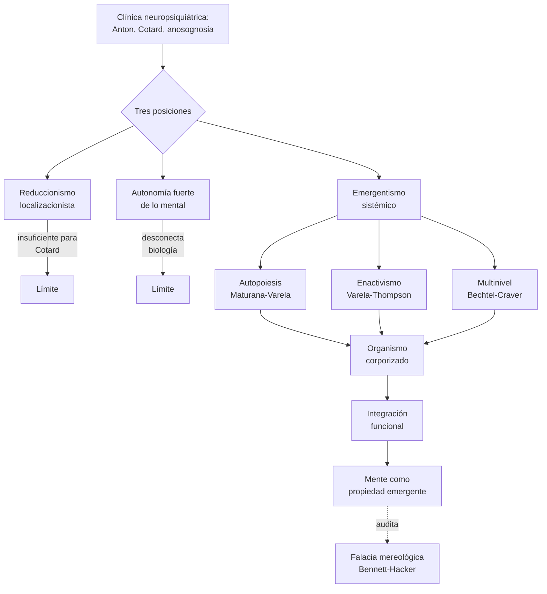

# Quinta clase — Mente, conducta y cerebro: reduccionismo, autonomía y emergencia

> **Posición cronológica:** quinta sesión. Después de instalar el vocabulario histórico (1-2), anatómico (3) y epistemológico (4), la clase asume el problema **ontológico**: *qué tipo de cosa es lo mental* y *qué tipo de explicación necesita*.
> **Texto de cabecera:** Ramírez-Bermúdez, Pérez-Gay & Aliseda (2024), *Neuropsychiatric Constructs as Bridges between Psychopathology and Neuropathology*; en diálogo crítico con Bennett & Hacker, *Mereological Fallacy in Neuroscience*.

---

## 1. Tema central

La clase plantea la disputa **reduccionismo vs. autonomía vs. emergentismo** desde el laboratorio donde la disputa se vuelve urgente: la **clínica neuropsiquiátrica**. Hay déficit clínicos que se explican muy bien con lesión-función localizada (afasia broca, ceguera cortical pura), y hay otros que se resisten obstinadamente: **síndrome de Anton** (ceguera con anosognosia), **síndrome de Cotard** (delirio nihilista), psicosis post-encefalitis, esquizofrenia. Estos últimos exigen pensar mente-conducta-cerebro como *niveles articulados de un mismo sistema vivo*.

La tesis del profesor es **monismo ontológico + pluralismo explicativo controlado**: no hay sustancias inmateriales, pero la mente no se reduce sin resto a una descripción de bajo nivel. La salida es una **filosofía del organismo**: autopoiesis (Maturana-Varela), cognición situada y enactiva (Varela-Thompson-Rosch), evolución multinivel, semiosis cultural, metacognición implícita y explícita.

En la sesión emerge además una **pregunta original del estudiante** (formalizada en los apuntes): *¿es lícito reemplazar parte del vocabulario mentalista por una formalización estructural más austera —grafos, hipergrafos, variables, relaciones— sin caer ni en eliminativismo vacío ni en emergentismo brumoso?*

## 2. Conceptos clave

- **Constructo neuropsiquiátrico** — Ramírez-Bermúdez et al.: requiere (1) patrón psicopatológico, (2) patrón neuropatológico identificado, (3) relación causal demostrable. Distingue *illness* (sufrimiento subjetivo) de *disease* (alteración objetiva).
- **Síndrome de Anton** — ceguera cortical bilateral con negación del déficit (anosognosia visual). Disocia visión, conducta y autoacceso.
- **Síndrome de Cotard** — delirio nihilista: el paciente cree estar muerto o no tener cuerpo. Caso paradigmático de fenómeno *integrativo* irreductible a una lesión local.
- **Reduccionismo** — explicar un fenómeno mediante sus partes constituyentes. Versión fuerte: eliminar el nivel superior. Versión moderada: preservar el nivel superior como abreviatura útil.
- **Falacia mereológica** (Bennett & Hacker, vía Wittgenstein) — atribuir a una **parte** del animal (el cerebro) predicados psicológicos que lógicamente solo se aplican al animal **como todo**. "El cerebro cree", "decide", "interpreta": confusión categorial.
- **Autonomía de lo psicológico** — Fodor: las generalizaciones de las "ciencias especiales" (psicología, economía) no se reducen a las de la física. El nivel funcional tiene autonomía explicativa.
- **Emergentismo** — débil (propiedades irreductibles *epistémicamente*) vs. fuerte (irreductibles *ontológicamente*, con causación descendente). El profesor inclina al débil.
- **Autopoiesis** — Maturana & Varela: organismo como sistema que produce y mantiene su propia organización. Base biológica de la autonomía.
- **Cognición enactiva** — Varela, Thompson, Rosch (*The Embodied Mind*, 1991): cognición como acoplamiento dinámico organismo-entorno; no como cómputo simbólico interno.
- **Sistemismo** — Mario Bunge: todo es sistema o parte de sistema; el comportamiento global no se lee transparente desde las partes.
- **Interocepción y emoción somática** — Damasio (somatic markers), Craig, Barrett: la emoción incluye monitoreo de estados internos del cuerpo.
- **Metacognición implícita / explícita** — la primera es regulación no consciente; la segunda es evaluación tematizable, requiere lenguaje y representación de segundo orden.
- **Modelos ODE vs ABM** — ecuaciones diferenciales ordinarias para variables agregadas continuas; modelos basados en agentes (agent-based models) para heterogeneidad e interacción local. La elección no es neutra: codifica una apuesta sobre qué cuenta como nivel relevante.

## 3. Autores y lecturas asociadas

- **Ramírez-Bermúdez, Pérez-Gay & Aliseda (2024)** — *Neuropsychiatric Constructs as Bridges between Psychopathology and Neuropathology*: lectura central. `[[Fuentes/pdf/5a - Ramírez-Bermúdez, Pérez-Gay, & Aliseda - (2024) Neuropsychiatric Constructs as Bridges between Psychopathology and Neuropathology. A Medical Perspective]]`.
- **Bennett & Hacker (2003)** — *Philosophical Foundations of Neuroscience*: falacia mereológica. Discutida en los apuntes de lecturas.
- **Maturana & Varela (1980)** — *Autopoiesis and Cognition*.
- **Varela, Thompson & Rosch (1991)** — *The Embodied Mind*.
- **Thompson (2007)** — *Mind in Life*.
- **Searle (1980)** — *Minds, Brains, and Programs* (cuarto chino). Background de la crítica al computacionalismo.
- **Putnam (1967), Fodor (1974)** — autonomía y realizabilidad múltiple (recapitulados).
- **Churchland P. & P.** — eliminativismo materialista; contrapeso fuerte al sistemismo del profesor. Ver `[[Fuentes/pdf/3b - Bickle - The Neurophilosophies of Patricia and Paul Churchland]]`.
- **Damasio (1994)** — *Descartes' Error*: somatic markers e ínsula.
- **Bunge (1980)** — *The Mind-Body Problem*: emergentismo sistémico.
- **Chalmers (1995)** — *Facing Up to the Problem of Consciousness*: el Hard Problem como telón de fondo.
- **Block (1995)** — *On a Confusion about a Function of Consciousness*: distinción acceso / fenoménico.
- **Friston (2010)** — *The free-energy principle*: marco para predictive processing (anticipo de clases futuras).

## 4. Hilos argumentales

Esta clase es el **eje ontológico** del curso. Recibe:

- De la **clase 1**: las tres reducciones psicofísicas (conductismo, identidad, funcionalismo), ahora puestas en tensión con la opción emergentista-sistémica.
- De la **clase 2**: la crítica a la metáfora computacional reaparece como **falacia mereológica** y como debate sobre si el formalismo (grafos, hipergrafos) reemplaza o complementa al vocabulario mentalista.
- De la **clase 3**: anatomía e ínsula como sustento orgánico de la teoría emergentista (interocepción, integración corporal).
- De la **clase 4**: epistemología de la evidencia como prerrequisito para discutir niveles de explicación.

Entrega:

- A la **clase 6**: discusión visual de **agnosia visual** y **prosopagnosia** como casos donde la integración multinivel se vuelve indispensable.
- Al **resto del curso** (emociones, funciones ejecutivas, lenguaje, conciencia, libre albedrío): el marco ontológico desde el cual se discutirán todos los fenómenos.
- A la **presentación Hinton**: introduce la sospecha sobre el vocabulario que el modelo conexionista hereda ("representación", "aprendizaje", "memoria") y obliga a preguntarse si una formalización austera es ganancia o pérdida.

## 5. Glosario mini

- **Falacia mereológica** — confundir lo que se predica de la parte con lo que se predica del todo. "El motor vuela" en vez de "el avión vuela".
- **Autopoiesis** — autoproducción organizacional: un sistema mantiene su identidad funcional generando sus propios componentes.
- **Enactivismo** — programa filosófico-cognitivo (Varela-Thompson) que entiende la mente como actividad encarnada y situada, no como cómputo interno sobre representaciones.
- **Emergentismo débil** — propiedades de sistemas complejos no derivables predictivamente desde el nivel inferior, pero compatibles con monismo material.
- **Constructo neuropsiquiátrico** — categoría clínica con respaldo psicopatológico **y** neuropatológico **y** evidencia causal entre ambos (Ramírez-Bermúdez et al.).

## 6. Estructura conceptual (Mermaid)

## 7. Tabla comparativa: tres posiciones sobre lo mental

| Eje | Reduccionismo | Autonomía fuerte | Emergentismo sistémico |
|---|---|---|---|
| Ontología | Solo lo físico es real | Lo mental es nivel funcional autónomo | Monismo material + niveles |
| Vocabulario mental | Por eliminar o traducir | Indispensable, independiente | Conservable revisado, anclado en biología |
| Caso favorito | Afasia broca, agnosias puras | Funciones cognitivas abstractas | Anton, Cotard, esquizofrenia |
| Riesgo | Eliminar fenómeno | Desencarnar la mente | Vaguedad si "emergencia" no se especifica |
| Aliados | P. & P. Churchland, Bickle | Fodor, Putnam | Bechtel, Craver, Varela, Thompson, Bunge |

## 8. Preguntas guía

1. ¿Por qué Anton y Cotard son los casos clínicos que **el reduccionismo localizacionista no puede explicar adecuadamente**? Construye el argumento sin caer en dualismo encubierto.
2. La falacia mereológica de Bennett-Hacker es una crítica conceptual a la neurociencia cognitiva contemporánea. ¿Es una crítica destructiva (hay que dejar de hablar así) o regulativa (hay que vigilar el uso)?
3. La autopoiesis de Maturana-Varela permite *definir* lo vivo sin apelar a una sustancia especial. ¿Permite también *definir* lo mental? ¿O hace falta algo más (Thompson: vida → mente)?
4. La pregunta del estudiante: ¿puede una formalización estructural (grafos, hipergrafos) reemplazar parte del vocabulario mentalista sin caer en eliminativismo ni en emergentismo brumoso? ¿Qué condiciones tendría que cumplir el formalismo para ser ganancia explicativa real?
5. Si seguimos un marco sistemista, ¿son legítimos los modelos computacionales del cerebro? ¿Bajo qué interpretación?
6. ¿Cómo se distingue **metacognición implícita** de **metacognición explícita** y por qué la segunda tiene relevancia para la **lógica modal** (mundos posibles, contrafácticos)?

## 9. Cross-refs al backup

- `[[01_Clases/clase-05-mente-conducta-cerebro/00_indice]]` — índice.
- `[[01_Clases/clase-05-mente-conducta-cerebro/01_desarrollo_pregunta]]` — formalización completa de la pregunta del estudiante.
- `[[01_Clases/clase-05-mente-conducta-cerebro/02_posturas_profesores]]` — tabla analítica vs. sistémica.
- `[[01_Clases/clase-05-mente-conducta-cerebro/03_pregunta_formalizada]]` — versión ST (lógica formal) de la pregunta.
- `[[01_Clases/clase-05-mente-conducta-cerebro/charla1]]` — reconstrucción larga de la clase (Anton, Cotard, autopoiesis, enactivismo, metacognición).
- `[[01_Clases/clase-05-mente-conducta-cerebro/charla2]]` — enredos categoriales.
- `[[01_Clases/clase-05-mente-conducta-cerebro/lecturas]]` — desglose de Ramírez-Bermúdez y de Bennett-Hacker.
- `[[Fuentes/pdf/5a - Ramírez-Bermúdez, Pérez-Gay, & Aliseda - (2024) Neuropsychiatric Constructs as Bridges between Psychopathology and Neuropathology. A Medical Perspective]]` — PDF.
- `[[02_Lecturas/06_emocion_interocepcion_neuropsiquiatria/00_indice]]` — carpeta temática.
- `[[02_Lecturas/08_conciencia_agencia_y_modelos/00_indice]]` — carpeta temática.

## 10. Para el estudiante

La quinta clase pide algo más exigente que las anteriores: **tomar partido teórico**, no solo entender doctrinas. Una posición razonable en este curso podría enunciarse así: *acepto monismo ontológico (todo lo real es material), pluralismo explicativo controlado (la psicología tiene autonomía relativa, no absoluta), y emergentismo débil (lo mental es propiedad organizacional irreductible epistémicamente pero no ontológicamente)*. Esa posición evita el dualismo, evita el eliminativismo grosero y evita el funcionalismo desencarnado. Es la que el profesor —según las notas— parece sostener. Tu pregunta sobre **formalización estructural** la lleva un paso más: ¿puede una ontología austera + hipergrafos + dinámicas hacer el trabajo conceptual que hoy hace el vocabulario mentalista? Es una pregunta abierta y posiblemente la más interesante del curso. La clase 6 te dará el caso visual para probarla; las clases sucesivas, los casos emocional, ejecutivo y lingüístico.
