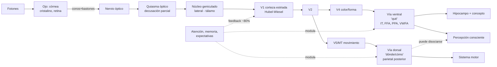

# Sexta clase — Visión: del ojo a la conciencia perceptiva

> **Posición cronológica:** sexta sesión. Aplicación del marco completo (histórico, anatómico, epistemológico, ontológico) al **caso paradigmático** de la cognición.
> **Textos de cabecera:** Triviño-Mosquera et al., cap. 3 *Percepción visual* (lectura central); Zeki (1992), *The Visual Image in Mind and Brain*.

---

## 1. Tema central

La visión es el sistema sensorial mejor estudiado y, por eso, el laboratorio donde todas las preguntas del curso se vuelven concretas. La clase muestra que **no existe "la visión"** como facultad unitaria: hay un sistema modular, jerárquico, multifásico, retroalimentado, donde **lo perceptivo está atravesado por lo conceptual** desde muy temprano (top-down) y donde **menos del 20% de la actividad cortical visual procede del ojo** —el resto es inferencia, expectativa, contexto.

Esto golpea de frente al ingenuo "ver es como una cámara". La visión es un **proceso constructivo activo** que opera sobre señales empobrecidas (la *bóveda oscura* de la clase 3), modulado por estados internos (atención, memoria, expectativas) y dividido funcionalmente en al menos dos grandes vías —**ventral ("qué")** y **dorsal ("dónde/cómo")**— cuya disociación clínica fundamenta uno de los argumentos más sólidos por la organización modular del sistema.

## Plan didáctico de la clase

1. **Apertura.** Psicofísica de Fechner (~1860): el problema de relacionar magnitud física y magnitud psíquica. *Ejemplo del pez beta y el elefante*: percibimos los cambios relativamente, no en magnitudes absolutas.
2. **Sustrato anatómico, paso a paso.** Ojo → retina (conos/bastones, fóvea, punto ciego) → nervio óptico → quiasma → tracto óptico → núcleo geniculado lateral (talámico) → radiaciones ópticas → corteza visual primaria (V1, lóbulo occipital).
3. **Decusación parcial.** En el quiasma se cruza solo la mitad nasal de cada retina. Mapa visual contralateral: hemicampo derecho → V1 izquierda.
4. **Retinotopía y especialización.** V1 → V2, V3, V4 (color), V5/MT (movimiento). Columnas de orientación de Hubel y Wiesel.
5. **Dos vías corticales.** Ventral (occipito-temporal): "qué" — identidad, color, forma, lectura, rostros. Dorsal (occipito-parietal): "dónde / cómo" — localización, guía de la acción.
6. **Top-down y leyes de la Gestalt.** Proximidad, similitud, continuidad, cierre, figura-fondo. El lenguaje y la categorización modulan masivamente lo que vemos.
7. **Disociaciones clínicas.** Agnosia visual aperceptiva vs asociativa, prosopagnosia, acromatopsia central, akinetopsia, *blindsight* (visión ciega), ataxia óptica, simultanagnosia (síndrome de Balint).
8. **Caso DF** (paciente de Goodale & Milner): no reconoce orientación de una ranura pero introduce correctamente la carta. Disociación percepción consciente / acción visomotora.
9. **Cierre.** Percepción visual como inferencia bayesiana; preámbulo a la Clase 11 (interocepción), Clase 13 (representaciones) y Clase 14 (cerebro predictivo).

## 2. Conceptos clave

- **Psicofísica (Fechner)** — relación cuantitativa entre estímulo físico y experiencia subjetiva. *Ley de Weber-Fechner*: la sensibilidad al cambio depende de la magnitud previa (proporcional, no absoluta). El ejemplo del profesor: notamos al pez beta que crece de 15 a 25 cm; no notamos al elefante que crece igual cantidad.
- **Espectro electromagnético visible** — 400-750 nm. Una franja minúscula del total. Otras especies ven UV (abejas, camarón mantis), IR (algunas serpientes).
- **Transducción retinal** — fotones → señal eléctrica en conos (color, alta resolución, fovea) y bastones (baja luz, periferia).
- **Vía retina-tálamo-corteza** — retina → nervio óptico → **quiasma óptico** (decusación parcial: hemicampo derecho proyecta a hemisferio izquierdo, viceversa) → **núcleo geniculado lateral** (NGL, tálamo; con separación de vías **magnocelular** —M: movimiento, contraste— y **parvocelular** —P: detalle, color—) → radiación óptica → **V1** (corteza estriada occipital).
- **Hubel & Wiesel** — Nobel 1981: células simples y complejas en V1; selectividad por orientación, organización columnar.
- **Áreas visuales extraestriadas** — V2, V3 (movimiento), V4 (color, forma), V5/MT (movimiento), FFA (caras, Kanwisher), PPA (lugares), VWFA (palabras).
- **Dos vías corticales (Ungerleider-Mishkin / Goodale-Milner)** —
  - **Ventral**: V1 → V2 → V4 → IT → temporal inferior. "Qué": forma, color, identidad, asociación con hipocampo y memoria. Conexión con conceptualización.
  - **Dorsal**: V1 → V2/V3 → V5/MT → parietal posterior. "Dónde/cómo": localización, movimiento, guía de acción. Conexión con sistema motor.
- **Procesamiento bottom-up vs top-down** — ascendente desde estímulo vs descendente desde expectativas, contexto, memoria. El profesor enfatiza: ~80% del input a V1 viene de feedback intracortical, no de retina.
- **Leyes de la Gestalt** — proximidad, similitud, continuidad, cierre, figura-fondo. Operan como **priors perceptivos** que organizan el campo visual.
- **Ilusiones y pareidolia** — vestido azul/negro o blanco/dorado, pato-conejo, rostros en nubes. Evidencia de organización top-down y de priors estadísticos.
- **Agnosias visuales** — Lissauer (1890): **aperceptiva** (no se forma la representación) vs **asociativa** (representación bien formada pero sin acceso a significado).
- **Prosopagnosia** — agnosia selectiva de rostros, asociada a daño FFA (gyrus fusiforme derecho). Caso de doble disociación clásica.
- **Blindsight / visión ciega** — paciente con lesión V1 que niega ver pero responde a estímulos por encima del azar. Disocia conciencia visual de procesamiento visual.
- **Síndrome de Anton** — recapitulado de clase 5: ceguera cortical con anosognosia. Toca la frontera entre visión, autoacceso y conciencia.
- **Síndrome de Balint** — lesión parietal bilateral: simultanagnosia (percibe un objeto a la vez), apraxia óptica y ataxia óptica. Forma extrema del fallo de la vía dorsal.

## 3. Autores y lecturas asociadas

- **Triviño-Mosquera et al.** — cap. 3 *Percepción visual* (lectura central): `[[Fuentes/pdf/6a - Triviño-Mosquera et al. - Visión]]`, transcripción en `[[01_Clases/clase-06-vision/6a_Trivino-Mosquera_vision]]`.
- **Zeki (1992)** — *The Visual Image in Mind and Brain*, Scientific American: `[[Fuentes/pdf/6b - Zeki - (1992) The Visual Image in Mind and Brain]]`. Defiende **modularidad funcional** (V4 color, V5 movimiento) y acroma topsia / akinetopsia como casos clínicos.
- **Fechner (1860)** — *Elemente der Psychophysik*.
- **Helmholtz (1867)** — *Handbook of Physiological Optics*: percepción como **inferencia inconsciente**. Precursor del procesamiento bayesiano y predictive coding.
- **Hubel & Wiesel (1959-1979)** — receptive fields, columnas de orientación.
- **Marr (1982)** — *Vision*: niveles de análisis aplicados al sistema visual; *primal sketch*, *2½D sketch*, modelo 3D.
- **Ungerleider & Mishkin (1982)** — propuesta original de dos vías.
- **Goodale & Milner (1992)** — reformulación funcional: vía dorsal *para la acción*, no solo *para localización*. Caso DF (paciente con agnosia visual pero coordinación visomotriz preservada).
- **Kanwisher** — FFA, evidencia de modularidad selectiva.
- **Bechtel** — *Representations* (clase 3) recuperado aquí: cada área visual computa una transformación específica.
- **Tononi (IIT)** — relevante para la pregunta visión-conciencia.
- **Frith, Friston, Clark** — predictive processing / cerebro predictivo. Ver `[[Fuentes/pdf/15a - Nave et al. - (2020) Wilding the Predictive Brain]]`.

## 4. Hilos argumentales

La sexta clase **integra y prueba** todo lo anterior:

- **Clase 1**: Ferrier ya había descrito ceguera por ablación occipital. Aquí se desarrolla el sistema entero.
- **Clase 2**: la metáfora computacional (Marr es el primer caso paradigmático) y la metáfora conexionista se aplican simultáneamente al sistema visual.
- **Clase 3**: el cerebro en la *bóveda oscura* y la multimodalidad encuentran aquí su demostración más fuerte: el sistema visual reconstruye el mundo a partir de fotones, integrando expectativas.
- **Clase 4**: las doble disociaciones (DF de Goodale-Milner, paciente con agnosia asociativa puro vs paciente con agnosia aperceptiva pura) son los ejemplos canónicos de la epistemología bechteliana.
- **Clase 5**: blindsight, Anton, agnosias asociativas y prosopagnosia son los casos donde el reduccionismo localizacionista no basta —se necesita integración entre niveles—.
- **Presentación Hinton**: las jerarquías de detección de rasgos en redes neuronales artificiales se inspiran directamente en Hubel-Wiesel y en la organización jerárquica del sistema visual. La pregunta filosófica: ¿una CNN que clasifica caras *ve* en algún sentido?

## 5. Glosario mini

- **Quiasma óptico** — punto de cruce parcial de los nervios ópticos. Información del hemicampo derecho de **ambos ojos** termina en hemisferio izquierdo (y simétrico). Por eso una lesión cortical produce hemianopsia y no ceguera monocular.
- **Vía ventral / dorsal** — "qué" / "dónde-cómo". Disociadas anatómica y clínicamente.
- **Top-down vs bottom-up** — procesamiento descendente (expectativa, contexto) vs ascendente (señal sensorial). En el sistema visual coexisten y se modulan: feedback intracortical domina cuantitativamente.
- **Agnosia aperceptiva vs asociativa** — falla en formar la representación vs falla en acceder al significado de la representación bien formada.
- **Blindsight** — disociación entre procesamiento visual y conciencia visual; clave para el debate Block (access vs phenomenal).

## 6. Estructura conceptual (Mermaid)

## 7. Tabla comparativa: cuatro síndromes visuales

| Síndrome | Lesión | Déficit | Conserva | Lección filosófica |
|---|---|---|---|---|
| Ceguera cortical bilateral | V1 bilateral | Toda visión consciente | A veces blindsight | Conciencia visual disociable de procesamiento |
| Síndrome de Anton | V1 bilateral + áreas asociativas | Visión + autoconciencia del déficit | Habla, conducta general | Anosognosia: autoacceso es proceso aparte |
| Agnosia asociativa | Temporal inferior | Reconocimiento semántico | Forma, copia, dibujo | Disocia percepción de conceptualización |
| Prosopagnosia | FFA (fusiforme derecho) | Reconocimiento de caras | Reconocimiento de otros objetos | Modularidad de categorías visuales |
| Akinetopsia (Zihl) | V5/MT bilateral | Percepción de movimiento | Forma, color | Modularidad funcional (Zeki) |
| Blindsight | V1 (vía secundaria intacta) | Conciencia visual | Discriminación por encima del azar | Procesamiento sin conciencia |
| Paciente DF (Goodale-Milner) | Vía ventral | Reconocimiento de objetos | Guía visomotriz precisa | Dos vías funcionales independientes |

## 8. Preguntas guía

1. Si "menos del 20% del input a V1 viene del ojo" (cifra del profesor / Frith), ¿en qué sentido seguimos diciendo que la visión es un sentido *receptivo*? Reconstruye el argumento del **cerebro predictivo** desde este dato.
2. Goodale-Milner (1992) reformularon Ungerleider-Mishkin (1982) cambiando "vía dorsal = dónde" por "vía dorsal = cómo (para la acción)". ¿Qué evidencia clínica forzó el cambio?
3. ¿Por qué la **prosopagnosia selectiva** es un argumento fuerte por la **modularidad funcional** (Fodor, Kanwisher) y qué objeción sistémica podrían darle Bechtel o Bennett-Hacker?
4. Blindsight pone en jaque la equivalencia procesamiento ↔ conciencia. ¿Cómo lo articula la distinción de **Block** entre conciencia de acceso y conciencia fenoménica?
5. La afirmación del profesor "el lenguaje es uno de los grandes moduladores de la experiencia visual" conecta con efectos como la *categorial perception* del color. ¿Es eso compatible con un modelo modular puro de la visión?

## 9. Cross-refs al backup

- `[[01_Clases/clase-06-vision/00_indice]]` — índice.
- `[[01_Clases/clase-06-vision/NotasJacob]]` — notas detalladas Jacob: psicofísica, sustrato, Gestalt, dos vías.
- `[[01_Clases/clase-06-vision/NotasStev]]` — notas Stev: vía retino-cortical, decusación, top-down.
- `[[01_Clases/clase-06-vision/6a_Trivino-Mosquera_vision]]` — transcripción del capítulo.
- `[[Fuentes/pdf/6a - Triviño-Mosquera et al. - Visión]]` — PDF original.
- `[[Fuentes/pdf/6b - Zeki - (1992) The Visual Image in Mind and Brain]]` — Zeki Scientific American.
- `[[Fuentes/pdf/15a - Nave et al. - (2020) Wilding the Predictive Brain]]` — cerebro predictivo aplicable.
- `[[02_Lecturas/03_percepcion_y_vision/00_indice]]` — carpeta temática.
- `[[01_Clases/clase-03-neuroanatomia/14_representaciones_multimodalidad_y_flujo]]` — *bóveda oscura*, raíz teórica.
- `[[01_Clases/clase-05-mente-conducta-cerebro/charla1]]` — Anton recapitulado.

## 10. Para el estudiante

Si tuvieras que defender un parcial sobre visión en cinco minutos, lo central es esto: **la visión no es captura sino construcción**. La cadena ojo-nervio-tálamo-corteza es solo el *bottom-up*; el sistema visual real es un grafo masivamente retroalimentado donde lo perceptivo y lo conceptual no son etapas sucesivas sino capas que se modulan mutuamente. La organización jerárquica (Hubel-Wiesel) coexiste con la organización modular (Zeki: V4 color, V5 movimiento, FFA caras) y con la división de gran escala en dos vías funcionales (ventral qué / dorsal cómo). Los síndromes clínicos —blindsight, agnosias, prosopagnosia, Anton— no son curiosidades: son **experimentos naturales** que disocian componentes funcionales y validan empíricamente la arquitectura. Y filosóficamente, la visión es el caso donde mejor se ve por qué el reduccionismo localizacionista, sin convergencia multitécnica (clase 4) y sin perspectiva sistémica (clase 5), no basta. Esta clase cierra una mitad del curso y abre la otra (emoción, lenguaje, memoria, conciencia, libre albedrío) con todo el aparato instalado.
