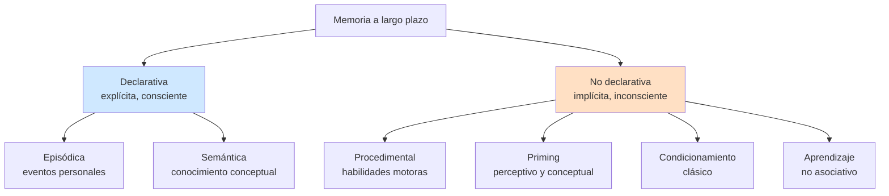
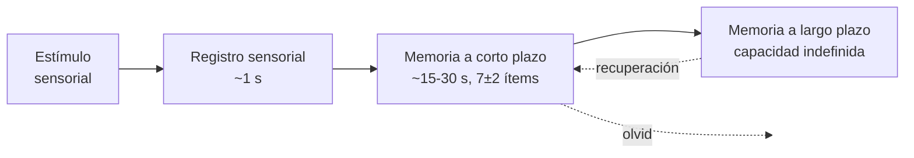
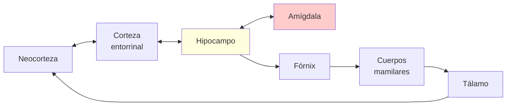
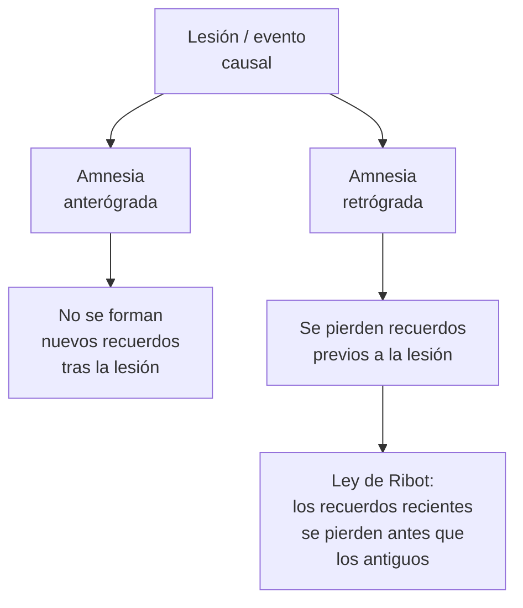
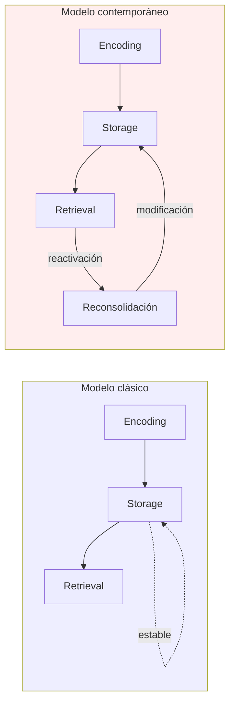
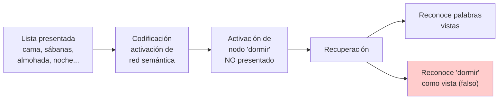

# Memoria — Filosofía de la mente y ciencia cognitiva

> Reconstrucción y desarrollo de notas de clase. Cada bloque conserva las ideas del docente y se completa con el contexto teórico, autores, fechas y evidencia que normalmente acompañan a estas exposiciones.

---

## 1. Por qué la memoria es un problema filosófico

Casi todo nuestro conocimiento del mundo depende de la memoria. Sin embargo, **el conocimiento del pasado es lógicamente independiente del pasado mismo**: lo que ocurrió ya no existe, y lo que tenemos son representaciones presentes (recuerdos, huellas, registros) sobre lo que ocurrió. Esos recuerdos son *intrascendentes* en el sentido técnico de que no trascienden el presente: están aquí, ahora, en el sujeto que recuerda. Y, paradójicamente, **conocemos mejor el pasado que el futuro**, aun cuando el pasado ya no es y el futuro todavía no es.

Recordar es además un proceso cognitivo fundamental, implicado en prácticamente todas las funciones cognitivas superiores:

> *"La memoria está involucrada en el razonamiento, la percepción, la resolución de problemas, la comprensión del lenguaje, la planificación, la toma de decisiones y la construcción del yo. Sin memoria no hay aprendizaje, ni identidad personal, ni proyecto, ni cultura."*

De ahí que la memoria sea simultáneamente un problema **psicológico** (cómo funciona), **neurocientífico** (en qué sustrato), **epistemológico** (qué garantiza el conocimiento que produce) y **metafísico** (qué tipo de entidad es un recuerdo).

---

## 2. Tres sentidos de "memoria"

La palabra *memoria* es ambigua. En contexto filosófico es útil distinguir tres sentidos:

1. **Facultad psicológica** — capacidad o disposición del sujeto para almacenar información.
2. **Proceso** — actividad de codificar, retener y recuperar información (el *recordar* como verbo).
3. **Contenido** — aquello que es recuperado: el recuerdo concreto, el *engrama*, la huella.

Buena parte de las confusiones en la literatura nacen de mezclar estos tres niveles. Por ejemplo: la pregunta "¿dónde está la memoria?" tiene respuestas distintas según se pregunte por la facultad (distribuida en sistemas), el proceso (dinámico) o el contenido (no localizable como cosa).

---

## 3. Tipos de memoria

### 3.1. Distinciones funcionales clásicas

**Memoria episódica.** Presenta su contenido en forma de imagen (imagística) y se refiere al pasado personal e individual. Es **autobiográfica**. Recordar el cumpleaños del año pasado, recordar dónde dejé las llaves esta mañana. Tulving (1972) la introdujo como distinta de la semántica.

**Memoria semántica.** Conocimiento conceptual y factual desvinculado del contexto en que se aprendió. Saber que la capital de Francia es París, saber qué es un triángulo. No se recuerda *cuándo* se aprendió.

**Memoria procedimental.** Saber-cómo: montar en bicicleta, conducir, tocar un instrumento. Es no declarativa, no verbalizable y se manifiesta en la ejecución.

**Memoria de trabajo.** Almacenamiento *temporal* y manipulación activa de información durante una tarea: sumar mentalmente, mantener una frase mientras se la interpreta. Modelo de Baddeley & Hitch (1974): ejecutivo central + bucle fonológico + agenda visoespacial + búfer episódico.

### 3.2. Modelo estándar (taxonomía Squire–Tulving)

A esto se suma, en paralelo y como sistema distinto, la **memoria a corto plazo / de trabajo**, que el modelo modal de Atkinson & Shiffrin (1968) sitúa antes del paso a largo plazo:

> **Punto crítico:** esta arquitectura modular es una idealización. La evidencia más reciente sugiere sistemas más entrelazados (la memoria de trabajo recluta regiones de largo plazo; el hipocampo participa en tareas que se consideraban puramente perceptivas).

---

## 4. El proceso diacrónico de recordar

Tres etapas, en el orden temporal en que ocurren:

1. **Codificación** — la experiencia se transforma en una representación mnémica. No es pasiva: depende de atención, profundidad de procesamiento (Craik & Lockhart 1972), estado emocional y contexto.
2. **Almacenamiento** — la representación persiste en el tiempo. Aquí ocurre la **consolidación**.
3. **Recuperación** — la representación se reactiva para producir un recuerdo. Implica reconstrucción y, según evidencia reciente, *reconsolidación* (la huella se modifica al ser reactivada).

### 4.1. La doble escala de la consolidación

La consolidación opera en dos escalas temporales y a dos niveles distintos:

- **Consolidación sináptica.** Estabilización local de la huella en las sinapsis del hipocampo y áreas vecinas. Ocurre en **minutos a horas**. Sustrato: LTP (potenciación a largo plazo), síntesis de proteínas, cambios en receptores AMPA/NMDA.
- **Consolidación de sistemas.** Redistribución gradual de la huella desde el hipocampo hacia la corteza neocortical, que pasa a ser su soporte estable. Ocurre en **semanas, meses o años**. Modelo dominante: *teoría de la consolidación estándar* (Squire & Alvarez 1995); alternativa: *teoría de la huella múltiple* (Nadel & Moscovitch 1997), según la cual el hipocampo permanece implicado en recuerdos episódicos detallados toda la vida.

$$
\text{Consolidación}_{\text{sináptica}} \subset \text{Consolidación}_{\text{sistemas}}
$$

(la primera es condición necesaria para la segunda, pero no a la inversa).

---

## 5. Sustrato neural: el hipocampo

- **Tamaño:** aproximadamente **3,5–4 cm** de longitud.
- **Localización:** oculto en la cara interna del cerebro, en el **lóbulo temporal medial**.
- **Estructura par:** existen dos hipocampos, uno en cada hemisferio (derecho e izquierdo).
- **Conexiones:** integrado en el **sistema límbico**, conectado con la **amígdala** (memoria emocional), el **fórnix**, los **cuerpos mamilares** y, mediante la **corteza entorrinal**, con amplias regiones de la **neocorteza**.

El hipocampo no es un "depósito" de recuerdos: es más bien un **integrador y orquestador** que une fragmentos representados en distintas áreas corticales (visual, auditiva, semántica) y que durante la consolidación va cediendo el control a la neocorteza.

---

## 6. Evidencia neuropsicológica: doble disociación

El argumento metodológico fuerte para postular sistemas de memoria distintos es la **doble disociación** (Teuber 1955):

- **Disociación simple:** una lesión deteriora la función A pero no la B → A y B podrían ser disociables.
- **Doble disociación:** una lesión deteriora A pero no B; *otra* lesión deteriora B pero no A → A y B son funcional y neuralmente independientes.

| Sistema afectado | Sistema preservado | Evidencia |
|---|---|---|
| Memoria explícita (declarativa) | Implícita y de corto plazo | Pacientes con lesión hipocampal (H.M.) |
| Memoria implícita (procedimental) | Explícita | Pacientes con Huntington, Parkinson |
| Memoria de corto plazo | Memoria a largo plazo | Paciente K.F. (Shallice & Warrington 1970) |

Las lesiones inversas demuestran que **la memoria explícita, la implícita y la de corto plazo operan sobre sustratos neurales funcionalmente independientes**.

---

## 7. Tipos de amnesia

- **Amnesia anterógrada.** El sujeto **no puede formar nuevos recuerdos declarativos** después del evento causal. Recuerda su pasado lejano, pero olvida lo que acaba de suceder. El caso paradigmático es H.M.
- **Amnesia retrógrada.** Pérdida de recuerdos de eventos previos a la lesión. Suele seguir la **Ley de Ribot** (Théodule Ribot, *Les maladies de la mémoire*, 1881): los recuerdos más recientes se pierden antes que los antiguos. La explicación clásica: los recuerdos antiguos están más consolidados (más distribuidos en neocorteza), y los recientes dependen aún del hipocampo.

### 7.1. El caso H.M. — Henry Molaison (1926–2008)

En **1953**, William Beecher Scoville le practicó una **resección bilateral del lóbulo temporal medial** (incluyendo ambos hipocampos y parte de la amígdala) para tratar una epilepsia intratable. La epilepsia mejoró; la memoria quedó devastada.

Resultado clínico (estudiado durante medio siglo por Brenda Milner, Suzanne Corkin y otros):

- **Perdió** la capacidad de almacenar nueva información declarativa, verbalizable y consciente → **amnesia anterógrada severa**.
- **Preservó** la memoria a corto plazo (podía mantener un número en mente unos segundos).
- **Preservó** la memoria no declarativa: aprendía nuevas habilidades motoras (tarea del *mirror tracing*, Milner 1962) y mostraba *priming* perceptivo, **aunque no recordaba haber practicado**.

Implicación teórica: la doble disociación entre memoria declarativa (perdida) y procedimental (intacta) demuestra que son **sistemas distintos**. Y que el lóbulo temporal medial es necesario para la consolidación declarativa.

> Su identidad real (Henry Molaison) se reveló tras su muerte en 2008. Su cerebro fue seccionado en 2.401 cortes y digitalizado por el equipo de Jacopo Annese.

---

## 8. Caracterización por contenido — Aristóteles y la concepción tradicional

Para **Aristóteles** (*De memoria et reminiscentia*), la memoria es la facultad encargada de proporcionarnos información **verídica sobre el pasado**. Esta es la **concepción tradicional** o **"de sentido común"** de la memoria:

> Recordar es traer al presente algo que ya ocurrió, y un recuerdo es genuino sólo si:
> (i) representa fielmente lo ocurrido, y (ii) lo ocurrido es la causa del recuerdo.

### 8.1. Problemas de la concepción tradicional

Cuatro fenómenos la ponen en crisis:

1. **Recuerdos sobre el futuro.** "Recuerdo que tengo una cita con Jorge". Aquí *recordar* no es presentar el pasado sino retener una intención o un compromiso. La memoria prospectiva no encaja en la definición aristotélica.
2. **Falsos recuerdos.** Recordamos sucesos que nunca ocurrieron, o que ocurrieron de otra manera. Si el recuerdo *no* corresponde al pasado, ¿deja de ser un recuerdo? Si la respuesta es sí, los falsos recuerdos no existen — pero existen empíricamente. Si la respuesta es no, hay que reformular la definición.
3. **Recuerdos menos vivaces que la experiencia.** Los recuerdos suelen tener menos detalle perceptivo: no se recuerda "a todo color". Esto sugiere que el recuerdo no es una *copia* sino una *reconstrucción degradada*, lo cual ya plantea el problema constructivista.
4. **Sentimiento de pasaditud.** Cuando recordamos hay una *fenomenología* característica: la sensación de que eso *fue*, de que ya ocurrió. Esa marca temporal no está dada por el contenido sino por algo añadido — y los falsos recuerdos pueden tenerla, lo cual la vuelve poco fiable como criterio.

### 8.2. La condición causal

Los filósofos insisten en que lo más importante del recuerdo es el **requisito causal**: si ahora recuerdo la fuente del parque, eso es genuinamente un recuerdo *sólo* si vi esa fuente y mi haberla visto es la causa apropiada de mi estado mental presente. Esta es la base de la **teoría causal del recuerdo**, formulada canónicamente por **Martin & Deutscher (1966)**.

Las **tres condiciones causales clásicas** (formulación de Bernecker, basada en Martin & Deutscher):

$$
S \text{ recuerda } p \;\Leftrightarrow\;
\begin{cases}
\text{(i)}  & S \text{ representa actualmente que } p \\
\text{(ii)} & S \text{ experimentó (o aprendió) que } p \text{ en } t_0 \\
\text{(iii)} & \text{La experiencia en } t_0 \text{ es causa apropiada} \\
            & \text{de la representación actual}
\end{cases}
$$

Refinadas por la psicología, las condiciones que un estado mental debe satisfacer para contar como recuerdo son:

- **Condición causal:** la representación debe haber sido causalmente producida por el evento recordado y debe ser causalmente responsable del estado mental presente.
- **Condición de retención:** la información debe haberse mantenido desde la codificación hasta la recuperación.
- **Condición de similaridad (representacional):** el contenido recuperado debe ser estructuralmente isomórfico, similar o semejante al evento que representa.

Quien rechace cualquiera de estas tres está, en la práctica, abandonando el causalismo clásico — y eso es lo que hacen las teorías constructivistas y simulacionistas contemporáneas.

---

## 9. Teorías preservacionistas

Las teorías preservacionistas se basan en la intuición del sentido común: **la memoria es almacenar información**. La huella permanece, y recordar es acceder a esa huella conservada.

### 9.1. Platón — el aviario y la tablilla de cera

En el *Teeteto* (191c–195b), Sócrates propone dos metáforas:

> *"Concedámosle entonces que hay en nuestras almas una tablilla de cera, la cual es mayor en unas personas y menor en otras [...]; si queremos recordar algo que hayamos visto u oído o pensado nosotros mismos, aplicamos a esta cera las percepciones y los pensamientos, y los grabamos en ella, como si imprimiéramos el sello de un anillo. Lo que haya quedado grabado lo recordamos y lo sabemos en tanto que permanezca su imagen; pero como se borre o no haya llegado a grabarse, lo olvidamos y no lo sabemos."*

La **metáfora de la tablilla de cera** establece tres parámetros que reaparecerán durante 24 siglos: la huella, el grabado y la durabilidad. Es el primer modelo de almacén de la memoria.

### 9.2. Aristóteles — el *eikōn* y la huella mnémica (engrama)

Aristóteles introduce el término **εἰκών (eikōn)**: el recuerdo es una *imagen* o *figura* que está en el alma como una pintura está en una tabla. Esa imagen es el **engrama** o **huella mnémica**: una marca dejada por la experiencia que persiste y que, al ser reactivada, produce el recordar.

Las tres condiciones del *eikōn* aristotélico anticipan las condiciones causalistas modernas:

1. **Condición causal:** haber sido causalmente producidas por el evento recordado, y ser causalmente responsables del recuerdo presente.
2. **Condición de retención:** retener la información inicial desde la codificación hasta el recobro.
3. **Condición de similaridad:** ser estructuralmente isomórficas, similares o semejantes a los eventos que representan.

> El término moderno *engrama* fue acuñado por **Richard Semon** en 1904 (*Die Mneme*) y reactivado en neurociencia contemporánea por Tonegawa y colaboradores (ver §13.4).

---

## 10. La teoría constructivista de Locke

**John Locke**, en el *Ensayo sobre el entendimiento humano* (1689, Libro II, Cap. X §2), formula una posición que rompe con el preservacionismo:

> *"Pero este almacenamiento de nuestras ideas en el repositorio de la memoria solamente significa esto: que en muchos casos nuestra mente tiene el poder de revivir percepciones que ha tenido antes [...]. En este sentido se dice que nuestras ideas están en nuestra memoria, cuando en realidad no están en ninguna parte, sino que tan sólo hay la capacidad de la mente de revivirlas a voluntad. Así, imaginación y memoria son una misma cosa, que por diversas consideraciones posee diversos nombres."*

Tres tesis lockeanas, decisivas para todo el debate posterior:

1. **No hay almacén literal.** Las ideas no están "guardadas" en ningún lugar; lo que hay es la *capacidad* de revivirlas.
2. **Memoria e imaginación son la misma facultad.** Difieren sólo por consideraciones extrínsecas (orientación temporal, fuerza, contexto).
3. **El recuerdo es una reactivación productiva**, no una recuperación de algo previamente guardado.

Esta posición anticipa por más de dos siglos lo que hoy se llama **simulacionismo** (Michaelian 2016) y **teoría constructiva**.

---

## 11. Bartlett y *War of the Ghosts*

**Frederic Bartlett** (*Remembering*, 1932) realizó el experimento que decidió la balanza experimental a favor del constructivismo. Pidió a participantes británicos que leyeran un cuento popular nativo americano — *The War of the Ghosts* — con elementos culturalmente extraños, y que lo reprodujeran después en distintos intervalos.

**Métodos:**

- **Reproducción repetitiva.** El mismo participante recordaba el relato varias veces, desde 15 minutos hasta meses después.
- **Reproducción serial.** Un participante reproducía el relato para otro, y así sucesivamente, como un teléfono roto cultural.

**Hallazgos centrales:** los recuerdos **no eran copias literales**, sino reproducciones guiadas por **esquemas previos**. Aparecieron tres patrones sistemáticos:

1. **Omisión:** el relato se volvía más corto.
2. **Racionalización:** los elementos extraños se volvían más lógicos para el lector.
3. **Transformación cultural:** elementos desconocidos eran reemplazados por equivalentes familiares (canoas → botes, focas → peces).

Conclusión de Bartlett — la cita programática del constructivismo:

> *"Recordar no es volver a estimular unos vestigios sin vida y fragmentarios; es una reconstrucción, o construcción imaginativa, elaborada a partir de la relación de nuestra actitud hacia una masa activa y organizada de reacciones o experiencias pasadas, y de un pequeño detalle prominente que aparece habitualmente en forma de imagen o de lenguaje."*
> — Bartlett, *Remembering*, 1932, p. 213.

---

## 12. De la retención a la reconstrucción

El modelo clásico sostiene que el almacén es estable — el modelo **ESR** (Encoding–Storage–Retrieval) entendido como una secuencia donde lo guardado se mantiene idéntico hasta su recuperación. El paradigma moderno introduce la **reconsolidación** (Nader, Schafe & LeDoux 2000): cada vez que se reactiva una huella, ésta se vuelve lábil y debe re-estabilizarse, con el riesgo (o la oportunidad) de modificarse en el proceso. El recuerdo es, así, un objeto dinámico.

### 12.1. El debate hoy

| Preservacionistas | Constructivistas |
|---|---|
| La memoria es un almacén | Los recuerdos no son almacenamiento sino simulación |
| El recuerdo conserva la huella | El recuerdo se construye en cada acto |
| La condición causal es central | La condición causal puede relajarse o abandonarse |
| Aristóteles, Locke (lectura tradicional), Squire | Bartlett, Schacter, Michaelian, Loftus |

---

## 13. Evidencia psicológica a favor de la teoría reconstructiva

### 13.1. El falso recuerdo del accidente aéreo (Crombag, Wagenaar & van Koppen 1996)

El **4 de octubre de 1992** un Boeing 747 de **El Al** se estrelló contra un edificio de apartamentos en **Bijlmermeer (Ámsterdam)**. **No existía video** del momento del impacto; nadie lo grabó.

Diez meses después, los investigadores preguntaron a participantes universitarios:

> *"¿Vio usted el video de televisión del momento en que el avión chocó contra el edificio?"*

Resultados:

- **66 %** afirmó **haber visto** el video.
- **18 %** afirmó **no recordar** haberlo visto.
- En un estudio de seguimiento se les preguntó por detalles (ángulo del impacto, si el avión iba en llamas antes), y muchos los proporcionaron con seguridad.

**Nunca hubo video.** El recuerdo había sido construido a partir de informes verbales, fotografías del edificio en llamas e inferencia, integrados en un esquema coherente y vivido como recuerdo episódico genuino.

### 13.2. Misinformation effect (Loftus 1993)

**Elizabeth Loftus** demostró en una larga serie de experimentos que **la introducción de palabras, frases o información en una conversación o en un proceso de interrogación puede contaminar un recuerdo**. En el experimento clásico (Loftus & Palmer 1974), participantes que vieron un video de un accidente automovilístico reportaron velocidades más altas si se les preguntaba *"¿a qué velocidad se estrellaron (smashed) los coches?"* en vez de *"¿a qué velocidad se golpearon (hit)?"*. Una semana después, los del primer grupo reportaban haber visto vidrios rotos que nunca aparecieron en el video.

Implicación: **la pregunta misma reescribe el recuerdo**. En contextos forenses esto es crítico (testimonios, identificación de sospechosos).

### 13.3. Paradigma DRM — Roediger & McDermott (1995)

Este es uno de los efectos más reproducibles de toda la psicología cognitiva. Se le presenta al sujeto una lista de palabras semánticamente asociadas a una palabra "señuelo" que **no aparece** en la lista:

> *Cansancio, cama, despierto, descanso, sábanas, ronquido, adormilado, almohada, bostezo, noche, calma, siesta...*

La palabra **"dormir"** no aparece nunca. Sin embargo, en la fase de reconocimiento posterior, los participantes reportan con altísima confianza haber visto la palabra *dormir* — con tasas de reconocimiento falso comparables a las de palabras realmente presentadas, e incluso con mayor confianza subjetiva.

> Roediger, H. L., & McDermott, K. B. (1995). *Creating false memories: Remembering words not presented in lists.* Journal of Experimental Psychology: Learning, Memory, and Cognition, 21(4), 803–814.

**Lo crucial — neuralmente:** los estudios de fMRI sobre el paradigma DRM (Cabeza et al. 2001; Schacter et al. 1996) muestran que **el hipocampo se activa tanto en el reconocimiento verdadero como en el falso**. Es decir, *the same neural regions engage during both true and false recognition*. El cerebro no distingue, en su sustrato hipocampal, entre recordar lo que ocurrió y "recordar" lo que nunca ocurrió pero encaja con el esquema.

### 13.4. Recuerdo e imaginación comparten sustrato neural

Una serie de estudios de neuroimagen (Schacter, Addis & Buckner 2007) ha mostrado que **al recordar eventos pasados y al imaginar eventos futuros se activan las mismas regiones cerebrales** — la llamada *core network* o **default mode network**: hipocampo, corteza prefrontal medial, corteza parietal posterior, lóbulo temporal medial.

Conclusión que algunos investigadores extraen: **recuerdo e imaginación son funcionalmente la misma cosa, orientadas en direcciones temporales distintas**. Este es el argumento empírico central del *simulationism* contemporáneo (Michaelian 2016, *Mental Time Travel*).

### 13.5. Optogenética y manipulación de engramas (Tonegawa et al.)

La **optogenética** es la intervención física directa de la luz sobre poblaciones neuronales genéticamente modificadas para expresar canales sensibles a la luz (channelrhodopsin), lo que permite identificar, encender, apagar y manipular las poblaciones neuronales específicas que conforman un recuerdo.

**Hallazgos clave del laboratorio de Susumu Tonegawa (MIT):**

- **Liu et al. (2012, *Nature*).** Identificaron células de un engrama específico en el hipocampo de ratones (girus dentado) y, reactivándolas con luz, **dispararon la conducta de miedo** asociada al contexto original. *Reactivar el engrama = recordar.*
- **Ramirez et al. (2013, *Science*).** Indujeron **falsos recuerdos** en ratones. Activaron el engrama de un contexto seguro mientras administraban un shock en otro contexto. El ratón terminó asustándose del primer contexto, donde nunca había sido lastimado. *Se "implantó" un recuerdo falso por intervención directa.*

Esto demuestra que un recuerdo es físicamente manipulable en su sustrato neural, y que la línea entre recuerdo verdadero y falso no es ontológica sino causal-funcional.

---

## 14. Una posición intermedia — Mohan Matthen (2010)

Frente a la dicotomía preservacionismo / constructivismo, **Mohan Matthen** propone una salida elegante:

> *"It is commonly held that memory is preservation, and surely it is. But it is wrong to think that memory is the preservation of what is experienced or represented in the memory experience, image, or belief. What is preserved is a trace from which it is possible to reconstruct an image or belief."*
> — Matthen, *Is Memory Preservation?*, Philosophical Studies, 2010.

La distinción es sutil pero decisiva: **lo que se preserva no es el contenido fenoménico del recuerdo, sino una huella desde la cual el contenido puede ser reconstruido**. La memoria preserva *materiales* (huellas, trazos, asociaciones); el recuerdo es lo que el sujeto fabrica con esos materiales en el momento de recordar.

Formalmente:

$$
\text{Recuerdo}(t_1) = f(\;\text{Huella}(t_0), \;\text{Contexto}(t_1), \;\text{Esquemas}(t_1)\;)
$$

donde $f$ es la función reconstructiva. La preservación es real (de la huella), pero el recuerdo no es la lectura de la huella sino el producto de $f$ aplicada a múltiples insumos, varios de los cuales son del presente.

---

## 15. Conclusiones

1. **Hay que abandonar el concepto tradicional de memoria como almacenamiento**. La metáfora de la tablilla de cera es heurísticamente útil pero literalmente falsa: no hay un depósito interno donde los recuerdos esperen, intactos, ser leídos.

2. **Problema metafísico abierto:** ¿son la imaginación y la memoria una sola capacidad? La evidencia neural (red por defecto compartida) sugiere que sí en el sustrato, pero las diferencias funcionales (orientación temporal, anclaje causal, fenomenología de pasaditud) podrían justificar mantenerlas conceptualmente distintas. La cuestión es si esas diferencias son **de tipo** o **de grado**.

3. **Problema epistemológico abierto:** si la memoria es meramente reconstrucción del pasado, **¿qué garantiza nuestro conocimiento, dado que éste depende en gran medida de la memoria?** Si cada recuerdo es una construcción guiada por esquemas presentes, parece que perdemos la fundamentación causal que el conocimiento empírico requiere. Hay tres salidas:
   - **Confiabilismo:** basta con que el proceso reconstructivo sea estadísticamente confiable, aunque no infalible.
   - **Externalismo causal:** se conserva el requisito causal sobre la huella, no sobre el contenido.
   - **Coherentismo:** el conocimiento descansa en la coherencia entre recuerdos, percepciones y testimonio, no en la fidelidad de un recuerdo aislado.

---

## 16. Apéndice — Sobre la localización de la memoria

> **Mi pregunta:** Si la memoria de alguna forma está situada, ¿por qué no está en todas partes? Y en las partes donde no está, ¿no cuenta como memoria? Pero ¿cómo es así, si digamos que la información, en los términos más reduccionistas, está en las sinapsis o mejor en las estructuras entre neurona y neurona? ¿Cómo no estaría localizada? El cerebro procesa y recuerda al mismo tiempo.

La intuición es buena y vale la pena desarmarla con precisión, porque mezcla varias preguntas distintas:

**(a) ¿La memoria está localizada en sinapsis?** Sí, parcialmente. La huella sináptica (cambios en la eficacia de las conexiones, LTP, número de espinas dendríticas) es el sustrato físico de la retención. Pero un recuerdo episódico no está en *una* sinapsis: está distribuido a través de **patrones de conectividad** que abarcan miles o millones de sinapsis en regiones distintas (visual, auditiva, hipocampal, prefrontal). La localización es real pero **distribuida**, no puntual.

**(b) ¿La memoria como contenido está localizada?** No, en el sentido en que un libro está en un estante. El contenido (lo recordado) **no es** una propiedad del cerebro de la misma manera en que el peso es una propiedad de un objeto. Es una propiedad **relacional y emergente** del patrón distribuido cuando éste se reactiva en un contexto. Esto conecta directamente con el emergentismo fuerte: los patrones tienen propiedades que las sinapsis individuales no tienen.

**(c) ¿El cerebro procesa y recuerda al mismo tiempo?** Sí, y esto es lo más importante para deshacer la confusión: **no hay distinción dura entre "memoria" y "procesamiento"**. Recordar *es* un acto de procesamiento que recluta patrones almacenados. Las mismas redes que procesan input perceptual están parcialmente almacenando ese input al hacerlo (codificación). Las mismas redes que recuperan están reconstruyendo (recuperación = procesamiento de huellas + insumos contextuales). Esta es una de las razones empíricas más fuertes a favor del constructivismo.

**Reformulación filosófica más limpia:** la pregunta "¿dónde está la memoria?" presupone que la memoria es una *cosa* (sustancia) localizable. Pero la memoria es mejor concebida como una **disposición** distribuida del sistema nervioso a producir, en condiciones apropiadas, ciertos estados representacionales. Las disposiciones no se localizan; se *manifiestan*. El cerebro es lo que tiene la disposición; el recuerdo es la manifestación.

$$
\text{Memoria} \;\not\subseteq\; \text{Lugar} \quad \text{; sino} \quad \text{Memoria} \;\subseteq\; \text{Disposición distribuida}
$$

---

## Referencias clave

- Aristóteles. *De memoria et reminiscentia*.
- Atkinson, R. C., & Shiffrin, R. M. (1968). Human memory: A proposed system. *The Psychology of Learning and Motivation*, 2.
- Baddeley, A. D., & Hitch, G. (1974). Working memory. *The Psychology of Learning and Motivation*, 8.
- Bartlett, F. C. (1932). *Remembering: A Study in Experimental and Social Psychology*. Cambridge UP.
- Bernecker, S. (2010). *Memory: A Philosophical Study*. Oxford UP.
- Crombag, H. F., Wagenaar, W. A., & van Koppen, P. J. (1996). Crashing memories. *Applied Cognitive Psychology*, 10.
- Locke, J. (1689). *Essay Concerning Human Understanding*, II.X.
- Loftus, E. F. (1993). The reality of repressed memories. *American Psychologist*, 48.
- Martin, C. B., & Deutscher, M. (1966). Remembering. *Philosophical Review*, 75.
- Matthen, M. (2010). Is memory preservation? *Philosophical Studies*, 148.
- Michaelian, K. (2016). *Mental Time Travel*. MIT Press.
- Milner, B. (1962). Les troubles de la mémoire accompagnant des lésions hippocampiques bilatérales.
- Nadel, L., & Moscovitch, M. (1997). Memory consolidation, retrograde amnesia and the hippocampal complex. *Current Opinion in Neurobiology*, 7.
- Platón, *Teeteto*, 191c–195b.
- Ramirez, S., Liu, X., et al. (2013). Creating a false memory in the hippocampus. *Science*, 341.
- Ribot, T. (1881). *Les maladies de la mémoire*.
- Roediger, H. L., & McDermott, K. B. (1995). Creating false memories. *J. Exp. Psych. LMC*, 21.
- Schacter, D. L., Addis, D. R., & Buckner, R. L. (2007). Remembering the past to imagine the future. *Nature Reviews Neuroscience*, 8.
- Squire, L. R., & Alvarez, P. (1995). Retrograde amnesia and memory consolidation. *Current Opinion in Neurobiology*, 5.
- Tulving, E. (1972). Episodic and semantic memory. *Organization of Memory*.

