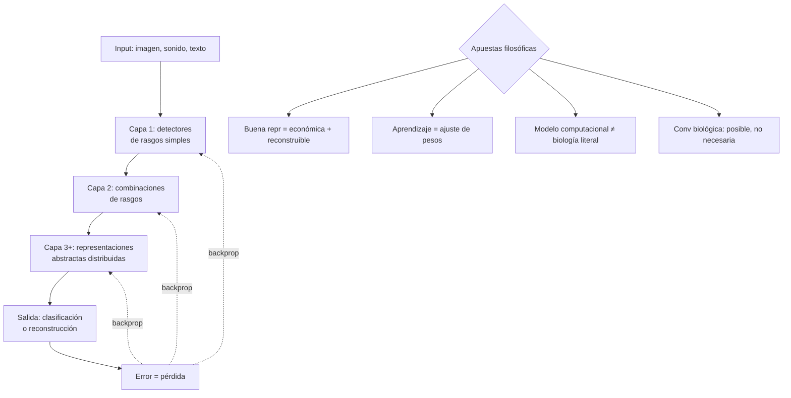

# Presentación — Hinton (1992): Redes neuronales que aprenden de la experiencia

> **Posición cronológica:** presentación estudiantil de la clase 2 (texto 2b del syllabus), elaborada con altísima profundidad por incluir guion, ontología formal en ST, app web interactiva y ejercicios filosóficos.
> **Texto fuente:** Geoffrey Hinton, *How Neural Networks Learn from Experience*, Scientific American, septiembre 1992.

---

## 1. Tema central

Hinton (1992) **no demuestra** que el cerebro sea una computadora. Lo que hace —y esta es la lectura filosófica correcta— es **proponer un programa de investigación** según el cual *aprender consiste en ajustar conexiones para formar representaciones internas útiles*. El artículo desarrolla dos núcleos técnicos: (i) cómo una red multicapa puede aprender por **retropropagación** del error y (ii) por qué el **aprendizaje no supervisado** importa, porque una buena representación no solo clasifica sino que **comprime** y **preserva estructura suficiente para reconstruir**.

La presentación lee a Hinton como **el laboratorio práctico** donde toda la clase 2 (metáforas computacionales y conexionistas) se vuelve técnicamente verificable, y donde toda la clase 4 (estándares epistemológicos) se aplica al modelo: ¿cuándo el éxito predictivo de una red neuronal justifica una conclusión ontológica sobre la mente?

## 2. Conceptos clave

- **Neurona artificial** — unidad que computa `salida = f(Σ wᵢ xᵢ + b)`. Función de transferencia *f*: lineal, umbral o sigmoide. Idealización deliberada (palabras de Hinton: "burda") de la neurona biológica.
- **Arquitectura multicapa** — capas de entrada, ocultas y salida. Las **unidades ocultas** son el corazón filosófico: nadie les dice qué representar, lo descubren al minimizar error.
- **Retropropagación (backprop)** — algoritmo de aprendizaje supervisado: presentar entrada, calcular error en salida, propagar gradiente hacia atrás capa por capa, ajustar pesos por descenso de gradiente. Plausibilidad biológica del *envío hacia atrás del error*: discutida, problemática.
- **Función de pérdida y gradiente** — formaliza qué es "estar equivocado" y cómo corregir. Apuesta empírica: que *minimizar pérdida en datos de entrenamiento* generaliza.
- **Representación distribuida** — patrón de activación que vive en muchas unidades simultáneamente. Opuesto a *grandmother cell* (neurona-abuela): "una neurona = un concepto".
- **Codificación poblacional** — la información reside en patrones de actividad de muchas neuronas; vector promedio en un espacio neural. Robustez por redundancia. Vínculo con clase 3 (anatomía).
- **Aprendizaje no supervisado** — sin etiquetas externas, la red extrae estructura del input. Hinton ejemplifica con **competitive learning** (Kohonen, mapas auto-organizados) y autoencoders. Importancia: el cerebro no recibe etiquetas para casi nada.
- **PCA vs aprendizaje competitivo** — PCA distribuye la representación entre varias unidades cooperantes; competitivo elige una "ganadora" por patrón (representación más local). Distintos códigos para distintos propósitos.
- **Mapas topográficos auto-organizados** — Kohonen: arquitectura que produce vecindad en la representación interna similar a vecindad en el input. Analogía sugestiva (no demostración) con la organización columnar de la corteza visual.
- **Recurrentes** — redes con bucles temporales (precursores de LSTMs); permiten secuencias y memoria de trabajo.
- **Idealización vs simplificación** — distinción que Hinton invoca explícitamente. Idealizar = asumir condiciones contrafácticas para ganar tratabilidad; el modelo no pretende copiar la biología punto a punto.

## 3. Autores y lecturas asociadas

- **Hinton (1992)** — texto base: `[[Fuentes/pdf/2b - Hinton - (1992) How Neural Networks Learn from Experience]]`, traducción `[[Fuentes/textos/2b - Hinton - (1992) Traduccion Cuidada al Espanol]]`, versión anotada `[[Fuentes/textos/2b - Hinton - Redes Neuronales que Aprenden de la Experiencia]]`.
- **Rumelhart, Hinton & Williams (1986)** — *Learning representations by back-propagating errors*: paper fundador del backprop moderno (aunque Werbos 1974 lo descubrió antes).
- **Rosenblatt (1958)** — perceptrón: predecesor histórico.
- **Minsky & Papert (1969)** — *Perceptrons*: crítica que retrasó el campo y motivó el renacimiento conexionista de los 80.
- **Pitts & McCulloch (1943)** — neuronas formales como funciones lógicas; predecesor teórico.
- **Kohonen (1982)** — *Self-organized formation of topologically correct feature maps*.
- **Hubel & Wiesel** — inspiración biológica de las CNNs (campos receptivos jerárquicos).
- **Daugman (2001)** — texto de la clase 2 que contextualiza a Hinton dentro de la genealogía de metáforas.
- **Bechtel (2001)** — *Representations*: marco filosófico para evaluar qué cuenta como representación neural.
- **Searle (1980)** — *Chinese Room*: crítica clásica al computacionalismo simbólico; aplica con menor fuerza a redes sub-simbólicas pero hereda el espíritu.
- **Marr (1982)** — niveles de análisis: Hinton trabaja sobre los niveles computacional y algorítmico, no necesariamente sobre el implementacional biológico.
- **Crick (1989)** — *The recent excitement about neural networks*: crítica temprana a la plausibilidad biológica del backprop.
- **Stork (1989)**, **Bengio et al. (2015)** — alternativas biológicamente plausibles al backprop (feedback alignment, target propagation).

## 4. Hilos argumentales

La presentación funciona como **bisagra evaluativa de medio curso**:

- Recoge de la **clase 1**: el funcionalismo y la realizabilidad múltiple aparecen como precondición conceptual: si la mente es función no sustrato, una red artificial puede *en principio* ejecutar la función.
- Recoge de la **clase 2**: el conexionismo es presentado allí como una de las grandes familias metafóricas; aquí se examina técnicamente.
- Recoge de la **clase 3**: dendrita-axón-sinapsis-peso, codificación poblacional, jerarquías corticales. La presentación muestra qué hereda la red artificial de esa anatomía y qué pierde.
- Recoge de la **clase 4**: aplica el estándar epistemológico ("¿qué cuenta como evidencia?") al modelo: el éxito predictivo del backprop no es evidencia directa sobre el cerebro real.
- Recoge de la **clase 5**: la tesis emergentista-sistémica del profesor pregunta si una formalización austera (la red) basta o si se pierden niveles psicológicos relevantes. La pregunta del estudiante sobre **hipergrafos como ontología minima** dialoga directamente con la lectura conexionista.
- Recoge de la **clase 6**: las jerarquías de detección de rasgos en la corteza visual son la inspiración biológica directa de las CNNs.

Entrega al resto del curso: el caso de **explicación computacional moderna**, con su poder y sus límites, contra el cual se medirán las teorías de emoción, memoria, ejecutividad, lenguaje, conciencia y agencia.

## 5. Glosario mini

- **Backpropagation** — algoritmo que computa el gradiente de la pérdida respecto a cada peso mediante regla de la cadena hacia atrás. Eficiente; no biológicamente plausible literal.
- **Unidad oculta** — neurona artificial en capa intermedia; su representación es *emergente del entrenamiento*, no programada.
- **Representación distribuida** — código en el que la información vive en patrones poblacionales; antinómico de "una neurona, un concepto".
- **Función de transferencia sigmoide** — `σ(x) = 1/(1+e⁻ˣ)`; suave, diferenciable, históricamente la elección estándar antes de ReLU.
- **Aprendizaje no supervisado** — extraer estructura sin etiquetas; objetivo intrínseco (reconstrucción, predicción, contraste).

## 6. Estructura conceptual (Mermaid)

## 7. Tabla comparativa: programa simbólico clásico vs conexionista

| Eje | Simbolismo clásico (Newell-Simon, Fodor) | Conexionismo (Hinton, Rumelhart) |
|---|---|---|
| Unidad básica | Símbolo con sintaxis | Patrón de activación distribuido |
| Manipulación | Reglas explícitas | Multiplicación matricial + no-linealidad |
| Aprendizaje | Programación + reglas heurísticas | Ajuste de pesos por gradiente |
| Inspiración biológica | Débil (mente como software) | Moderada (neurona como inspiración) |
| Composicionalidad | Inherente (lenguaje del pensamiento, Fodor) | Discutida (Smolensky vs Fodor-Pylyshyn 1988) |
| Trasparencia explicativa | Alta (reglas legibles) | Baja (cajas negras) |
| Éxito empírico | Tareas formales | Percepción, lenguaje natural moderno, LLMs |

## 8. Preguntas guía (de defensa oral)

1. ¿Qué tesis filosófica precisa propone Hinton sobre el aprendizaje y la representación, **sin** caer en la afirmación fuerte de que el cerebro es literalmente una red neuronal artificial?
2. La retropropagación es un algoritmo notable pero **no es biológicamente plausible** en su forma estándar. ¿Por qué eso no invalida automáticamente el programa? ¿Qué papel separa Hinton entre "modelo computacional" y "modelo biológico"?
3. ¿Qué significa "representación distribuida" y por qué desplaza el debate Fodor (lenguaje del pensamiento) vs conexionismo (vectores en un espacio neural)?
4. ¿Qué importancia tiene el **aprendizaje no supervisado** para una teoría del aprendizaje cerebral? (Pista: el cerebro no recibe etiquetas, debe descubrir estructura.)
5. ¿Cómo conecta el modelo de Hinton con la **falacia mereológica** (Bennett-Hacker)? ¿Es problemático decir que "la red entiende"?
6. ¿En qué se parecen y en qué se diferencian las LLMs contemporáneas (GPT, Claude) del programa que Hinton dejó instalado en 1992?

## 9. Cross-refs al backup

- `[[Fuentes/pdf/2b - Hinton - (1992) How Neural Networks Learn from Experience]]` — texto original transcrito.
- `[[Fuentes/textos/2b - Hinton - (1992) Traduccion Cuidada al Espanol]]` — traducción.
- `[[Fuentes/textos/2b - Hinton - Redes Neuronales que Aprenden de la Experiencia]]` — versión anotada larga.
- `[[10_LogicaFormal/hinton/NotasDelTexto]]` — fichado del paper.
- `[[10_LogicaFormal/hinton/PlanPresentacion]]` — plan completo de la app web interactiva con timing 20 min.
- `[[10_LogicaFormal/hinton/GuionCompletoPresentacionHinton]]` — guion oral.
- `[[10_LogicaFormal/hinton/AsesorRapidoHinton]]` — Q&A de defensa oral.
- `[[10_LogicaFormal/hinton/ExplicacionesExtra_ConexionNeuronalYSinapsis]]` — explicaciones para públicos no técnicos.
- `[[10_LogicaFormal/hinton/01_Hinton_Ontologia_Base.st]]` — formalización ST (lógica de primer orden + modal) de la ontología del paper.
- `[[Fuentes/pdf/2b - Hinton - (1992) How Neural Networks Learn from Experience]]` — PDF original.
- `[[02_Lecturas/01_fundamentos_y_marco/03_hinton_redes_neuronales]]` — desarrollo temático.

## 10. Para el estudiante (y para la defensa oral)

La presentación de Hinton no es un anexo técnico al curso: es **el ejercicio donde toda la filosofía aprendida hasta la clase 6 se aplica a un caso concreto con compromisos técnicos verificables**. Lo que tienes que sostener en la defensa, en una frase: *Hinton propone un programa donde aprender es reorganizar pesos para construir representaciones internas útiles, distribuidas y comprimidas; este programa es filosóficamente sofisticado porque distingue cuidadosamente entre modelo computacional eficaz y descripción biológica literal*.

Si te aprietan con la pregunta "entonces ¿el modelo explica el cerebro?": la respuesta es **no directamente, pero ofrece la mejor hipótesis funcional actual sobre el aprendizaje a partir de experiencia**. Si te aprietan con la conexión a LLMs: heredan la idea general (representaciones distribuidas, capas profundas, aprendizaje desde datos) pero la escala, los datos y la arquitectura cambian el juego —y abren preguntas filosóficas nuevas que Hinton, en 1992, no podía formular.

La ontología ST de la presentación (módulos `01_Ontologia_Base`, `02_Argumento_Global`, `05_Presupuestos_Expandidos`, `06_Critica_Ontologica`) muestra algo precioso: las cinco vías independientes por las que el constructo `INTERNAL_REPR` se deriva (computacional, métrica, robustez, espacial, autoorganización) y la posibilidad lógica de su negación (`◇¬INTERNAL_REPR` satisfacible en Modal K). Es decir: el programa de Hinton no es necesario, pero está abierto desde múltiples ángulos. Esa apertura controlada es lo que hace que el texto siga vivo en 2026.
