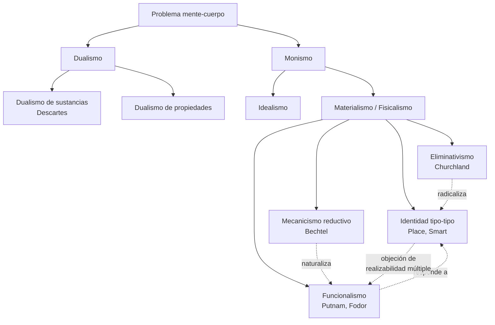

# 01 — El problema mente-cuerpo: dualismo, materialismo, funcionalismo, eliminativismo

> Guía temática transversal del bloque **Fundamentos y Marco**. Cruza Bechtel/Mandik/Mundale, Daugman, Bickle (sobre los Churchland), y conecta hacia memoria, representación y métodos.

## 1. El problema filosófico central

¿Qué relación guardan los estados mentales (creer, percibir, sentir dolor) con los estados físicos del cerebro? ¿Son los primeros idénticos, reducibles, supervenientes, realizados, o ilusorios respecto de los segundos? El problema es viejo —Descartes lo planteó con dramatismo— pero el desarrollo empírico del siglo XX (lesión, PET, fMRI, registro unicelular) lo transformó: hoy ninguna respuesta puramente conceptual basta. Como argumentan Bechtel, Mandik y Mundale (texto 1 de la materia), la filosofía de la neurociencia nace **cuando los problemas clásicos sobre mente, cuerpo, explicación y conocimiento dejan de poder discutirse sólo en abstracto y pasan a depender del trabajo científico real sobre el cerebro**.

La pregunta operativa para nosotros no es "¿hay alma?" sino: **dadas las taxonomías psicológicas (creencias, deseos, atención, dolor) y dadas las taxonomías neurobiológicas (poblaciones neuronales, redes, ritmos), ¿cómo se relacionan?** ¿Por identidad teórica? ¿Por reducción mecanicista? ¿Por realizabilidad múltiple sin reducción? ¿Por reemplazo?

## 2. Posiciones principales

| Autor / corriente | Tesis | Argumento clave | Objeción principal |
|---|---|---|---|
| Descartes (dualismo de sustancias) | Mente y cuerpo son dos sustancias realmente distintas. | Imaginabilidad de la mente sin cuerpo; certeza del cogito. | ¿Cómo interactúa lo no-físico con lo físico? Causación misteriosa. |
| Teoría de la identidad (Place, Smart) | Estados mentales = estados cerebrales (identidad tipo-tipo). | Parsimonia ontológica; modelo del agua = H₂O. | Putnam: realizabilidad múltiple — el dolor podría ser realizado en silicio o pulpos. |
| Funcionalismo (Putnam, Fodor) | Lo mental es un papel funcional; importa la organización, no el sustrato. | Permite autonomía de la psicología frente a la biología. | "Es liberal de más": cualquier sistema con la estructura funcional cuenta como mental. |
| Materialismo eliminativo (P. y P. Churchland, vía Bickle) | La psicología popular es una teoría que probablemente sea reemplazada, no reducida. | La psicología cotidiana casi no cambió desde Aristóteles; falla en sueño, memoria, psicopatología. | Si "creencias" desaparece, ¿en qué términos describimos la conducta? Riesgo de autorrefutación. |
| Reduccionismo mecanicista (Bechtel) | Explicar lo mental = descomponer en partes y operaciones organizadas, no identificar zonas. | Encaja con cómo realmente trabaja la neurociencia cognitiva. | Algunos fenómenos (qualia, contenido intencional) pueden resistir descomposición. |
| Naturalismo no reductivo | La filosofía dialoga con la ciencia sin reducir lo mental. | Postura por defecto de la materia (Bechtel et al.). | Riesgo de quedarse en "diálogo" sin compromiso ontológico. |

## 3. Árbol de posiciones

## 4. Evidencia neurocientífica que tensa cada posición

- **Contra dualismo**: lesiones focales (Gage, Broca, H.M.) muestran que daños circunscritos producen cambios mentales específicos. La mente es modificable interviniendo el cerebro.
- **Contra identidad tipo-tipo simple**: la realizabilidad múltiple es plausible; el mismo "estado de alerta" puede involucrar circuitos distintos en distintos animales o en distintas etapas del desarrollo.
- **A favor de mecanicismo**: el éxito de la neurociencia cognitiva al descomponer funciones (memoria de trabajo en bucle fonológico + ejecutivo central + agenda visoespacial) sin postular sustancias adicionales.
- **A favor del eliminativismo (en parte)**: categorías como "histeria" o "neurosis" fueron reemplazadas, no reducidas. La psicopatología sí cambia su léxico.

## 5. Equivalencia funcional y realizabilidad múltiple

Una formulación útil: dos sistemas $S_1$ y $S_2$ realizan el mismo estado mental $M$ si y sólo si existe una abstracción funcional $f$ tal que

$$f(\text{estado}(S_1)) = f(\text{estado}(S_2)) = M$$

El funcionalista dice que esa $f$ es lo único que cuenta; el reductivista exige que además exista una correspondencia sistemática entre $f$ y propiedades físicas; el eliminativista sospecha que para muchos $M$ de la psicología popular no existe ninguna $f$ científica respetable.

## 6. Conexión con otros temas del curso

- **Métodos y evidencia (doc 04)**: la disputa mente-cuerpo se juega también en si las técnicas (fMRI, lesión) pueden o no dar evidencia válida de identidad o realización.
- **Representaciones (doc 03)**: Bechtel defiende un realismo funcional sobre representaciones que esquiva tanto el dualismo como el eliminativismo radical.
- **Conciencia (doc 02)**: el Hard Problem de Chalmers es la objeción contemporánea más fuerte al materialismo reductivo.
- **Redes neuronales (doc 05)**: el conexionismo nutrió al eliminativismo de los Churchland.

## 7. Lecturas del workspace

- [[02_Lecturas/01_fundamentos_y_marco/01_bechtel_mandik_mundale_filosofia_y_neurociencias]]
- [[02_Lecturas/01_fundamentos_y_marco/02_daugman_metaforas_del_cerebro]]
- [[02_Lecturas/01_fundamentos_y_marco/05_bickle_churchland_y_neurofilosofias]]
- [[02_Lecturas/09_material_complementario/05_cobb_idea_of_the_brain]]
- [[02_Lecturas/04_memoria_y_representacion/03_bechtel_representaciones]]

## 8. Conceptos clave que se desbloquean

- Dualismo de sustancias vs dualismo de propiedades.
- Identidad tipo-tipo vs identidad token-token.
- Realizabilidad múltiple (Putnam) y autonomía de la psicología (Fodor).
- Materialismo eliminativo y "psicología popular como teoría".
- Reducción interteórica vs reemplazo teórico.
- Naturalismo metodológico.
- Mecanismo: partes + operaciones + organización.

## 9. Preguntas tipo parcial

1. Explique por qué la realizabilidad múltiple es a la vez una objeción a la identidad tipo-tipo y una motivación para el funcionalismo. ¿Qué responde el mecanicismo de Bechtel a este dilema?
2. Bickle subraya que el aporte de los Churchland excede al eliminativismo. Reconstruya su tesis sobre **relaciones interteóricas** y compárela con la posición reduccionista clásica.
3. Distinga "reducción" de "reemplazo" usando un ejemplo de la psicopatología contemporánea (puede apoyarse en Ramírez-Bermúdez et al.).
4. ¿Por qué Bechtel, Mandik y Mundale sostienen que la mera autonomía de la psicología (Fodor) ya no es defendible tras el desarrollo de PET, fMRI y registro unicelular?
5. ¿Qué quiere decir Daugman cuando advierte que la metáfora computacional del cerebro no es neutral? ¿Cómo impacta esa advertencia en el debate mente-cuerpo?
