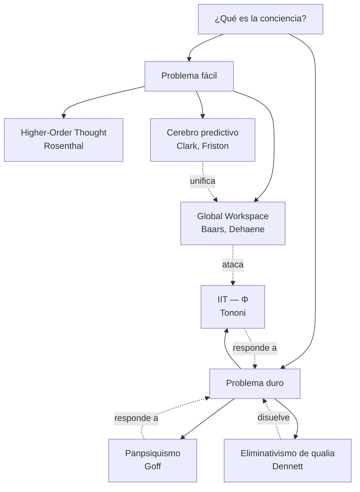

# 02 — Conciencia y qualia: el Hard Problem, IIT, GWT, panpsiquismo

> Guía temática del bloque **Conciencia, Agencia y Modelos**. Cruza Laureys (estado vegetativo), Nave/Deane/Miller/Clark (cerebro predictivo), Obhi y Haggard (libre albedrío), y conecta con percepción, métodos e interocepción.

## 1. El problema filosófico central

La conciencia plantea dos preguntas que conviene no mezclar:

- **Problema fácil (Chalmers)**: ¿qué mecanismos explican funciones como la discriminación, la atención, el reporte verbal, la integración multimodal?
- **Problema duro (Chalmers)**: ¿por qué hay **algo que es ser** un organismo con esos mecanismos? ¿De dónde viene la experiencia subjetiva, los *qualia*?

Laureys aporta la distinción clínica fundamental: **vigilia (wakefulness) ≠ awareness (conciencia del entorno y de uno mismo)**. Un paciente en estado vegetativo puede abrir los ojos y tener ciclos sueño-vigilia sin que medie experiencia consciente. La conciencia, entonces, tiene al menos dos dimensiones disociables, y para diagnosticarla en pacientes que no pueden reportar hay que apelar a neuroimagen, escalas conductuales finas y, según algunas teorías, a medidas estructurales como Φ.

## 2. Posiciones principales

| Autor / teoría | Tesis | Argumento clave | Objeción principal |
|---|---|---|---|
| Chalmers (Hard Problem) | Ningún relato funcional explica por qué hay experiencia. | Zombis filosóficos concebibles; brecha explicativa. | "Zombis no son realmente concebibles, sólo parecen serlo." |
| Tononi (IIT) | La conciencia es información integrada; identifica conciencia con un valor Φ. | Predice conciencia residual en pacientes vegetativos; ofrece formalismo. | Implica panpsiquismo gradual; difícil de medir empíricamente. |
| Baars / Dehaene (GWT, Global Workspace) | Consciente = contenido difundido en un "espacio de trabajo global" fronto-parietal. | Encaja con datos de "ignición" cortical; explica reporte. | Confunde conciencia con accesibilidad/reporte. |
| Cerebro predictivo (Nave, Deane, Miller, Clark) | La conciencia surge del modelo generativo del organismo prediciendo causas sensoriales. | Unifica percepción, acción, emoción; encarnado. | Sigue sin abordar por qué la predicción "se siente". |
| Panpsiquismo (Goff, Strawson) | La experiencia es propiedad fundamental de la materia. | Disuelve la brecha: no hace falta "generar" lo mental. | Problema de combinación: ¿cómo se unen micro-experiencias? |
| Eliminativismo sobre qualia (Dennett) | Los qualia tal como se definen no existen; sólo hay procesos funcionales. | Heterofenomenología: trate los reportes como datos, no como hechos privilegiados. | Niega lo que la introspección parece mostrar de modo más obvio. |

## 3. Árbol de teorías de la conciencia

## 4. IIT en una fórmula

IIT propone que el grado de conciencia de un sistema es la cantidad de información integrada que el sistema genera más allá de sus partes:

$$\Phi = \min_{\text{particiones } P} D\big(\,p(X_{t+1}\mid X_t) \,\,\|\,\, \prod_i p(X_{t+1}^{(P_i)}\mid X_t^{(P_i)})\,\big)$$

Donde $D$ es una divergencia (la integración fuerte cuando el todo no se factoriza en sus partes). Φ grande = el sistema, como un todo, hace más de lo que harían sus partes independientemente. Implicaciones: (i) la conciencia es estructural, (ii) puede haber Φ > 0 en organismos sin reporte, (iii) sistemas feedforward (CNN clásicas) tienen Φ bajo.

## 5. Cerebro predictivo y conciencia

En la versión de Nave/Deane/Miller/Clark, percibir es **inferir las causas del flujo sensorial minimizando error de predicción**. Bajo la formalización de Friston (free energy), el organismo minimiza:

$$F = \mathbb{E}_{q(s)}\!\left[\ln q(s) - \ln p(o, s)\right]$$

donde $q(s)$ es el modelo interno sobre causas ocultas y $p(o, s)$ es la distribución conjunta de observaciones y causas. La conciencia, en esta lectura, no es un módulo extra: es la dinámica de un modelo generativo que **estima precisiones**, **actúa para confirmar predicciones** (inferencia activa) y **integra señales interoceptivas y exteroceptivas**.

## 6. Evidencia neurocientífica

- **Estado vegetativo y mínimamente consciente** (Laureys): paradigmas de imaginería motora (tenis vs casa) muestran respuesta cortical en algunos pacientes sin conducta, lo que sugiere conciencia encubierta.
- **Ignición global**: paradigmas de máscara visual muestran activación tardía fronto-parietal sólo cuando el estímulo se reporta. Apoyo a GWT.
- **Anestesia y sueño**: Φ y métricas relacionadas (PCI, índice de complejidad perturbacional) caen en anestesia y sueño profundo, consistente con IIT.
- **Disociación vigilia/awareness**: ciclos circadianos preservados en pacientes vegetativos demuestran que vigilia subcortical (tronco/tálamo) y conciencia (cortical y talamo-cortical) son separables.

## 7. Conexión con otros temas

- **Mente-cuerpo (doc 01)**: el Hard Problem es la objeción contemporánea más fuerte al fisicalismo reductivo.
- **Métodos (doc 04)**: diagnosticar conciencia sin reporte exige convergencia técnica (Bechtel).
- **Percepción (doc 06)**: la cuestión de los qualia visuales conecta con Zeki y la especialización funcional.
- **Emoción e interocepción (doc 07)**: la conciencia encarnada de Damasio/Barrett complementa el predictivo.
- **Funciones ejecutivas (doc 08)**: agencia, veto y "free won't" (Obhi y Haggard) tocan conciencia de la intención.

## 8. Lecturas del workspace

- [[02_Lecturas/08_conciencia_agencia_y_modelos/01_laureys_estado_vegetativo]]
- [[02_Lecturas/08_conciencia_agencia_y_modelos/02_nave_cerebro_predictivo]]
- [[02_Lecturas/08_conciencia_agencia_y_modelos/04_obhi_haggard_libre_albedrio]]
- [[02_Lecturas/09_material_complementario/09_passingham_cognitive_neuroscience]]
- [[05_Visualizaciones/08_cerebro_predictivo_y_formalizacion]]

## 9. Conceptos clave que se desbloquean

- Hard problem vs easy problems.
- Qualia, "what it is like", zombis filosóficos.
- Φ (phi) e información integrada.
- Global Workspace y "ignición".
- Inferencia activa y free energy.
- Vigilia vs awareness; estado vegetativo vs MCS.
- Conciencia de acceso vs conciencia fenoménica (Block).
- Panpsiquismo y problema de combinación.

## 10. Preguntas tipo parcial

1. Reconstruya el Hard Problem en sus propios términos. ¿Por qué Chalmers cree que ninguna explicación funcional puede resolverlo? Discuta una réplica posible desde GWT.
2. Compare IIT y GWT como teorías rivales: ¿qué predicciones empíricas distinguibles hacen sobre pacientes anestesiados?
3. Explique la distinción de Laureys entre vigilia y awareness y por qué importa para el diagnóstico del estado mínimamente consciente.
4. Bajo el cerebro predictivo, percibir es inferir. ¿Eso resuelve, disuelve o sólo desplaza el problema de los qualia?
5. ¿Qué papel juega la noción de "precisión" en la arquitectura predictiva, y por qué conecta con atención y emoción?
