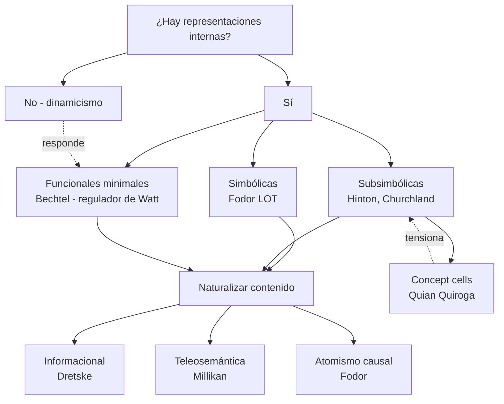

# 03 — Representaciones y contenido: Bechtel, intencionalidad, vehicle/content

> Guía temática del bloque **Memoria y Representación** + **Fundamentos**. Cruza Bechtel (representaciones), Quian Quiroga et al. (concept cells), de Brigard & Robins (memoria), Hinton (representaciones distribuidas), y conecta con percepción y métodos.

## 1. El problema filosófico central

¿Tiene sentido decir que un estado del cerebro **representa** algo, o eso es vestigio mentalista que la neurociencia debería abandonar? Dinamistas (van Gelder, Chemero) propusieron que la cognición es coordinación dinámica sin contenido representacional. Bechtel responde defendiendo una noción minimalista pero realista: **una representación es un estado que porta información sobre algo y que es usado por un sistema para guiar su conducta o su procesamiento**. El ejemplo paradigmático no es un libro ni una imagen mental: es el regulador centrífugo de Watt, donde la posición de las bolas funciona como portador de información sobre la velocidad de la máquina.

A esto se suman cuestiones más finas:

- **Contenido vs vehículo**: el vehículo es el estado físico que porta la información (un patrón de disparo); el contenido es lo que ese estado refiere ("hay una cara delante"). Confundirlos es un error categorial recurrente.
- **Intencionalidad**: ¿cómo es que un estado físico se vuelve "acerca de" algo? Brentano la señaló como marca de lo mental; Dretske, Millikan, Fodor ofrecen naturalizaciones (informacional, teleosemántica, atomismo causal).
- **Localismo vs distribuido**: ¿el cerebro guarda conceptos en neuronas únicas ("grandmother cells") o en patrones distribuidos sobre poblaciones?

## 2. Posiciones principales

| Autor / corriente | Tesis | Argumento clave | Objeción principal |
|---|---|---|---|
| Brentano | La intencionalidad es la marca de lo mental, irreducible. | Cualquier estado mental es "acerca de" algo. | No explica cómo un estado físico adquiere referencia. |
| Dretske (informacional) | Una representación es un indicador causal fiable que cumple una función biológica. | Naturaliza el contenido sin postular almas. | Problema de la disyunción: ¿representa "vaca o caballo de noche"? |
| Millikan (teleosemántica) | El contenido se fija por la función selectiva que el estado cumple. | Resuelve disyunción apelando a la evolución. | Difícil aplicar a estados nuevos sin historia evolutiva clara. |
| Fodor (LOT) | Representaciones mentales en un "lenguaje del pensamiento" composicional. | Explica productividad y sistematicidad del pensamiento. | Postula nivel sintáctico interno que la neurociencia no encuentra como tal. |
| Conexionismo (Hinton, Churchland) | Representaciones distribuidas y subsimbólicas; conocimiento en pesos. | Sensibilidad gradual, generalización, robustez al daño. | ¿Cómo dan cuenta de la composicionalidad? |
| Bechtel (mecanicista) | Representación = estado informacional + uso funcional en un mecanismo. | Encaja con cómo trabaja la neurociencia (ej: representación retinotópica). | Demasiado liberal: ¿el termostato representa? |
| Antirrepresentacionalismo (van Gelder) | La cognición es dinámica acoplada sin representaciones internas. | El regulador de Watt no necesita "símbolos" para regular. | Bechtel: precisamente Watt **sí** ilustra representación funcional minimal. |

## 3. Mapa de la disputa

## 4. Vehicle vs content: ejemplos

| Sistema | Vehículo | Contenido |
|---|---|---|
| Termómetro | columna de mercurio a 37 °C | "temperatura ambiente es 37 °C" |
| Neurona V1 simple | tren de spikes a 80 Hz | "barra orientada ~45° en el campo receptivo" |
| Population code en MT | patrón vectorial sobre N neuronas | "movimiento global a la izquierda" |
| Concept cell (Quian Quiroga) | actividad sostenida de una neurona en lóbulo temporal medial | "Jennifer Aniston (sea foto, nombre escrito o voz)" |

La lección de Quian Quiroga: la selectividad puede ser muy alta y abstracta (invariante a modalidad), pero eso **no significa una neurona = un concepto**. Son nodos en una representación esparsa-distribuida.

## 5. Información, contenido y una versión formal

Una versión simple del contenido informacional (Dretske/Shannon):

$$I(X; Y) = \sum_{x,y} p(x,y) \log \frac{p(x,y)}{p(x)\,p(y)}$$

Un estado neural $Y$ "porta información sobre" un evento $X$ si $I(X; Y) > 0$ y además ese vínculo cumple una función para el sistema (Millikan añade: una función selectivamente conservada).

## 6. Evidencia neurocientífica

- **Retinotopía** (V1): mapa preservado de la retina sobre la corteza. Vehículo: actividad en una columna; contenido: ubicación visual.
- **Códigos vectoriales** (Georgopoulos en M1): la dirección del movimiento del brazo se predice como suma vectorial de las preferencias de muchas neuronas.
- **Place cells y grid cells** (Moser & Moser): representación de espacio físico en hipocampo y corteza entorrinal.
- **Concept cells** (Quian Quiroga, Fried, Koch): selectividad a personas/objetos abstractos en MTL.
- **Representaciones distribuidas en redes profundas** (Hinton): los pesos de las capas ocultas capturan regularidades que no están "en" ninguna unidad sola.

## 7. Conexión con otros temas

- **Métodos (doc 04)**: identificar un estado como "representación de X" exige diseño experimental cuidadoso (Bechtel epistemología).
- **Percepción (doc 06)**: vehículos representacionales en V1, V4, MT, IT.
- **Memoria (este bloque)**: la noción de engrama es una hipótesis sobre vehículos de contenidos pasados.
- **Redes neuronales (doc 05)**: el conexionismo cambió la imagen de qué tipo de vehículos son posibles.
- **Conciencia (doc 02)**: ¿el contenido fenoménico es contenido representacional? (Representacionalismo de Tye).

## 8. Lecturas del workspace

- [[02_Lecturas/04_memoria_y_representacion/03_bechtel_representaciones]]
- [[02_Lecturas/04_memoria_y_representacion/02_quian_quiroga_celulas_de_la_abuela]]
- [[02_Lecturas/04_memoria_y_representacion/01_de_brigard_robins_memoria]]
- [[02_Lecturas/01_fundamentos_y_marco/03_hinton_redes_neuronales]]
- [[02_Lecturas/09_material_complementario/02_bechtel_mental_mechanisms]]

## 9. Conceptos clave que se desbloquean

- Representación funcional minimalista (Bechtel).
- Intencionalidad y su naturalización (Dretske, Millikan).
- Vehículo vs contenido.
- Códigos locales, distribuidos, esparsos.
- Sistematicidad y composicionalidad (Fodor).
- Concept cells y selectividad invariante.
- Antirrepresentacionalismo dinamicista.

## 10. Preguntas tipo parcial

1. Explique por qué Bechtel usa el regulador de Watt para defender una noción minimalista de representación. ¿Cómo responde al antirrepresentacionalismo dinamicista?
2. Distinga vehículo y contenido con un ejemplo de la corteza visual. ¿Qué error categorial se evita haciendo esa distinción?
3. ¿Por qué los hallazgos de Quian Quiroga sobre concept cells no implican una "neurona-abuela" en sentido fuerte? ¿Cómo se concilian con representaciones distribuidas?
4. Compare la naturalización informacional (Dretske) con la teleosemántica (Millikan) ante el "problema de la disyunción".
5. ¿Qué cambia, para el debate sobre representaciones, el éxito de las redes neuronales profundas a la Hinton?
