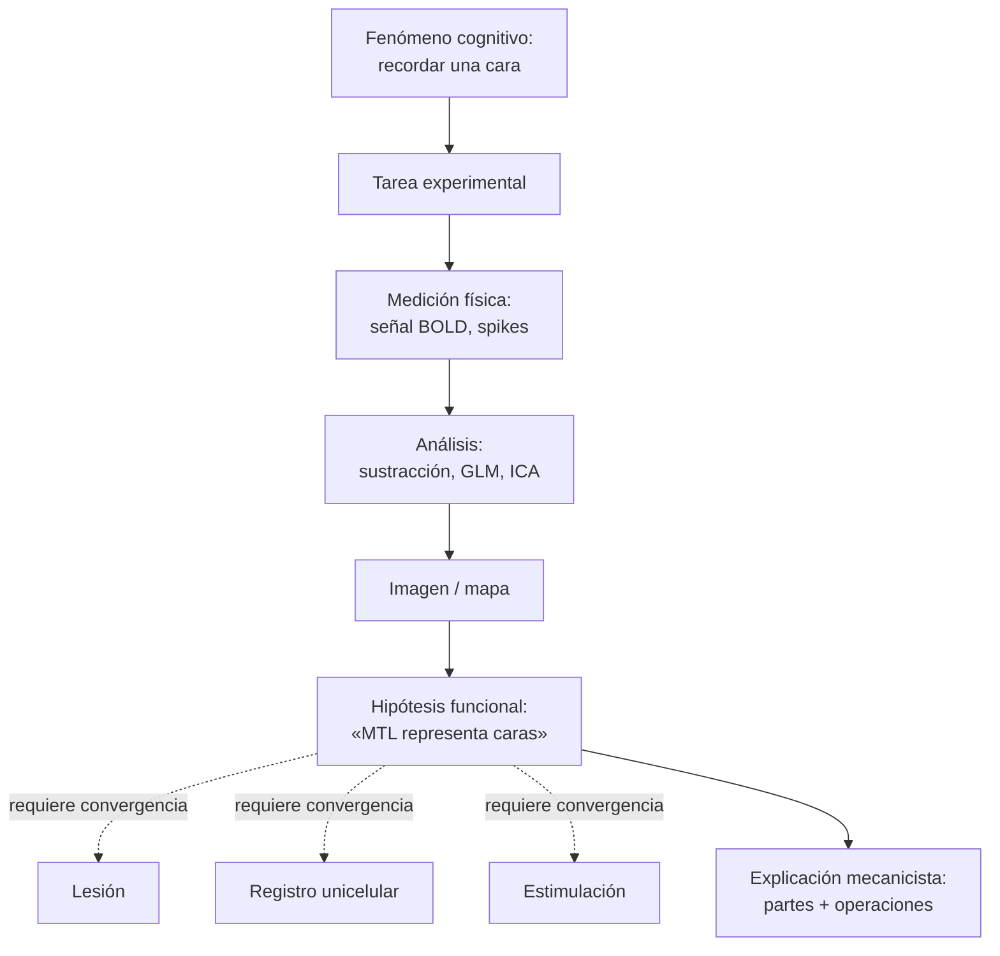

# 04 — Metodología y evidencia: mecanicismo, niveles, fMRI epistémico, reducción

> Guía temática del bloque **Métodos y Evidencia**. Núcleo: Bechtel (epistemología) y Raichle (visualizando la mente). Cruza Daugman (metáforas), Chirimuuta (abstracción) y conecta a todo el resto del programa.

## 1. El problema filosófico central

¿Cuándo un dato neurocientífico **constituye evidencia** de una hipótesis cognitiva, y cuándo es un **artefacto** de la técnica que lo produjo? La pregunta no es ociosa: lesiones, registros unicelulares, EEG, PET, fMRI y optogenética no son ventanas transparentes. Cada técnica **interviene** el sistema (corta, electrofija, contrasta condiciones, etiqueta con BOLD, etc.) y los resultados dependen de esa intervención. La filosofía de la neurociencia, en su versión epistemológica más madura (Bechtel 4a), exige examinar **cómo se justifica la confiabilidad de las técnicas**, no sólo las teorías que ellas sustentan.

A esto se suma el problema de la **explicación**: ¿qué cuenta como explicar un fenómeno cognitivo? Para los mecanicistas (Bechtel, Craver), no basta localizar una función en una región: hay que descomponer el fenómeno en **partes**, **operaciones** y **organización**. Para Chirimuuta, esa descomposición a menudo se logra mediante **abstracción canónica**, no por descripción literal del cerebro.

## 2. Posiciones principales

| Autor / corriente | Tesis | Argumento clave | Objeción principal |
|---|---|---|---|
| Empirismo simple | Observar y comparar con teoría. | Modelo estándar de la ciencia. | Bechtel: en neurociencia, "observar" presupone instrumentos no transparentes. |
| Mecanicismo (Bechtel, Craver) | Explicar = identificar partes + operaciones + organización. | Encaja con la práctica real (memoria de trabajo, vía visual). | ¿Y los fenómenos que no se descomponen bien (consciencia)? |
| Reduccionismo eliminativo (Bickle reductivo) | Las teorías psicológicas se reducirán a neurobiología molecular. | Casos de éxito en LTP/aprendizaje. | Realizabilidad múltiple; mecanismos no necesariamente moleculares. |
| Pluralismo de niveles (Craver) | Hay explicaciones legítimas en múltiples niveles, integradas. | Refleja la práctica científica real. | Riesgo de relativismo si no se especifica integración. |
| Modelos abstractos (Chirimuuta) | Las neurociencias usan modelos canónicos que simplifican deliberadamente. | Modelos no son malas réplicas; son herramientas inferenciales. | Riesgo de tomar el modelo como la cosa. |
| Antilocalizacionismo (críticos de la fMRI ingenua) | La "imagen del pensamiento" en pantalla es interpretación, no fotografía. | Sustracción y promediado son operaciones, no fotos. | Hay que usar fMRI, pero saber qué lee. |

## 3. La pirámide de la inferencia en neurociencia cognitiva

## 4. Niveles de Marr y niveles mecanicistas

Marr distinguió tres niveles para analizar un sistema de procesamiento de información:

| Nivel | Pregunta | Ejemplo (visión 3D) |
|---|---|---|
| Computacional | ¿Qué calcula el sistema y por qué? | Recuperar estructura 3D a partir de 2D. |
| Algorítmico | ¿Cómo lo calcula? ¿qué representaciones, qué pasos? | Detección de bordes, estéreo, sombreado. |
| Implementacional | ¿En qué hardware corre? | Circuitos en V1/V2, neuronas simples y complejas. |

Bechtel y Craver añaden la noción de **niveles mecanicistas** anidados: un mecanismo $M$ en el nivel $n$ se explica descomponiéndolo en submecanismos $M_1, ..., M_k$ en el nivel $n-1$, y a su vez $M$ es una parte funcional en algún mecanismo del nivel $n+1$. La explicación es vertical y horizontal a la vez.

## 5. fMRI epistemológico: qué muestra y qué no

La señal BOLD (Blood Oxygen Level Dependent) refleja cambios en oxihemoglobina/desoxihemoglobina, que se acoplan a actividad neural mediante el **acoplamiento neurovascular**. El diseño experimental clásico es **sustractivo**:

$$\text{Mapa funcional} = \text{Activación}(\text{Tarea}) - \text{Activación}(\text{Control})$$

Eso permite atribuir un voxel "más activo" a la diferencia entre tarea y control, no a un proceso cognitivo en bruto. De ahí la regla de oro de Bechtel:

> Ninguna técnica por sí sola basta. Lesiones, registros, neuroimagen y estimulación tienen que **converger** para justificar una hipótesis funcional.

Errores frecuentes a evitar:
- **Inferencia inversa** ingenua: "el voxel X se activó → el sujeto sintió emoción", olvidando que X se activa en muchas tareas.
- **Forward inference** sin teoría: mapear sin pregunta cognitiva.
- **Doble-dippings** y selección post hoc de ROIs.
- **Tomar la imagen como foto del pensamiento** (la crítica de Daugman y Dehaene).

## 6. Reducción, integración, abstracción

- **Reducción interteórica** (Nagel clásica): la teoría $T_2$ se reduce a $T_1$ si hay puentes que permiten derivar $T_2$ desde $T_1$. Casi nunca ocurre limpiamente.
- **Reducción mecanicista** (Bechtel, Craver): explicar un fenómeno descomponiéndolo en mecanismos de nivel inferior **sin** exigir derivación lógica.
- **Integración entre niveles**: explicaciones múltiples coordinadas (Craver, *Explaining the Brain*).
- **Abstracción canónica** (Chirimuuta): los modelos neurocientíficos simplifican deliberadamente; el "cerebro abstracto" del modelo es una herramienta inferencial, no una caricatura defectuosa.

## 7. Conexión con otros temas

- **Mente-cuerpo (doc 01)**: el debate reducción vs autonomía depende de esta metodología.
- **Representaciones (doc 03)**: identificar un estado como "representación de X" requiere convergencia técnica.
- **Conciencia (doc 02)**: diagnosticar conciencia en pacientes que no reportan exige neuroimagen e índices estructurales.
- **Percepción (doc 06)** y **emoción (doc 07)**: cada tema vive bajo la misma exigencia epistemológica.
- **IA (doc 05)**: los modelos conexionistas también son explicaciones abstractas, no réplicas literales.

## 8. Lecturas del workspace

- [[02_Lecturas/02_metodos_y_evidencia/01_bechtel_epistemologia_de_la_evidencia]]
- [[02_Lecturas/02_metodos_y_evidencia/02_raichle_visualizando_la_mente]]
- [[02_Lecturas/09_material_complementario/04_chirimuuta_brain_abstracted]]
- [[02_Lecturas/09_material_complementario/06_dehaene_seeing_the_mind]]
- [[02_Lecturas/01_fundamentos_y_marco/02_daugman_metaforas_del_cerebro]]
- [[02_Lecturas/09_material_complementario/02_bechtel_mental_mechanisms]]

## 9. Conceptos clave que se desbloquean

- Artefacto técnico vs evidencia genuina.
- Convergencia metodológica (lesión + registro + imagen + estimulación).
- Sustracción y diseño experimental en fMRI.
- Niveles de Marr y niveles mecanicistas.
- Inferencia inversa y sus trampas.
- Reducción interteórica vs mecanicista.
- Abstracción canónica (Chirimuuta).

## 10. Preguntas tipo parcial

1. Explique por qué Bechtel insiste en que la evidencia neurocientífica está **mediada** por técnicas. Ilustre con un ejemplo (lesión, registro o imagen).
2. ¿Qué significa "inferencia inversa" en fMRI y por qué es problemática? ¿Cómo la mitiga el principio de convergencia?
3. Reconstruya los tres niveles de Marr y muéstrelos en un ejemplo concreto (visión 3D, memoria de trabajo, decisión perceptual).
4. Compare la reducción interteórica clásica (Nagel) con la reducción mecanicista de Bechtel/Craver. ¿Cuál describe mejor la práctica real?
5. ¿Qué quiere decir Chirimuuta con "cerebro abstracto"? ¿Cómo dialoga eso con la crítica de Daugman a la metáfora computacional?
