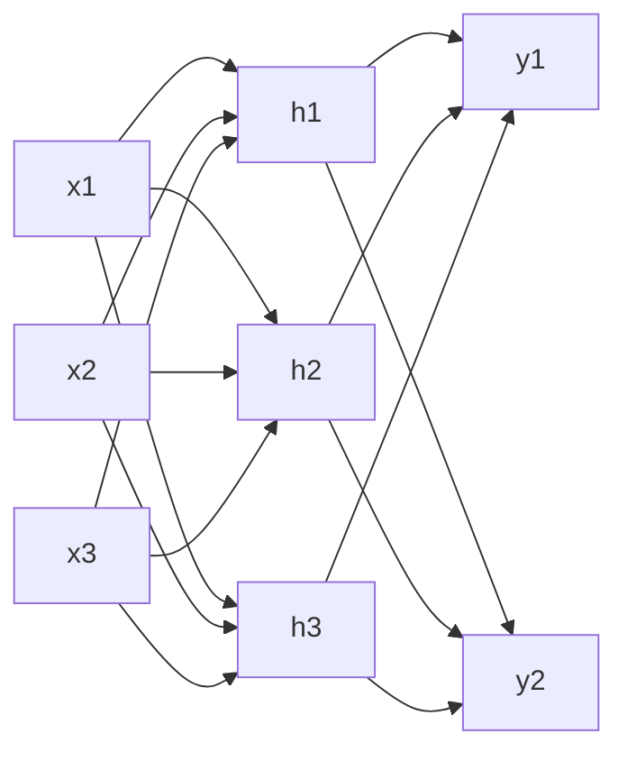

# 05 — Redes neuronales e IA: Hinton, backprop, conexionismo vs simbolismo

> Guía temática del bloque **Fundamentos** (Hinton) + lecturas conexionistas en **Memoria/Representación** y **Conciencia/Modelos**. Aborda la relación entre IA y filosofía de la mente.

## 1. El problema filosófico central

¿Qué tipo de modelo es una red neuronal artificial respecto del cerebro? ¿Una explicación, una metáfora, un sustituto, o sólo una herramienta de ingeniería? ¿Y qué consecuencias tiene para el debate mente-cuerpo y para la filosofía de la mente que sistemas conexionistas exhiban capacidades antes consideradas exclusivamente "simbólicas" o "humanas" (lenguaje, razonamiento, percepción categorial)?

Hinton (texto 2b) presenta una idea simple pero filosóficamente explosiva: **el conocimiento puede no estar localizado en una unidad ni codificado por reglas simbólicas explícitas**, sino distribuido en el peso relativo de muchas conexiones que se ajustan por experiencia. Eso reabre tres debates:

- **Conexionismo vs simbolismo (Fodor & Pylyshyn vs Smolensky)**: ¿basta una arquitectura distribuida para explicar la sistematicidad del pensamiento?
- **¿Qué cuenta como "entender"?** Habitación china (Searle), Turing Test, stochastic parrots (Bender et al.).
- **¿Pueden las redes "decirnos algo" sobre el cerebro, o son sólo simulacros?**

## 2. Posiciones principales

| Autor / corriente | Tesis | Argumento clave | Objeción principal |
|---|---|---|---|
| Simbolismo clásico (Fodor) | Cognición = manipulación de símbolos discretos en un LOT. | Productividad, sistematicidad, composicionalidad. | Implausibilidad biológica; rigidez ante datos ruidosos. |
| Conexionismo (Rumelhart, McClelland, Hinton) | Cognición = activación distribuida + aprendizaje por ajuste de pesos. | Aprende de ejemplos; generaliza; tolera daño parcial. | Fodor: no captura sistematicidad sin "implementar" estructura simbólica. |
| Eliminativismo conexionista (Churchland) | Las "creencias" se reemplazarán por activaciones vectoriales en espacios de estados. | Conexionismo + neurociencia naturalizan psicología popular. | Riesgo de no explicar lo distintivo del pensamiento conceptual. |
| Pluralismo arquitectural (Smolensky) | Niveles simbólico y subsimbólico coexisten; el segundo implementa el primero. | Reconcilia ventajas de ambos. | Difícil articular técnicamente el puente. |
| Funcionalismo computacional (Putnam temprano) | Lo mental es lo computacionalmente caracterizado. | Permite IA fuerte conceptualmente. | Putnam tardío y Searle: la realización física no es indiferente; sintaxis ≠ semántica. |
| Searle (Habitación China) | Manipular símbolos no es entender; falta intencionalidad genuina. | Argumento de la habitación. | Réplica de los sistemas: el "entendimiento" emerge del sistema como un todo. |
| Stochastic parrots (Bender et al., 2021) | Los LLMs imitan distribución sin comprensión genuina. | Generan texto plausible sin referente. | Subestima capacidades emergentes en escala. |

## 3. Arquitectura básica de una red feedforward

Una neurona artificial $j$ en la capa oculta computa:

$$h_j = \sigma\!\left(\sum_i w_{ij}\, x_i + b_j\right)$$

donde $\sigma$ es una no-linealidad (sigmoide, ReLU, etc.). La salida $\hat{y}$ se compara con la etiqueta $y$ vía una función de pérdida $\mathcal{L}(\hat y, y)$ (p. ej. entropía cruzada).

## 4. Backpropagation en una ecuación

El aprendizaje ajusta cada peso por descenso de gradiente:

$$w_{ij} \leftarrow w_{ij} - \eta \, \frac{\partial \mathcal{L}}{\partial w_{ij}}$$

Y el truco de **backprop** (Rumelhart, Hinton, Williams, 1986) es calcular eficientemente esa derivada propagando el error desde la salida hacia atrás usando la regla de la cadena:

$$\frac{\partial \mathcal{L}}{\partial w_{ij}^{(l)}} = \delta_j^{(l)}\, a_i^{(l-1)}, \quad \delta_j^{(l)} = \sigma'\!\big(z_j^{(l)}\big) \sum_k w_{jk}^{(l+1)}\, \delta_k^{(l+1)}$$

Filosóficamente importante: el aprendizaje **no requiere un programador que diga la regla**; basta con datos y una señal de error. Eso socava la imagen clásica de la cognición como sistema gobernado por reglas explícitas (Daugman ya advertía sobre tomar metáforas como descripciones literales).

## 5. Representaciones distribuidas: el aporte conceptual de Hinton

| Propiedad | Local | Distribuida |
|---|---|---|
| Una entidad → ¿cuántas unidades? | 1 | N |
| Robustez al daño | baja | alta (graceful degradation) |
| Capacidad | lineal en unidades | combinatoria |
| Generalización a nuevos casos | pobre | rica |
| Interpretabilidad | alta | baja |

La idea de **representación distribuida** es el puente conceptual entre redes y neurociencia: encaja con codificación poblacional (Georgopoulos), con representaciones esparsas en hipocampo, y con resultados de tipo "neuronas conceptuales" reinterpretados como nodos de una representación esparsa-distribuida (ver doc 03 sobre Quian Quiroga).

## 6. Evidencia y conexión empírica

- **CNN ↔ corteza visual ventral**: las capas tempranas de redes convolucionales aprenden filtros que se parecen a campos receptivos de V1; las capas tardías predicen actividad en IT (Yamins, DiCarlo).
- **LLMs ↔ procesamiento del lenguaje**: las representaciones internas de transformers correlacionan con respuestas en regiones del lenguaje (Toneva, Goldstein et al.).
- **RL profundo ↔ ganglios basales**: la señal de error de predicción de recompensa (TD-error) se mapea a actividad dopaminérgica (Schultz, Dayan, Montague).
- **Limitaciones**: las redes profundas son robustas pero también frágiles (ejemplos adversariales); fallan en sistematicidad fuera-de-distribución; no son explícitamente plausibles biológicamente (backprop no es claro en cerebros).

## 7. Conexión con otros temas

- **Mente-cuerpo (doc 01)**: el conexionismo nutre el eliminativismo de los Churchland; el debate de realizabilidad múltiple se reaviva con IA.
- **Representaciones (doc 03)**: Hinton es ineludible para entender por qué hay representaciones sin símbolos.
- **Métodos (doc 04)**: las redes son **modelos abstractos** en el sentido de Chirimuuta; útiles aun si no son literalmente cerebros.
- **Conciencia (doc 02)**: ¿una red profunda con suficiente Φ podría ser consciente? IIT diría sí en principio; GWT exigiría arquitectura específica.
- **Lenguaje (doc 08)**: LLMs reabren la pregunta de Searle.

## 8. Lecturas del workspace

- [[02_Lecturas/01_fundamentos_y_marco/03_hinton_redes_neuronales]]
- [[02_Lecturas/01_fundamentos_y_marco/02_daugman_metaforas_del_cerebro]]
- [[02_Lecturas/01_fundamentos_y_marco/05_bickle_churchland_y_neurofilosofias]]
- [[02_Lecturas/04_memoria_y_representacion/03_bechtel_representaciones]]
- [[02_Lecturas/09_material_complementario/04_chirimuuta_brain_abstracted]]
- [[repos/RedesNeuronalesFilosofiaNeurociencia/README]]

## 9. Conceptos clave que se desbloquean

- Neurona artificial, capa, función de activación.
- Backpropagation y descenso de gradiente.
- Representaciones distribuidas vs locales.
- Conexionismo vs simbolismo (Fodor-Pylyshyn vs Smolensky).
- Habitación China y Test de Turing.
- Stochastic parrots y debate sobre LLMs.
- Modelos canónicos vs réplicas literales.

## 10. Preguntas tipo parcial

1. ¿Por qué la idea de representación distribuida desafía la imagen clásica de la mente como manipulador de símbolos? Apoye en Hinton.
2. Reconstruya el argumento de Fodor y Pylyshyn contra el conexionismo (sistematicidad/composicionalidad) y la réplica de Smolensky.
3. Explique en qué consiste la "Habitación China" de Searle. ¿Refuta a la IA fuerte o sólo desplaza el problema de la intencionalidad?
4. Discuta la analogía CNN ↔ corteza visual ventral. ¿Qué tipo de evidencia (en términos de Bechtel) provee a favor o en contra de una explicación mecanicista de la visión?
5. ¿Es legítimo, según Chirimuuta, usar una red neuronal artificial como modelo del cerebro aun sabiendo que es una abstracción radical?
