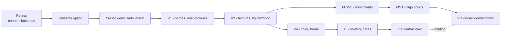

# 06 — Percepción y visión: V1, especialización funcional, predictive coding visual

> Guía temática del bloque **Percepción y Visión**. Núcleo: Triviño-Mosquera et al. (vision) y Zeki (especialización funcional). Cruza con cerebro predictivo (Nave/Clark) y representaciones.

## 1. El problema filosófico central

¿Es la percepción visual una **recepción pasiva** de información del mundo, una **construcción activa** del cerebro, o una **inferencia bajo incertidumbre**? La intuición ingenua dice "veo lo que hay"; el sistema visual real desmiente esa intuición. Triviño-Mosquera et al. lo plantean en términos biológicos: **la visión humana es una solución adaptativa, no una ventana transparente**. Sólo captamos una franja angosta del espectro electromagnético; otras especies hacen cosas que nosotros no. Zeki radicaliza: la corteza visual no procesa "imágenes" como una pantalla; segrega atributos (color, movimiento, forma, orientación) en circuitos parcialmente independientes y los reintegra de algún modo.

Tres preguntas filosóficas que esto abre:

- **Realismo perceptual**: ¿lo que vemos refiere a propiedades del mundo o a categorías construidas por el cerebro?
- **Binding problem**: si V4 codifica color y MT/V5 movimiento, ¿cómo se reúnen en la experiencia de "una manzana roja que cae"?
- **Predictive perception**: ¿percibimos las causas inferidas por el modelo generativo, no la señal sensorial cruda?

## 2. Posiciones principales

| Autor / corriente | Tesis | Argumento clave | Objeción principal |
|---|---|---|---|
| Realismo directo (Gibson) | Percibimos directamente affordances del entorno. | Información disponible en el ambiente óptico. | Difícil acomodar ilusiones y construcción cortical. |
| Constructivismo (Helmholtz, Gregory) | Percibir = inferencia inconsciente. | Ilusiones, completamiento perceptual. | ¿De dónde vienen las hipótesis previas? |
| Visión computacional (Marr) | Percibir = construir representaciones 3D a partir de 2D vía algoritmos. | Esboza pipeline: sketch primario → 2½D → 3D. | Asume separación rígida niveles que el cerebro no respeta. |
| Especialización funcional (Zeki) | La corteza visual segrega atributos en módulos parcialmente independientes. | Lesiones disociadas: acromatopsia central, akinetopsia. | El cerebro reintegra; el binding sigue sin resolverse. |
| Predictive coding (Rao & Ballard, Friston, Clark) | Percibir = minimizar error de predicción del modelo generativo. | Explica completamiento, ilusiones, atención como precisión. | Hard problem persiste; difícil de medir directamente. |
| Enactivismo (Noë, O'Regan) | Percibir = saber cómo cambia la señal con la acción. | Acoplamiento sensoriomotor; ceguera al cambio. | Riesgo de minimizar el papel del modelo interno. |

## 3. Pipeline visual y áreas

## 4. Predictive coding visual: una formulación

En la versión Rao & Ballard, cada nivel cortical pasa **predicciones top-down** al nivel inferior y recibe **errores de predicción bottom-up**. Sea $\mu_l$ la representación (creencia) en el nivel $l$ y $\hat\mu_{l-1} = g(\mu_l)$ la predicción que el nivel $l$ envía al nivel $l-1$. El error es:

$$\varepsilon_{l-1} = \mu_{l-1} - \hat\mu_{l-1}$$

y las creencias se actualizan según:

$$\dot\mu_l = -\partial_{\mu_l} F \;\;\propto\;\; \pi_{l-1}\,\varepsilon_{l-1}\, \frac{\partial g}{\partial \mu_l} - \pi_l\,\varepsilon_l$$

donde $\pi_l$ es la **precisión** (inverso de la varianza esperada). Atender = subir $\pi$ para canales relevantes. Bajo esta lectura, lo que "vemos" es $\mu_l$ tras converger, no la señal en bruto: percibimos las **causas inferidas**.

## 5. Evidencia neurocientífica clave

- **Conos y bastones** (Triviño-Mosquera): conos = color + agudeza (fóvea); bastones = sensibilidad y periferia.
- **Retinotopía** preservada en V1: vehículo representacional clásico.
- **Acromatopsia central** (lesión V4): pierde percepción de color sin perder forma → disociación.
- **Akinetopsia** (lesión MT, caso de M.P. de Zihl): pierde percepción de movimiento → "ve el mundo a saltos".
- **Áreas selectivas en IT**: FFA (caras), PPA (lugares), VWFA (palabras).
- **Ilusiones**: Kanizsa (contornos ilusorios), efecto McGurk, completamiento del punto ciego — todo evidencia de inferencia activa.
- **Vías ventral ("qué") y dorsal ("cómo/dónde")** (Ungerleider & Mishkin; Goodale & Milner).

## 6. El binding problem

Si V4 dice "rojo" y MT dice "moviéndose a la derecha", ¿qué garantiza que el sujeto experimente "manzana roja moviéndose a la derecha" y no "verde a la derecha + rojo quieto"? Propuestas:

- **Sincronía gamma** (Singer, Engel): ensembles que disparan a ~40 Hz se ligan.
- **Atención** como mecanismo de binding (Treisman, FIT).
- **Predicción top-down**: el modelo generativo impone coherencia.

## 7. Conexión con otros temas

- **Métodos (doc 04)**: Zeki es ejemplo clásico de convergencia (lesión + registro + imagen).
- **Representaciones (doc 03)**: V1 retinotópico es paradigma de vehículo representacional.
- **Conciencia (doc 02)**: percepción consciente vs inconsciente (blindsight); IIT predice Φ alto en redes córtico-corticales del sistema visual.
- **Redes neuronales (doc 05)**: CNNs ↔ vía ventral; un paralelo arquitectural directo.
- **Lenguaje (doc 08)**: VWFA muestra reciclaje cortical para la lectura.

## 8. Lecturas del workspace

- [[02_Lecturas/03_percepcion_y_vision/01_trivino_mosquera_vision]]
- [[02_Lecturas/03_percepcion_y_vision/02_zeki_imagen_visual_mente_y_cerebro]]
- [[02_Lecturas/09_material_complementario/10_the_minds_machine_vision]]
- [[02_Lecturas/08_conciencia_agencia_y_modelos/02_nave_cerebro_predictivo]]
- [[05_Visualizaciones/03_vision_y_representacion_visual]]

## 9. Conceptos clave que se desbloquean

- Conos, bastones, retinotopía.
- Vía visual: retina → LGN → V1 → V2/V4/MT → IT.
- Especialización funcional vs unidad de la experiencia.
- Vías ventral (qué) y dorsal (cómo/dónde).
- Binding problem y propuestas (sincronía, atención, top-down).
- Predictive coding y precisión.
- Inferencia activa y enactivismo.
- Realismo perceptual vs constructivismo.

## 10. Preguntas tipo parcial

1. Reconstruya la tesis de Zeki sobre especialización funcional y muestre cómo se apoya en evidencia lesional (akinetopsia o acromatopsia).
2. ¿Qué es el binding problem? Compare la propuesta de sincronía gamma con la de predictive coding top-down.
3. Triviño-Mosquera et al. dicen que la visión no es una ventana transparente. ¿Qué argumentos biológicos sostienen esa tesis?
4. Explique cómo el cerebro predictivo (Nave/Clark) reinterpreta la percepción como inferencia activa. ¿Qué papel juega la precisión?
5. Compare visión ventral y dorsal usando un caso clínico (agnosia visual vs ataxia óptica).
