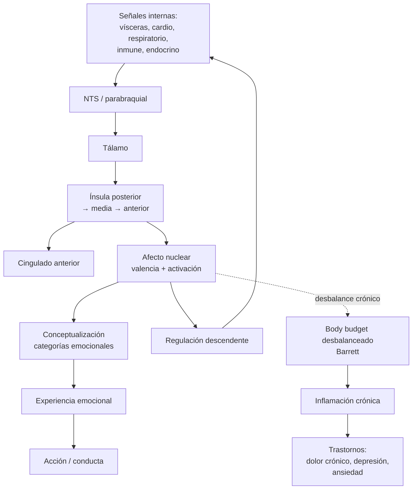

# 07 — Emoción y neuropsiquiatría: interocepción, Damasio, constructos psiquiátricos

> Guía temática del bloque **Emoción, Interocepción y Neuropsiquiatría**. Núcleo: Chen et al. (interocepción), Barrett (emoción y enfermedad), Ramírez-Bermúdez et al. (constructos neuropsiquiátricos).

## 1. El problema filosófico central

¿Qué es una emoción? ¿Una reacción biológica innata con núcleo cerebral fijo (Ekman, Panksepp), o una **construcción** del cerebro a partir de señales corporales, conceptos y contexto (Barrett, Russell)? Y, en clínica, ¿qué tipo de entidades son los "trastornos mentales"? ¿Son enfermedades naturales con esencias biológicas (esencialismo biomédico), o **constructos** definidos por convergencia de signos, síntomas, mecanismos y trayectorias (Ramírez-Bermúdez et al.)? Estas preguntas se cruzan con un tercer eje: la **interocepción** como representación del estado interno del organismo, que en la lectura de Chen et al. y Barrett es la base afectiva de la cognición.

## 2. Posiciones principales

| Autor / corriente | Tesis | Argumento clave | Objeción principal |
|---|---|---|---|
| James-Lange (clásico) | Sentimos porque percibimos cambios corporales. | "No lloramos porque estamos tristes; estamos tristes porque lloramos." | Cannon: respuestas viscerales son demasiado lentas e inespecíficas. |
| Cannon-Bard | Sensación y respuesta corporal ocurren en paralelo. | Bypass talámico. | Subestima cuerpo. |
| Damasio (hipótesis del marcador somático) | Decisiones racionales requieren señales somáticas; vmPFC integra cuerpo y elección. | Pacientes vmPFC con razonamiento intacto fallan en decisiones afectivas. | Críticas metodológicas (Iowa Gambling Task). |
| Panksepp (afectos básicos) | Hay sistemas emocionales subcorticales evolutivamente conservados (SEEKING, RAGE, FEAR, etc.). | Estimulación subcortical evoca respuestas emocionales en muchas especies. | Riesgo de esencialismo. |
| Ekman (emociones básicas) | 6 emociones universales con expresiones faciales fijas. | Estudios transculturales. | Réplicas mixtas; sesgo metodológico. |
| Barrett (teoría construccionista) | Las emociones son **categorías** construidas por el cerebro a partir de afecto nuclear + conceptos + contexto. | Variabilidad enorme dentro de una "misma" emoción. | ¿Cómo explica universales? |
| Chen et al. (interocepción amplia) | Interocepción = sentir + interpretar + integrar + regular señales internas. | Insula como nodo clave; gradiente posterior-anterior. | Definición tan amplia que puede diluirse. |
| Ramírez-Bermúdez et al. (constructos neuropsiquiátricos) | Un constructo neuropsiquiátrico válido = patrón psicopatológico + patrón neuropatológico + relación significativa. | Permite puentes entre neurología y psiquiatría. | Riesgo de neuro-reduccionismo. |

## 3. Mapa interocepción → emoción → enfermedad

## 4. Marcador somático y decisión

Una versión simplificada (Damasio):

$$U(a) = U_{\text{cog}}(a) + \lambda \cdot M_{\text{som}}(a)$$

donde $U(a)$ es la utilidad subjetiva de la acción $a$, $U_{\text{cog}}$ es la evaluación cognitiva, $M_{\text{som}}$ es la señal somática asociada (intuición visceral, "gut feeling") y $\lambda$ pondera su peso. En vmPFC dañado, $\lambda \to 0$: la deliberación racional permanece, pero la decisión se vuelve errática porque pierde el guiado somático.

## 5. Body budget y enfermedad (Barrett)

Una versión esquemática:

$$\Delta B_t = \text{Ingreso}_t - \text{Gasto}_t - \text{Error de predicción metabólica}_t$$

Cuando el cerebro **predice mal** sostenidamente lo que va a necesitar (sueño, glucosa, oxígeno, esfuerzo), el balance $B$ se desequilibra, la regulación falla, aparece inflamación crónica y, con ella, alteraciones en circuitos interoceptivos y de control. La "enfermedad mental" deja de ser categoría puramente psíquica: es un fenotipo del cerebro como regulador corporal.

## 6. Evidencia neurocientífica

- **Ínsula**: nodo interoceptivo clave; gradiente posterior (sensorial puro) → medio → anterior (integración consciente y conceptual).
- **Amígdala**: aprendizaje de miedo (LeDoux), pero también valencia general y atención emocional.
- **vmPFC**: integración valor-decisión-emoción.
- **Cingulado anterior**: monitoreo de error, dolor, conflicto, regulación.
- **Eje HPA y vagal**: regulación del estrés y la inflamación.
- **Neuroinflamación**: marcadores elevados en depresión, ansiedad, fibromialgia, fatiga crónica, dolor crónico.
- **Constructos neuropsiquiátricos**: ej. delirium, psicosis lúpica, demencia frontotemporal — casos donde el puente neurología/psiquiatría es claro.

## 7. Conexión con otros temas

- **Conciencia (doc 02)**: el "self" mínimo es interoceptivo (Damasio, Craig); conciencia corporizada y emoción.
- **Cerebro predictivo (doc 02 y 06)**: la interocepción es predictive coding aplicado al medio interno (Seth).
- **Funciones ejecutivas (doc 08)**: regulación emocional pasa por vmPFC + dlPFC; disfunciones explican parte de psicopatología.
- **Métodos (doc 04)**: Ramírez-Bermúdez ofrece criterios para validar constructos clínicos, eco del problema de evidencia de Bechtel.
- **Mente-cuerpo (doc 01)**: Barrett apoya un fisicalismo no eliminativo donde lo "mental" es regulación encarnada.

## 8. Lecturas del workspace

- [[02_Lecturas/06_emocion_interocepcion_neuropsiquiatria/02_chen_interocepcion]]
- [[02_Lecturas/06_emocion_interocepcion_neuropsiquiatria/03_barrett_emocion_y_enfermedad]]
- [[02_Lecturas/06_emocion_interocepcion_neuropsiquiatria/04_ramirez_bermudez_constructos_neuropsiquiatricos]]
- [[02_Lecturas/09_material_complementario/08_neuroscience_and_psychopathology]]
- [[05_Visualizaciones/06_interocepcion_emocion_y_neuropsiquiatria]]

## 9. Conceptos clave que se desbloquean

- Interocepción (definición amplia de Chen et al.).
- Afecto nuclear: valencia y activación.
- Marcador somático (Damasio).
- Body budget y predicción metabólica (Barrett).
- Construccionismo emocional vs emociones básicas (Ekman/Panksepp).
- Ínsula como nodo y red de saliencia.
- Constructo neuropsiquiátrico: psicopatología + neuropatología + relación significativa.
- Neuroinflamación y enfermedad.

## 10. Preguntas tipo parcial

1. Reconstruya la definición ampliada de interocepción de Chen et al. ¿Qué agrega frente a la noción tradicional de "sentir las vísceras"?
2. Explique la hipótesis del marcador somático de Damasio. ¿Cómo predeciría la performance de un paciente vmPFC en la Iowa Gambling Task?
3. Compare construccionismo de Barrett con teoría de emociones básicas de Ekman. ¿Qué tipo de evidencia distinguiría una de la otra?
4. ¿Qué criterios proponen Ramírez-Bermúdez et al. para hablar de un constructo neuropsiquiátrico válido? Ejemplifique.
5. ¿Por qué el "body budget" y la inflamación crónica tensan la separación rígida entre lo mental y lo físico? Conecte con el debate mente-cuerpo (doc 01).
