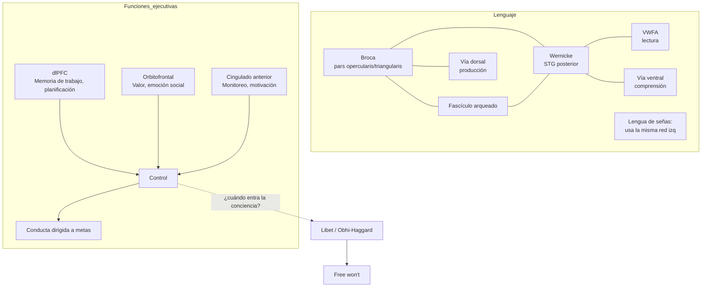

# 08 — Lenguaje y funciones ejecutivas: Baggio, lóbulos frontales, control

> Guía temática del bloque **Lenguaje** + **Funciones ejecutivas y lóbulos frontales**. Núcleo: Baggio (neurolingüística), Hickok-Bellugi-Klima (lengua de señas), Suchy (funciones ejecutivas), Miller & Cummings (lóbulos frontales). Cruza con agencia (Obhi-Haggard) y memoria.

## 1. El problema filosófico central

**Sobre el lenguaje**: ¿es el lenguaje un módulo computacional discreto (Chomsky, Fodor) o una red distribuida que recluta áreas multifuncionales? ¿Está atado al canal auditivo-vocal o es indiferente al sustrato sensoriomotor? El caso de las lenguas de señas (Hickok, Bellugi, Klima) responde: el cerebro las trata como lenguaje pleno, no como mímica. Esto separa **sustancia sensoriomotora** de **organización lingüística formal**, una distinción de peso filosófico.

**Sobre funciones ejecutivas**: ¿qué son? Suchy y Miller-Cummings convergen en que no son una unidad sino un conjunto de procesos para conducta intencional dirigida a metas; tampoco son monopolio del lóbulo frontal. Esto reabre el problema de la **agencia**: si la conducta deliberada emerge de una red distribuida, ¿qué queda del "yo" decisor? Obhi & Haggard, con los experimentos tipo Libet, complican aún más la imagen: la preparación motora precede a la conciencia de la intención. Hay que distinguir **iniciación**, **conciencia**, **ejecución** y **veto** ("free won't").

## 2. Posiciones principales

### Lenguaje

| Autor / corriente | Tesis | Argumento clave | Objeción principal |
|---|---|---|---|
| Localizacionismo clásico (Broca, Wernicke) | Lenguaje en áreas frontales (producción) y temporales (comprensión). | Lesiones disociadas. | Excesiva simplificación; modalidades, vías y redes. |
| Modularismo (Chomsky, Fodor) | Lenguaje = facultad innata, modular, computacional. | Pobreza del estímulo; gramática universal. | Plasticidad y entrenamiento; lengua de señas también lo es. |
| Conexionismo lingüístico (Elman, McClelland) | El lenguaje emerge de redes aprendiendo regularidades. | Modelos PDP capturan adquisición y errores. | Sistematicidad débil; Fodor-Pylyshyn. |
| Neurolingüística temporal (Baggio) | Importa el tiempo del procesamiento, no sólo el lugar. | EEG/MEG revelan dinámica (N400, P600). | Riesgo de quedarse en correlatos. |
| Lengua de señas como lenguaje (Hickok, Bellugi, Klima) | El cerebro la trata como lenguaje pleno, no como gesto. | Afasia de señas tras lesión izquierda en sordos. | Confirma modularidad funcional pero no sustancialmente. |
| Embodied/grounded cognition (Pulvermüller) | Significado anclado en circuitos sensoriomotores. | Activación motora al leer verbos de acción. | Riesgo de sobreinterpretar correlatos. |

### Funciones ejecutivas y agencia

| Autor / corriente | Tesis | Argumento clave | Objeción principal |
|---|---|---|---|
| Síndrome frontal clásico (Luria) | Lóbulo frontal = control voluntario y planificación. | Casos clínicos (Phineas Gage, lobotomías). | Suchy: no todo dano frontal da el mismo cuadro. |
| Unidad-diversidad (Miyake) | FE = inhibición + actualización + switching, parcialmente disociables. | Análisis factorial sobre baterías de pruebas. | Demasiado test-céntrico. |
| Suchy (orientación funcional) | FE = procesos para conducta intencional adaptativa en la vida diaria. | Crítica a definir FE sólo por tests o frontales. | Definición amplia, difícil de operacionalizar. |
| Triparticion prefrontal (Miller & Cummings) | dlPFC (cognición), orbitofrontal (social/emocional), cingulado (motivación). | Sindromes clínicos diferenciables. | No agota la complejidad. |
| Libet/Obhi-Haggard | Potencial de preparación precede conciencia de la intención. | Datos electrofisiológicos clásicos. | No prueba ausencia de libre albedrío; reorganiza el debate. |
| Free won't (Obhi-Haggard) | La conciencia podría intervenir vetando, no iniciando. | Inhibición tardía documentada. | Difícil de testear rigurosamente. |

## 3. Mapa de redes

## 4. N400, P600 y el tiempo del lenguaje

La neurolingüística temporal de Baggio se apoya en marcadores ERP:

- **N400** (~400 ms post-estímulo): negatividad ante incongruencia semántica. Amplitud ∝ esperabilidad (cloze probability).
- **P600** (~600 ms): positividad ante violaciones sintácticas o reanálisis.

Formalmente, se puede modelar la amplitud como:

$$A_{\text{N400}} \approx -k_1 \cdot \log p(w_t \mid \text{contexto})$$

es decir, **predicción** y **sorpresa** son centrales. Esto enlaza con cerebro predictivo (doc 02 y 06): comprender es predecir.

## 5. Evidencia neurocientífica relevante

- **Afasia de Broca**: agramatismo, lenguaje no fluente; lesión frontal inferior izquierda.
- **Afasia de Wernicke**: comprensión deficitaria, parafasias; lesión temporal superior posterior izquierda.
- **Afasia en sordos** (Hickok-Bellugi-Klima): lesión izquierda produce déficits estructuralmente análogos en lengua de señas → el lenguaje no depende del canal.
- **N400 / P600**: dinámica predictiva del procesamiento.
- **Phineas Gage** (1848): cambio de personalidad y juicio social tras lesión vmPFC/orbitofrontal.
- **Pacientes vmPFC**: Iowa Gambling Task — razonamiento intacto, decisión afectiva fallida (cruce con doc 07).
- **Síndrome disejecutivo**: tras lesión dlPFC, perseveración, fallas en switching, problemas en Wisconsin Card Sorting.
- **Libet (1983) y replicaciones**: potencial de preparación 350-500 ms antes del reporte consciente de intención.

## 6. Conexión con otros temas

- **Representaciones (doc 03)**: lengua de señas separa vehículo (gesto) y contenido (significado lingüístico).
- **Conciencia y agencia (doc 02)**: free won't refina la distinción intención-acción-conciencia.
- **Cerebro predictivo (doc 02)**: N400/P600 son señales de error en predicción lingüística.
- **Emoción y neuropsiquiatría (doc 07)**: pacientes orbitofrontales conectan FE con afecto y decisión.
- **Redes neuronales (doc 05)**: LLMs procesan lenguaje sin frontal ni temporal — ¿qué nos dicen del lenguaje humano?
- **Métodos (doc 04)**: estudios de FE dependen de convergencia entre baterías neuropsicológicas, fMRI y casos clínicos.

## 7. Lecturas del workspace

- [[02_Lecturas/05_lenguaje/01_baggio_neurolinguistica]]
- [[02_Lecturas/05_lenguaje/02_hickok_bellugi_klima_lenguaje_de_senas]]
- [[02_Lecturas/07_funciones_ejecutivas_y_lobulos_frontales/01_suchy_funciones_ejecutivas]]
- [[02_Lecturas/07_funciones_ejecutivas_y_lobulos_frontales/02_miller_cummings_lobulos_frontales]]
- [[02_Lecturas/08_conciencia_agencia_y_modelos/04_obhi_haggard_libre_albedrio]]
- [[05_Visualizaciones/05_lenguaje_y_arquitecturas]]
- [[05_Visualizaciones/07_funciones_ejecutivas_frontales_y_agencia]]

## 8. Conceptos clave que se desbloquean

- Afasia de Broca, Wernicke, conducción.
- Vía dorsal (producción) y ventral (comprensión) del lenguaje (Hickok & Poeppel).
- N400, P600 y procesamiento predictivo lingüístico.
- Lengua de señas como lenguaje pleno.
- Funciones ejecutivas: inhibición, actualización, switching.
- Triparticion prefrontal: dlPFC, orbitofrontal, cingulado.
- Potencial de preparación (Bereitschaftspotential).
- Free will vs free won't.

## 9. Preguntas tipo parcial

1. Reconstruya la tesis de Hickok, Bellugi y Klima sobre la lengua de señas. ¿Qué consecuencia tiene para teorías que identifican lenguaje con habla?
2. Explique la importancia del N400 para una neurolingüística temporal en el sentido de Baggio. ¿Cómo conecta con cerebro predictivo?
3. Suchy critica las definiciones estrechas de funciones ejecutivas. ¿Qué propone en su lugar y por qué se considera un "enfoque ecológico"?
4. Reconstruya los experimentos de Libet y el matiz de Obhi-Haggard ("free won't"). ¿Qué queda en pie del libre albedrío?
5. Compare las tres divisiones funcionales prefrontales de Miller-Cummings con los hallazgos clínicos clásicos (Phineas Gage, pacientes Iowa Gambling).
